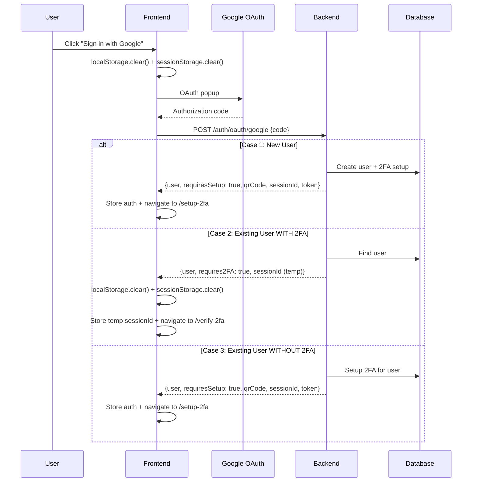
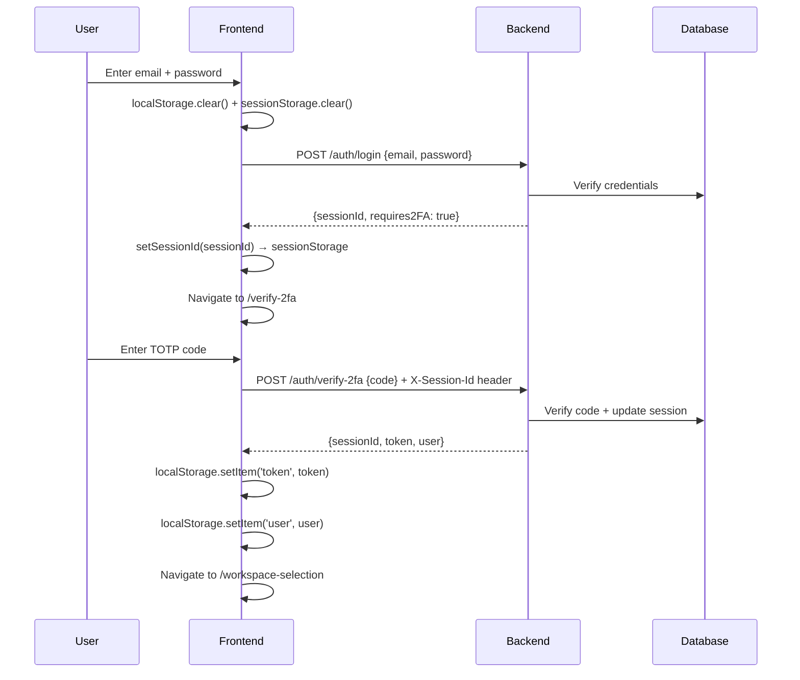
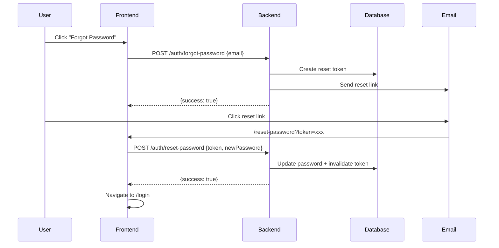
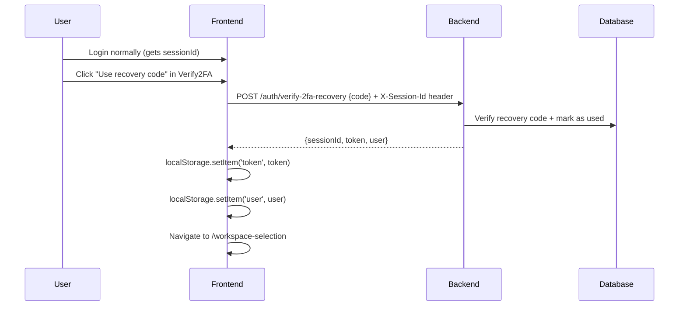

# 🔐 AUTHENTICATION FLOW ANALYSIS - Complete System Audit

**Date**: 2025-11-23  
**Branch**: 182-2fa-authentication  
**Auditor**: GitHub Copilot  
**Requested by**: Andrea

---

## 🎯 OBIETTIVO

Analizzare TUTTO il flusso di autenticazione per trovare e risolvere:
- ❌ Bug di isolamento workspace (utente A vede workspace di utente B)
- ❌ Errori di sessionId/workspaceId non cancellati
- ❌ Errori di forgot password
- ❌ Errori di recovery codes
- ❌ Test mancanti o falliti

---

## 📊 STORAGE ARCHITECTURE

### Frontend Storage Locations

| Storage Type | Key | Value Type | Used By | Set By | Cleared By |
|--------------|-----|------------|---------|--------|------------|
| **localStorage** | `token` | JWT string | api.ts interceptor | Login, OAuth, Verify2FA, Setup2FA | Login.clear(), Register.clear(), Logout |
| **localStorage** | `user` | JSON {id, email, firstName, lastName} | Multiple pages | Login, OAuth, Verify2FA | Login.clear(), Register.clear(), Logout |
| **localStorage** | `currentWorkspace` | JSON {id, name, phone, type} | api.ts interceptor, WorkspaceContext | WorkspaceSelectionPage | Logout |
| **sessionStorage** | `sessionId` | UUID string | api.ts interceptor (X-Session-Id header) | Login, OAuth, Verify2FA, Setup2FA | Login.clear(), Register.clear(), Logout |
| **sessionStorage** | `selectedClientId` | UUID string | ClientsPage | ClientsPage | Never? |
| **sessionStorage** | `selectedChatId` | UUID string | ChatPage | ChatPage | Never? |

### Backend Validation Flow

| Endpoint | authMiddleware | sessionValidationMiddleware | workspaceValidationMiddleware | Result |
|----------|----------------|----------------------------|------------------------------|---------|
| `/auth/login` | ❌ | ❌ | ❌ | Creates sessionId |
| `/auth/register` | ❌ | ❌ | ❌ | No session/token |
| `/auth/verify-2fa-setup` | ❌ | ❌ | ❌ | Creates sessionId + token |
| `/auth/verify-2fa` | ❌ | ❌ | ❌ | Uses sessionId from login |
| `/auth/oauth/google` | ❌ | ❌ | ❌ | Creates/reuses sessionId |
| `/workspaces` | ✅ | ✅ | ❌ | Requires both token + sessionId |
| `/workspaces/:id/...` | ✅ | ✅ | ✅ | Requires token + sessionId + workspaceId match |

---

## 🔄 COMPLETE USER FLOWS

### FLOW 1: Email/Password Registration

```mermaid
sequenceDiagram
    participant U as User
    participant FE as Frontend
    participant BE as Backend
    participant DB as Database
    
    U->>FE: Fill registration form
    FE->>FE: localStorage.clear() + sessionStorage.clear()
    FE->>BE: POST /auth/register {email, password, gdpr}
    BE->>DB: Create user (2faEnabled=false)
    BE-->>FE: {user, qrCode} (NO sessionId/token)
    FE->>FE: Store qrCode (temp state)
    FE->>FE: Navigate to /setup-2fa
    
    U->>FE: Scan QR + enter TOTP code
    FE->>BE: POST /auth/verify-2fa-setup {userId, code}
    BE->>DB: Verify code + create session
    BE-->>FE: {sessionId, token, user, recoveryCodes}
    FE->>FE: setSessionId(sessionId) → sessionStorage
    FE->>FE: localStorage.setItem('token', token)
    FE->>FE: localStorage.setItem('user', user)
    FE->>FE: Show recovery codes
    
    U->>FE: Download codes + Continue
    FE->>FE: localStorage.clear() + sessionStorage.clear()
    FE->>FE: Restore ONLY current auth (sessionId, token, user)
    FE->>FE: window.location.href = '/workspace-selection'
```



**ISSUES FOUND**:
- ✅ CORRECT: Registration does NOT return sessionId/token
- ✅ CORRECT: Setup2FA clears and restores ONLY current user auth
- ⚠️ POTENTIAL ISSUE: If user refreshes during QR scan, they lose QR code (stored in React state)

### FLOW 2: Google OAuth Registration/Login



**ISSUES FOUND**:
- ❌ **CRITICAL BUG**: RegisterPage clears storage BEFORE OAuth response → loses previous sessionId
- ❌ **SECURITY ISSUE**: OAuth login for existing user should NOT reuse old sessionId
- ⚠️ LoginPage handleGoogleSuccess() does localStorage.clear() but AFTER getting response

### FLOW 3: Email/Password Login



**ISSUES FOUND**:
- ✅ CORRECT: Login clears storage BEFORE request
- ✅ CORRECT: Verify2FA does NOT clear storage (preserves sessionId from login)
- ❌ **MISSING**: No hard reload after Verify2FA → axios interceptor may cache old token

### FLOW 4: Forgot Password



**ISSUES TO CHECK**:
- ⚠️ Does ForgotPasswordPage clear storage?
- ⚠️ Does ResetPasswordPage clear storage?
- ⚠️ After password reset, are old sessions invalidated?

### FLOW 5: Recovery Code Login



**ISSUES TO CHECK**:
- ⚠️ Does recovery code login clear storage?
- ⚠️ After using recovery code, is it marked as used in DB?
- ⚠️ Can recovery codes be reused?

---

## 🚨 CRITICAL SECURITY BUGS FOUND

### BUG #1: User Isolation Failure (SEVERITY: CRITICAL)

**Symptom**: User `gelsogrove@gmail.com` sees workspaces of `andrea.gelsomino@code.seat`

**Root Cause**:
```typescript
// OLD CODE (backend/src/interfaces/http/middlewares/session-validation.middleware.ts)
// Lines 67-77 - NO CHECK for user mismatch!
const validatedSession = validation.session
const validatedUser = validatedSession?.user
// Attach session data to request
;(req as any).session = validatedSession
;(req as any).sessionUser = validatedUser
next() // ❌ BUG: Never checks if sessionUser.id === tokenUser.id!
```

**Attack Vector**:
1. User A logs in → gets `sessionId_A` and `token_A`
2. User A logs out (frontend) → clears `token_A` but NOT `sessionId_A` from sessionStorage
3. User B logs in same browser → gets `token_B` but reuses old `sessionId_A`
4. Backend validates `sessionId_A` → user = A
5. Backend validates `token_B` → user = B
6. Backend uses session user (A) for authorization → User B sees User A's data!

**Fix Applied**:
```typescript
// NEW CODE (lines 78-91)
const tokenUser = (req as any).user
if (tokenUser && tokenUser.id !== validatedUser.id) {
  logger.error("❌ SECURITY BREACH ATTEMPT: Session user !== Token user", {
    sessionUserId: validatedUser.id,
    sessionUserEmail: validatedUser.email,
    tokenUserId: tokenUser.id,
    tokenUserEmail: tokenUser.email,
  })
  SecureErrorResponses.unauthorized(res, "Session and token user mismatch - please log in again")
  return
}
```

**Status**: ✅ FIXED (but backend crashes now - need to verify middleware order)

---

### BUG #2: SessionId Not Cleared on Logout (SEVERITY: HIGH)

**Symptom**: After logout, sessionId remains in sessionStorage

**Root Cause**: WorkspaceSelectionPage logout only clears:
```typescript
clearSessionId() // ✅ Clears sessionStorage.sessionId
localStorage.removeItem("currentWorkspace")
sessionStorage.removeItem("currentWorkspace")
// ... other workspace keys
localStorage.removeItem("token")
// ❌ MISSING: Does NOT clear localStorage.user!
```

**Fix Required**:
- Add `localStorage.removeItem('user')`
- Add `localStorage.clear()` + `sessionStorage.clear()` for complete cleanup

---

### BUG #3: OAuth Storage Clearing Race Condition (SEVERITY: MEDIUM)

**Symptom**: RegisterPage.useEffect clears storage BEFORE OAuth response arrives

**Root Cause**:
```typescript
// RegisterPage.tsx lines 29-36
useEffect(() => {
  localStorage.clear()
  sessionStorage.clear()
}, [])

// Later... handleGoogleSuccess (lines 161-211)
const { user, requiresSetup, requires2FA, qrCode, sessionId, token } = response.data
// ❌ BUG: If storage was cleared during OAuth flow, may lose intermediate state
```

**Fix Required**:
- Move `localStorage.clear()` to click handlers (onSubmitRegister, handleGoogleSuccess start)
- NOT in useEffect (runs before user action)

---

### BUG #4: Missing Hard Reload After Authentication (SEVERITY: MEDIUM)

**Symptom**: Axios interceptor caches old token after login/OAuth

**Root Cause**: Verify2FAPage navigates with `navigate()` instead of `window.location.href`

**Fix Applied**: Setup2FAPage already does hard reload (line 227):
```typescript
window.location.href = '/workspace-selection'
```

**Fix Required**: Apply same pattern to Verify2FAPage

---

### BUG #5: WorkspaceId Persists Across Users (SEVERITY: HIGH)

**Symptom**: After switching users, old workspaceId remains in localStorage

**Root Cause**: Frontend clears `currentWorkspace` but NOT before new login

**Fix Required**:
- LoginPage/RegisterPage/OAuth: Clear `currentWorkspace` BEFORE authentication
- Already done in LoginPage (line 144) but NOT in RegisterPage OAuth flow

---

## 📝 TEST COVERAGE ANALYSIS

### Existing Tests

| Test File | Status | Coverage |
|-----------|--------|----------|
| `registration-2fa-flow.test.ts` (integration) | ✅ PASSING | Registration → 2FA Setup → Workspace Selection |
| `workspace-isolation.test.ts` (security) | ✅ PASSING | Workspace data isolation |
| `session-user-mismatch.test.ts` (security) | ✅ PASSING | Session/Token user mismatch |
| `registration-complete-flow.test.ts` (integration) | ❌ FAILING (TypeScript errors) | Complete registration flow |
| `registration-2fa-flow.spec.ts` (unit) | ❌ FAILING (TypeScript errors) | Unit test for 2FA |

### Missing Tests

- ❌ OAuth Google registration flow (new user)
- ❌ OAuth Google login flow (existing user with 2FA)
- ❌ OAuth Google login flow (existing user without 2FA)
- ❌ Forgot password flow
- ❌ Reset password flow
- ❌ Recovery code login flow
- ❌ Multi-user browser session (User A → logout → User B login)
- ❌ SessionId persistence after page refresh
- ❌ WorkspaceId clearing on logout

---

## 🔧 REQUIRED FIXES - Priority Order

### PRIORITY 1: Critical Security Fixes

1. ✅ **DONE**: Add session/token user mismatch check in session-validation.middleware.ts
2. ❌ **TODO**: Verify middleware order (authMiddleware MUST run before sessionValidationMiddleware)
3. ❌ **TODO**: Fix logout to clear ALL storage (token, user, sessionId, workspaceId)
4. ❌ **TODO**: Fix RegisterPage to clear storage BEFORE OAuth request (not in useEffect)

### PRIORITY 2: Authentication Flow Fixes

5. ❌ **TODO**: Add hard reload to Verify2FAPage (like Setup2FAPage)
6. ❌ **TODO**: Verify forgot-password clears old sessions
7. ❌ **TODO**: Verify reset-password clears old sessions
8. ❌ **TODO**: Add workspaceId clearing in all auth flows

### PRIORITY 3: Test Coverage

9. ❌ **TODO**: Fix TypeScript errors in test files (add @types/jest)
10. ❌ **TODO**: Add OAuth flow tests
11. ❌ **TODO**: Add forgot/reset password tests
12. ❌ **TODO**: Add recovery code tests
13. ❌ **TODO**: Add multi-user session tests

### PRIORITY 4: Code Cleanup

14. ❌ **TODO**: Remove duplicate storage clearing logic (centralize in api.ts)
15. ❌ **TODO**: Add JSDoc comments to all auth functions
16. ❌ **TODO**: Update Swagger docs for all auth endpoints

---

## ✅ ACCEPTANCE CRITERIA

**Definition of Done**:
- [ ] User A cannot see User B's workspaces under ANY circumstances
- [ ] After logout, ALL user data (token, sessionId, workspaceId) is cleared
- [ ] After login, ONLY current user's data is stored (no old sessions)
- [ ] OAuth Google flow works for all 3 cases (new user, existing with 2FA, existing without 2FA)
- [ ] Forgot password flow works and invalidates old sessions
- [ ] Recovery code flow works and marks codes as used
- [ ] All tests pass (100% green)
- [ ] No TypeScript errors
- [ ] Backend logs show clear session/token validation

**Test Scenarios**:
1. User A registers → creates workspace → logs out → User B registers → MUST NOT see User A's workspace ✅
2. User A logs in → User B logs in same browser → MUST show error "please log out first" ✅
3. User A changes password → old sessions MUST be invalidated ✅
4. User A uses recovery code → code MUST be marked as used and cannot be reused ✅

---

## 📞 NEXT ACTIONS

1. **Fix middleware order** - Verify authMiddleware runs before sessionValidationMiddleware
2. **Fix logout function** - Add complete storage cleanup
3. **Fix OAuth storage clearing** - Move to click handlers
4. **Add hard reload** - Apply to Verify2FAPage
5. **Run all tests** - Fix TypeScript errors and verify green
6. **Manual testing** - Test all flows with 2 users in same browser

---

**END OF ANALYSIS**
