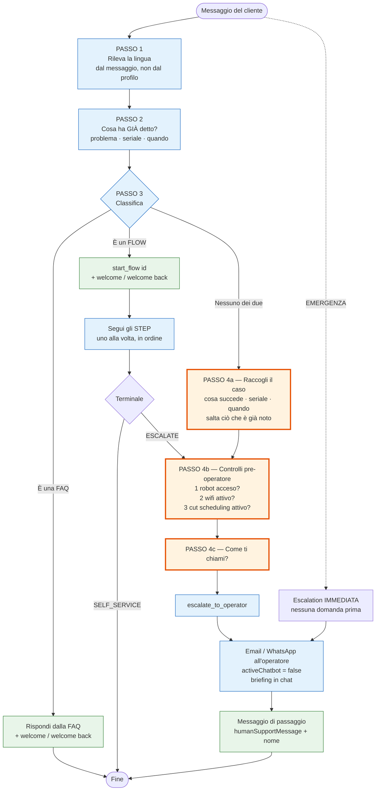
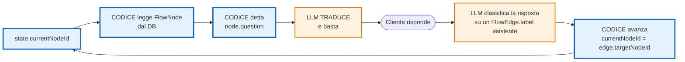
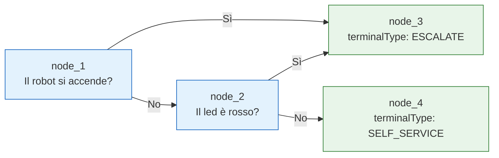
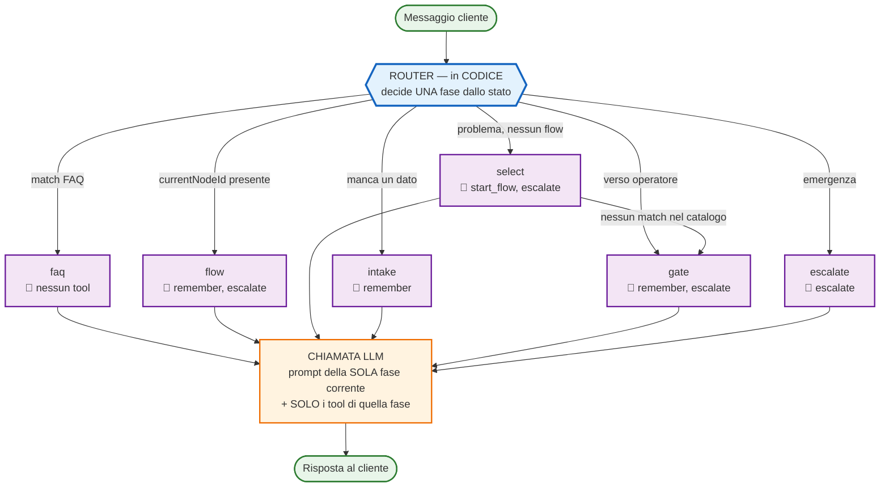
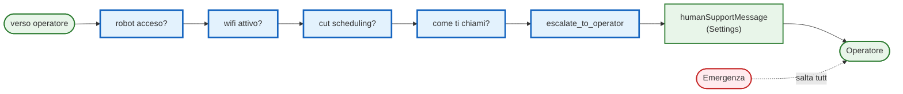

# TODO — demorobot

> Scritto 2026-08-03. Cosa deve fare il chatbot, cosa manca, e le regole che
> non sono negoziabili. Aggiornare qui man mano, non in chat.

---

## 🎯 Il comportamento voluto

### PASSO 1 — Rilevare la lingua

Dal messaggio del cliente, non dal profilo. Quello che arriva dalla
registrazione è solo un **suggerimento**: se il cliente scrive in spagnolo si
risponde in spagnolo, anche se il profilo dice "en". La lingua diventa
definitiva quando l'LLM ha risposto in quella lingua (trailer `⟦LANG:xx⟧`), e
da lì è sticky.

### PASSO 2 — Leggere e capire cosa ha già detto

Prima di chiedere qualsiasi cosa, guardare cosa il cliente ha **già** espresso
nel suo messaggio:

- ha già descritto il problema?
- ha già dato il numero di serie?
- sta facendo una domanda a cui una FAQ risponde?

**Mai richiedere ciò che è già stato detto.** Se apre con seriale + codice
errore, si va dritti al flow.

### PASSO 3 — Classificare: FAQ, FLOW, o nessuno dei due

Una decisione a **tre esiti**, valutati in quest'ordine. Il primo che si
applica vince, e da lì si prosegue solo su quel binario:

```
┌─ È una FAQ?    → rispondi con la FAQ. Chiuso, niente flow, niente intake.
│
├─ È un FLOW?    → start_flow(id) → carica il compiledPrompt
│                  → segui gli STEP uno alla volta fino al terminale
│
└─ Nessuno dei due → PASSO 4 (raccolta + controlli + operatore)
```

Welcome (o welcome back se lo conosciamo per nome) **insieme** alla risposta,
in un solo messaggio. Non due turni separati.

**Una volta scelto il binario, si continua su quello.** Non si torna indietro a
riclassificare a ogni turno: se è partito un flow, si finisce il flow; se è
stata data una risposta FAQ, la conversazione prosegue normalmente da lì.

### PASSO 4 — Prima dell'operatore, SEMPRE questi controlli

⚠️ **Vale ogni volta che si va verso l'operatore**, non solo quando nessun flow
corrisponde. Anche se ci si arriva da dentro un flow.

```
1. il robot è acceso?
2. il wifi è attivo?
3. il cut scheduling è attivo?
4. come ti chiami?
   ↓
messaggio di passaggio all'operatore (quello configurato nei settings)
```

Le prime tre sono il **FLOW GENERALE** (da creare nel builder, senza
categoria). La quarta è il gate sul nome, già in codice.

Il messaggio finale è `humanSupportMessage`, editabile nella card Human
Support — **mai una frase scritta nel codice**.

**Unica deroga**: emergenza. Lì si escala subito senza chiedere nulla.

---

**Quando un flow è attaccato**, quello è l'unico copione: si seguono i suoi
STEP e si dimentica il catalogo, incluso il flow generale. Mai mescolare
domande di un flow in un altro.

### Passaggio all'operatore

Deve avvenire **tutto nello stesso turno**, mai a metà:

1. Se il nome non è noto → chiedilo (una domanda breve)
2. Appena risponde → `remember({key:'name'})` **e** `escalate_to_operator`
3. Poi conferma **per nome**: _"Andrea, ti metto in contatto con il nostro
   operatore, ti risponderà il prima possibile"_

Effetti collaterali attesi: email/WhatsApp all'operatore secondo
`operatorDeliveryMode` (all / random), `activeChatbot: false`, briefing 👤
visibile in chat con nome, azienda, seriale, problema, quando, risposte
raccolte.

**Emergenza** (ferito, animale, fumo, incendio, danni): escalation IMMEDIATA,
senza chiedere prima nulla. Poi, nello stesso messaggio, partecipazione e
richiesta dei dati per il richiamo. Mai una riga piatta.

### Come parla

- UNA domanda per messaggio
- Opzioni numerate `1.` `2.` `3.` — ma **solo** se vengono da un flow o da una
  FAQ, mai inventate
- Emoji: al massimo una per messaggio, nessuna va benissimo
- Lingua: quella del cliente, rilevata dal suo messaggio (il profilo è solo un
  suggerimento iniziale)

---

## 🗺 Il flusso completo



🟦 **Codice** — il meccanismo, non modificabile da app: rilevamento lingua,
classificazione, sequenza degli STEP, effetti collaterali dell'escalation.

🟩 **Configurazione** — già editabile dall'app: FAQ, flow dal builder,
`humanSupportMessage`, welcome / welcome back.

🟧 **Da sistemare** — il testo esiste ma non è configurabile: intake (solo in
`settings.json`), controlli pre-operatore (non esistono), domanda del nome
(hardcodata nell'`instruction` del gate).

### ⚠️ 4b arriva da DUE strade

I controlli pre-operatore valgono **ogni volta** che si va verso l'operatore:
sia dall'intake (nessun flow ha corrisposto), sia da un terminale ESCALATE
dentro un flow specifico. Oggi il secondo percorso li salta.

Il flow generale da solo non basta: quando un flow specifico è attivo, il
generale viene ignorato per progetto. Serve che il gate di
`escalate_to_operator` li pretenda, leggendo **quali** dalla configurazione:

```json
"preEscalationChecks": {
  "robotPowered":      "Il robot è acceso?",
  "wifiActive":        "Il wifi è attivo?",
  "cutScheduleActive": "Il cut scheduling è attivo?"
}
```

Il codice garantisce che siano raccolti (meccanismo), il workspace decide
quali sono e come sono formulati (contenuto).

---

## 🚫 Non deve inventare — mai

Tutto ciò che dice viene da ACTIVE FLOW, FAQ o SESSION STATE. Il suo training
**non è una fonte**.

Casi visti in produzione, tutti da non ripetere:

| Cosa ha inventato                       | Quando                 |
| --------------------------------------- | ---------------------- |
| _"È la batteria carica?"_               | nessun flow agganciato |
| Menu di cause (_"le lame non girano?"_) | fase di raccolta       |
| _"Le lame girano normalmente?"_         | dopo la prima domanda  |
| Promessa di richiamo senza escalation   | terminale SELF_SERVICE |

⚠️ **temperature: 0 NON impedisce le invenzioni** — rende l'output
deterministico, non veritiero. Se inventa, inventa in modo consistente.

Il rimedio non è l'ennesima regola nel prompt: è **togliere spazio**
all'improvvisazione con guardie deterministiche in codice.

---

## ✅ Fatto

- `start_flow` — l'LLM sceglie dal catalogo, il tool valida l'id
- STEP numerati nel compiledPrompt + regole d'ordine
- Gate intake: la domanda la detta il codice, l'LLM traduce soltanto
- Gate escalation: rifiuta finché mancano nome, seriale, descrizione, quando
- Briefing operatore visibile in chat (marker `**👤 Human Support message**`)
- `operatorDeliveryMode` all/random (era dichiarato ma mai implementato)
- Settings dal DB a runtime (`maxTokens` 2500 non aveva effetto)
- Round-trip `maxTokens` verso la UI (l'API non lo restituiva)
- Gate `enableCalendarBooking` (era ignorato dal percorso custom)
- `welcomeBackMessage` + `humanSupportMessage` editabili dall'app
- Zero copy hardcodato (vedi sotto)
- Categorie nel catalogo dei flow
- 36 test nuovi, inclusi quelli che leggono il sorgente


---

# 🔍 LA DIAGNOSI — perché inventa

> Aggiornato 2026-08-03 dopo aver letto lo schema DB e il flow-compiler.
> Questa sezione sostituisce le ipotesi precedenti: sono fatti verificati nel
> codice, non stime.

## Il grafo esiste già. Non viene usato a runtime.

`FlowNode` e `FlowEdge` (schema.prisma §2390-2427) sono **già una macchina a
stati completa**:

| Tabella | Colonne | Cosa dà |
| --- | --- | --- |
| `FlowNode` | `id`, `question`, `fieldKey`, `terminalType` | lo stato e la sua domanda |
| `FlowEdge` | `sourceNodeId`, `targetNodeId`, `label`, `triggersEscalation` | le transizioni etichettate |

E il compiler la **valida** (`flow-compiler.service.ts:47`): root unico, edge
non penzolanti, cicli solo con `terminalType: 'LOOP'`, ogni path raggiunge un
terminale. Esiste persino `ALLOWED_TOOLS_BY_TERMINAL_TYPE`.

## Il difetto, in una frase

> **Il compiler appiattisce il grafo in prosa markdown, e a runtime si chiede
> all'LLM di re-interpretarla ad ogni messaggio per capire dove si trova.**

`renderCompiledPrompt` (flow-compiler.service.ts:280-309) produce:

```
### STEP 3 — Q: Il robot si accende?
- If "No" → go to STEP 4: "Hai controllato il fusibile?"
- If "Sì" → call escalate_to_operator immediately.
```

Poi `state.ts:14` dichiara la conseguenza:

```ts
// No currentNode/pendingQuestion — position is inferred by the LLM every turn
```

**Il grafo viene buttato via alla compilazione e ricostruito per inferenza a
ogni turno.** Quando l'inferenza sbaglia, il modello non si ferma: improvvisa.
Da qui *"le lame girano normalmente?"*.

Gli STEP numerati (aggiunti 2026-08-02, "so the model can state its position")
erano il rimedio giusto **dentro il paradigma sbagliato**: hanno reso la prosa
più leggibile invece di usare il grafo che già c'era.

## Agent vs Workflow

Il modulo oggi è un **Agent** secondo
[Anthropic](https://www.anthropic.com/engineering/building-effective-agents):
una chiamata LLM, tutti i tool sempre disponibili, il modello decide da solo.
**Inventa perché è progettato per decidere.**

Serve un **Workflow**: *"LLMs and tools orchestrated through predefined code
paths"* — predicibilità e consistenza su un compito ben definito. Una
procedura diagnostica scritta nel builder **è** un compito ben definito.

Il pezzo che già funziona senza invenzioni è `formatIntakeBlock`: detta la
domanda, sovrascrive tutto, il modello traduce. **Il lavoro è estendere quel
pattern al flow**, non aggiungere una libreria.

---

# 🏗️ ARCHITETTURA TARGET

## Il principio

> **Una volta scelto il flow, il codice sa sempre quale domanda è dovuta
> adesso. L'LLM la traduce e classifica la risposta. Nient'altro.**

⚠️ La precisazione conta. **Prima** della selezione (FAQ vs flow vs intake, e
quale flow) la decisione resta probabilistica: è l'LLM a scegliere, e
`start_flow` valida l'id, non la pertinenza. La garanzia deterministica
comincia quando il flow è attaccato.

## Il ciclo del flow — la posizione è STATO, non deduzione



Se la risposta del cliente non mappa su **nessun** edge esistente, il codice lo
sa e chiede chiarimento. Non c'è spazio per inventare: l'LLM non compone mai
una domanda, e non decide mai dove andare.

`FlowEdge.triggersEscalation` → escalation **in codice**, non una frase nel
prompt che la chiede. `FlowNode.terminalType` → il codice sa quali tool
esporre (`ALLOWED_TOOLS_BY_TERMINAL_TYPE` esiste già).

## Il codice, in concreto

### Lo stato — una riga in più, ed è tutto

```ts
// state.ts — rovescia la scelta attuale a riga 14
export interface SessionState {
  activeFlowId?: string
  currentNodeId?: string   // ← LA riga. Prima: "inferred by the LLM every turn"
  collectedData?: Record<string, JsonValue>
  // ...
}
```

### La transizione — una funzione pura, testabile

```ts
// flow-machine.ts (nuovo)
export interface FlowGraph {
  nodes: Map<string, FlowNode>   // id → { question, fieldKey, terminalType }
  edgesBySource: Map<string, FlowEdge[]>  // sourceNodeId → [{ label, targetNodeId, triggersEscalation }]
}

/** Dove si va rispondendo `label` da `nodeId`. Null = label non valido. */
export function advance(
  graph: FlowGraph,
  nodeId: string,
  label: string,
): { nextNodeId: string | null; escalate: boolean } | null {
  const edge = graph.edgesBySource.get(nodeId)?.find((e) => e.label === label)
  if (!edge) return null                          // il codice SA che non mappa
  if (edge.triggersEscalation) return { nextNodeId: null, escalate: true }
  return { nextNodeId: edge.targetNodeId, escalate: false }
}

/** Le sole risposte ammesse ora. Diventano l'enum del tool. */
export function allowedLabels(graph: FlowGraph, nodeId: string): string[] {
  return (graph.edgesBySource.get(nodeId) ?? []).map((e) => e.label)
}
```

### Il tool che l'LLM usa dentro un flow

Non `remember` generico: un tool il cui **schema stesso** impedisce
l'invenzione, perché l'enum è calcolato dal grafo a ogni turno.

```ts
// L'enum NON è statico: viene dal DB, per il nodo corrente
{
  name: 'answer_step',
  description: 'Classifica la risposta del cliente allo step corrente.',
  parameters: {
    type: 'object',
    properties: {
      label: { type: 'string', enum: allowedLabels(graph, state.currentNodeId) },
    },
    required: ['label'],
  },
}
```

⚠️ Se il cliente dice qualcosa che non è né "Sì" né "No", l'LLM **non può**
passare un `label` inventato: non è nell'enum. Chiede chiarimento sullo stesso
step. Oggi invece inventerebbe la domanda successiva.

### Il blocco di prompt in fase `flow`

Stessa forma di `formatIntakeBlock`, che è l'unica zona senza invenzioni:

```ts
export function formatFlowStepBlock(node: FlowNode, labels: string[]): string {
  return [
    '## THE QUESTION TO ASK NOW',
    '',
    'This overrides every other instruction. Ask THIS question, verbatim,',
    "translated into the customer's language, and nothing else:",
    '',
    node.question,
    '',
    'Do NOT add other questions and do NOT invent options.',
    `When they answer, call answer_step with one of: ${labels.join(' | ')}.`,
  ].join('\n')
}
```

Il modello riceve **una domanda**, non tutto il flow. Non deve capire dove si
trova: glielo dice il codice.

---

## Esempio — la stessa conversazione, prima e dopo

Flow "ERR 02", tre nodi:



### ❌ Oggi

```
Cliente:  Il robot non parte, errore 02
Bot:      Il robot si accende?                    ← ok, STEP 1 letto dalla prosa
Cliente:  no
Bot:      Le lame girano normalmente?             ← ⚠️ INVENTATA
                                                     (node_2 dice "Il led è rosso?")
```

L'LLM ha riletto il markdown, ha sbagliato a dedurre la posizione, e invece di
fermarsi ha improvvisato una domanda plausibile.

### ✅ Dopo

```
Cliente:  Il robot non parte, errore 02
          → start_flow('err02') → currentNodeId = 'node_1'
Bot:      Il robot si accende?                    ← CODICE: nodes['node_1'].question

Cliente:  no
          → answer_step({label: 'No'})            ← enum: ['No', 'Sì']
          → advance(graph, 'node_1', 'No') → node_2
          → currentNodeId = 'node_2'
Bot:      Il led è rosso?                         ← CODICE: nodes['node_2'].question

Cliente:  sì
          → advance(graph, 'node_2', 'Sì') → node_3
          → nodes['node_3'].terminalType === 'ESCALATE'
          → fase 'gate', tool start_flow NON esposto
Bot:      Il robot è acceso?                      ← gate pre-operatore
```

**L'invenzione è strutturalmente impossibile**: la domanda viene da
`nodes[currentNodeId].question`, e `currentNodeId` si muove solo attraverso
`advance()`.

### Il caso limite — risposta fuori enum

```
Bot:      Il led è rosso?
Cliente:  non lo so, è tutto spento
          → l'LLM non può inventare un label: l'enum è ['Sì', 'No']
          → chiede chiarimento sullo STESSO nodo
Bot:      Riesci a vedere se il led è acceso, anche debolmente?
          → currentNodeId resta 'node_2'
```

Oggi qui il modello tirerebbe a indovinare e proseguirebbe sul ramo sbagliato,
in silenzio.

---

## Il flusso completo



⚠️ In fase `flow` il tool `start_flow` **non esiste**. In fase `gate` nemmeno.
Un tool assente non si può usare male.

## Il gate pre-operatore

⚠️ Vale su **ogni** strada verso l'operatore, non solo quando manca un flow.



Contatore **per campo**, non globale: con sette campi un solo contatore
condiviso faceva passare tutto dopo una domanda ignorata, e l'operatore
ereditava un ticket vuoto. Contato, mai rilevato per frase (§14): "no", "non
lo so" e il silenzio si comportano uguale.

## Chi decide cosa

| Decisione | Chi |
| --- | --- |
| Quale fase | 🔵 CODICE (router) |
| Quali tool sono disponibili | 🔵 CODICE (per fase / `terminalType`) |
| A che punto è il flow | 🔵 CODICE (`currentNodeId`) |
| Quale domanda si fa adesso | 🔵 CODICE (`FlowNode.question` / settings) |
| Dove si va dopo la risposta | 🔵 CODICE (`FlowEdge.targetNodeId`) |
| Se si escala | 🔵 CODICE (`triggersEscalation`, gate) |
| Quale flow corrisponde al problema | 🟠 LLM (validato da `start_flow`) |
| Su quale edge cade la risposta | 🟠 LLM (fra i `label` esistenti) |
| Come tradurre la domanda, il tono | 🟠 LLM |

All'LLM restano solo le decisioni dove **sbagliare è recuperabile**.

## Cosa risolve

I quattro casi visti in produzione (§ "Non deve inventare"):

| Invenzione | Chi la ferma |
| --- | --- |
| *"È la batteria carica?"* — nessun flow | Router: `select` senza match → `gate`, in codice |
| Menu di cause in fase di raccolta | `intake` detta UNA domanda (già funziona) |
| *"Le lame girano normalmente?"* | `currentNodeId` — non deduce più la posizione |
| Promessa di richiamo su SELF_SERVICE | `terminalType` → tool per fase |

---

# 🔬 Dettagli di progettazione — decisi

> Domande emerse rivedendo il disegno (Andrea, 2026-08-03). Le prime due hanno
> trovato buchi reali; le altre erano implicite e ora sono esplicite.

## 1. Il nodo iniziale — ricavato, non salvato

Il root si ricava dal grafo: **l'unico nodo che non è target di nessun edge**.
Il compiler lo calcola già (`flow-compiler.service.ts:56-72`) e **rifiuta il
salvataggio** se i root sono zero o più d'uno (`no_root_node` /
`multiple_root_nodes`).

Non va persistito: sarebbe un dato duplicato che può divergere dal grafo. Si
riusa la stessa logica, con l'accortezza già presente nel compiler — gli edge
uscenti da un nodo `LOOP` non contano per la ricerca del root.

```ts
export function rootNodeId(graph: FlowGraph): string | null {
  const targeted = new Set<string>()
  for (const [sourceId, edges] of graph.edgesBySource) {
    if (graph.nodes.get(sourceId)?.terminalType === 'LOOP') continue
    for (const e of edges) if (e.targetNodeId) targeted.add(e.targetNodeId)
  }
  const roots = [...graph.nodes.keys()].filter((id) => !targeted.has(id))
  return roots.length === 1 ? roots[0] : null   // il compiler garantisce ===1
}
```

## 2. ⚠️ Label duplicate — il compiler NON le valida (buco trovato)

Verificato: `flow-compiler.types.ts:19` ha `label: string` e **nessun
controllo di unicità per nodo**. Oggi non fa danno perché la prosa è
interpretata dall'LLM; con `advance()` due edge con la stessa label
significherebbero **prendere sempre il primo, in silenzio**.

**Da aggiungere al compiler** come errore bloccante:

```ts
// flow-compiler.service.ts → validateGraph
const byNode = groupBy(edges, (e) => e.sourceNodeId)
for (const [nodeId, list] of byNode) {
  const seen = new Set<string>()
  for (const e of list) {
    const key = e.label.trim().toLowerCase()
    if (seen.has(key)) {
      errors.push({
        code: 'duplicate_edge_label',
        message: `Node ${nodeId} has two edges labelled "${e.label}".`,
        nodeId,
      })
    }
    seen.add(key)
  }
}
```

⚠️ **Va fatto PRIMA del punto 1**: i flow già salvati potrebbero violarlo, e
vanno scoperti prima che `advance()` li interpreti male.

## 3. Label localizzate — chiave logica ≠ testo mostrato

Hai ragione: oggi `label` è insieme la chiave e il testo. Un cliente spagnolo
costringerebbe l'LLM a produrre `"Sì"` italiano — funziona, ma è fragile e
mescola due cose.

**Decisione: non toccare lo schema adesso.** L'LLM riceve l'enum come
identificatori opachi, non come testo da mostrare — il prompt lo dice
esplicitamente:

```
When they answer, call answer_step with one of: Sì | No.
These are internal identifiers, NOT text to show the customer.
```

Classificare in una lingua e rispondere in un'altra è un compito che i modelli
fanno bene. **Se in QA si rivela fragile**, si aggiunge `FlowEdge.key`
(opzionale, default = `label` slugificato) e l'enum passa a quello — migration
additiva, nessuna rottura.

## 4. FAQ — non è terminale, il binario si può lasciare

"FAQ → chiuso" vale **per quel turno**, non per la conversazione. Se dopo la
FAQ il cliente dice "non ha funzionato", il turno successivo ripassa dal router
come qualsiasi altro messaggio.

Non serve meccanismo: dopo una FAQ non resta nessuno stato (`currentNodeId`
resta vuoto), quindi il router valuta da capo. **Era implicito, ora è scritto.**

## 5. ⚠️ Abbandonare un flow — serve un'uscita esplicita (buco trovato)

Se durante un flow il cliente cambia argomento ("altra domanda: come aggiorno
il firmware?"), con `currentNodeId` impostato il router va sempre in fase
`flow` e **il cliente resta intrappolato**. Oggi non succede perché l'LLM è
libero di ignorare il flow — libertà che stiamo togliendo.

**Decisione: un tool `abandon_flow`, esposto SOLO in fase `flow`.**

```ts
{
  name: 'abandon_flow',
  description:
    'Call ONLY when the customer clearly moves to a different subject, ' +
    'not when their answer is merely unclear — for that, ask again.',
  parameters: { type: 'object', properties: {}, },
}
// handler: detachFlow(sessionId) → currentNodeId = undefined → il router riparte
```

È una decisione LLM, ma di **uscita**, non di invenzione: il peggio che può
fare è abbandonare troppo presto, e il cliente ridescrive il problema.
`collectedData` **non si azzera** — quanto raccolto resta per il briefing.

## 6. Il gate pre-operatore è persistente

Sì: le risposte finiscono in `collectedData`, che è già persistito in
`ChatSession.context` via `dehydrateState` (`state.ts:196`). Alla ripresa
`nextPreOperatorStep` salta ciò che è già risposto e riparte dalla terza
domanda.

⚠️ Ma `askedCounts` **non** è persistito, di proposito — come `turnCount` e i
timestamp di rate-limit, è una guardia per-processo (`state.ts:157-159`). In
pratica: dopo un riavvio del dyno il conteggio dei tentativi riparte, quindi
una domanda ignorata potrebbe essere richiesta una volta in più. Accettabile:
il rischio inverso (contatore persistito che apre il gate per sempre) è
peggiore.

## 7. `remember` resta disponibile durante il flow

Sì. `answer_step` classifica la risposta sul ramo; `remember` continua a
salvare i fatti spontanei ("ho già cambiato la batteria") in `collectedData`.

Sono due canali distinti e **entrambi servono**: senza `remember` il briefing
all'operatore perderebbe tutto ciò che il cliente racconta oltre al sì/no. È il
motivo per cui la fase `flow` espone `remember, escalate` e non solo
`answer_step`.

⚠️ `fieldKey` del nodo resta il canale per il dato *richiesto* da quello step;
`remember` è per tutto il resto.

## 8. Il limite di tentativi per nodo

Se il cliente non risponde in modo classificabile, `answer_step` non viene
chiamato e `currentNodeId` non si muove. Senza limite → ciclo infinito.

**Due tentativi per nodo, poi `gate`** — stesso meccanismo per-campo del gate
pre-operatore, contato e mai rilevato per frase (§14).

---

# ⚖️ Funzionerà? — onestamente

## Sì, su queste (garanzie strutturali)

Non sono previsioni: sono conseguenze di com'è fatto il codice.

| Garanzia | Perché è certa |
| --- | --- |
| La domanda è sempre di un nodo reale | Viene da `nodes[currentNodeId].question`. Non c'è un percorso in cui l'LLM la componga |
| La posizione non si perde mai | `currentNodeId` si muove solo via `advance()` |
| Il ramo preso è un edge esistente | L'enum di `answer_step` è calcolato dal grafo |
| I tool sbagliati non esistono | Esposti per fase / `terminalType` |
| I 3 controlli valgono ovunque | Il gate è nel tool, non nel flow |

**Le quattro invenzioni documentate finiscono tutte in questa tabella.**

## No, su queste (restano al modello)

| Rischio | Perché resta | Mitigazione |
| --- | --- | --- |
| **Sceglie il flow sbagliato** | La corrispondenza problema→flow è semantica | `start_flow` valida l'id, non la pertinenza. Il flow parte comunque, con le domande giuste ma del problema sbagliato |
| **Classifica male la risposta** | "boh, forse" → `Sì` o `No`? | L'enum limita i valori, non l'interpretazione. Ramo sbagliato, ma sempre un ramo reale |
| **Traduce male la domanda** | Traduzione = generazione | Bassa gravità, ma esiste |
| **Aggiunge testo attorno** | Può premettere frasi sue | Il prompt lo vieta; senza guardia in uscita non è garantito |

⚠️ **I rischi nuovi**, tutti con mitigazione decisa in §🔬:

| Rischio nuovo | Mitigazione |
| --- | --- |
| Label che non coprono le risposte reali → bot bloccato | Limite 2 tentativi per nodo → `gate` (§🔬 8) |
| Due edge con la stessa label → ramo scelto in silenzio | Validazione nel compiler, **da fare per prima** (§🔬 2) |
| Cliente intrappolato nel flow se cambia argomento | Tool `abandon_flow` (§🔬 5) |

Prima il bot improvvisava e andava avanti — peggio, ma *sembrava* funzionare.
Ora si ferma: va garantito che si fermi bene.

## La riga onesta

> Diventa impossibile **inventare una domanda**.
> Resta possibile **prendere il ramo sbagliato** o **scegliere il flow sbagliato**.

Il primo è il problema documentato in produzione. Gli altri due sono errori
di giudizio su input ambiguo: nessuna architettura li elimina, perché
richiedono capire cosa intende una persona.

## Verificato — i dubbi sono chiusi

### ✅ `loadFlow` — estensione banale

`custom-client-chatbot.service.ts:722` fa già una query Prisma su `flow`,
scopata per `workspaceId` (§2). Basta ampliare la `select`:

```ts
// PRIMA
select: { compiledPrompt: true, hash: true }

// DOPO
select: {
  compiledPrompt: true, hash: true,
  nodes: {
    select: {
      id: true, question: true, fieldKey: true, terminalType: true,
      outgoingEdges: {
        select: { label: true, targetNodeId: true, triggersEscalation: true },
      },
    },
  },
}
```

`FlowNode.outgoingEdges` è **già** una relazione Prisma (`@relation("EdgeSource")`).
Nessuna migration, nessun nuovo confine da attraversare: **una select più larga
sulla stessa query**. Poi si allarga `LoadedFlow` in `flow-selection.ts:25`.

### ✅ FAQ — nessun retrieval, sono tutte nel prompt

`agent.ts:1056-1065`: `getFaqs({ workspaceId })` → `formatFaqBlock(...)`.
Nessuna soglia, nessun `topK`, nessun embedding. **Tutte le FAQ del workspace
vengono iniettate ogni turno.**

⚠️ Conseguenza sul router: **la fase `faq` come disegnata non esiste**. Non c'è
un punto in cui il codice sappia "questa è una FAQ" — è l'LLM che sceglie di
rispondere dal blocco.

**Non è un problema per le invenzioni** (le FAQ sono testo reale, non inventato)
e **non blocca i punti 1-3**. Rispondere da una FAQ resta una decisione LLM,
come lo è oggi. Va tolta dal disegno del router, non implementata.

Questo spiega anche perché `similarityThreshold` / `topK` sono decorativi: il
retrieval FAQ non esiste proprio.

### ⚠️ `FlowEdge.label` — l'unica verifica che resta

Tutto il meccanismo si regge sul fatto che i `label` degli edge coprano le
risposte reali. Se nei flow esistenti sono "Sì"/"No" va bene; se sono liberi o
imprecisi, il bot si blocca dove prima improvvisava.

**Da guardare in produzione** (Supabase):

```sql
select label, count(*) from demorobot_flow_edges group by label order by 2 desc;
```

Mitigazione già prevista a prescindere dall'esito: **limite di tentativi per
nodo → `gate`**. Nessun blocco infinito.

## Cosa resta non misurabile

- [ ] Nessuna misura di **quanto** inventa oggi → il miglioramento si vede
      leggendo le conversazioni, non da un numero

⚠️ Il `compiledPrompt` **non si butta**: serve ancora per la selezione del flow
(fase `select`) e come contesto. Cambia solo chi decide la posizione.

---

# ⏳ DA FARE

## Il lavoro strutturale, in ordine

| # | Pezzo | Sforzo | Perché |
| --- | --- | --- | --- |
| 0 | **Validazione label duplicate** nel compiler + audit dei flow esistenti | 🟢 basso | **prerequisito**: senza, `advance()` sceglie il primo edge in silenzio (§🔬 2) |
| 1 | **`loadFlow` restituisce i nodi**, non solo `compiledPrompt` | 🟢 basso | prerequisito del punto 2 — solo una `select` più larga |
| 2 | **`currentNodeId` + `advance()` + `answer_step`** | 🟢 basso | la causa principale. I dati ci sono già |
| 3 | **`abandon_flow`** + limite tentativi per nodo | 🟢 basso | senza, il cliente resta intrappolato nel flow (§🔬 5, 8) |
| 4 | **Tool per fase** da `terminalType` | 🟢 basso | `ALLOWED_TOOLS_BY_TERMINAL_TYPE` esiste già |
| 5 | **Gate pre-operatore** (3 controlli + nome, contatore per campo) | 🟡 a metà | vedi sotto |
| 6 | **Router** (senza fase `faq` — non esiste, vedi sopra) | 🟡 medio | dopo 1-4 serve meno |

⚠️ **`agent.ts` non compila**: il gate (punto 5) è stato lasciato a metà, con
import mancanti (`registerFieldRequest`, `getAskedCounts`,
`nextPreOperatorStep`, `formatPreOperatorInstruction`) e `ctx.intakeQuestions`
non presente su `ToolContext`. Da completare o ripristinare **prima** di
qualsiasi altra cosa.

## L'unica verifica che resta

- [ ] **`FlowEdge.label` in produzione** — se sono "Sì"/"No" tutto fila; se
      sono liberi o duplicati, il punto 0 va fatto prima e alcuni flow vanno
      corretti a mano. Query in §⚖️
- [ ] **Quanto inventa davvero?** Non misurabile oggi — il miglioramento si
      vede leggendo le conversazioni, non da un numero

## Il resto (non strutturale)

- [ ] **Risalvare i flow dal builder** — i compiledPrompt vecchi non hanno gli
      STEP numerati e alcuni terminali sono ancora SELF_SERVICE (il tool di
      escalation non è permesso lì, quindi il bot promette un contatto che non
      avviene)
- [ ] **Alleggerire `customChatbotSystemPrompt`** — contiene una sua procedura
      di raccolta (13 menzioni del seriale) che compete con l'orchestrazione
      del modulo. Lasciargli identità, tono e conoscenza AmRobots; togliere
      "cosa chiedere e in che ordine"
- [ ] **FLOW GENERALE** — 3 nodi (acceso / wifi / cut scheduling), **senza
      categoria**, terminali **ESCALATE**. ⚠️ Non sostituisce il gate: un flow
      si attacca *invece* di un altro, quindi non coprirebbe l'escalation che
      arriva da dentro un flow specifico
- [ ] Campi intake editabili dall'app (oggi solo in `settings.json`)
- [ ] `similarityThreshold` / `topK` — ancora decorativi
- [ ] `audioVoices` vuoto su demorobot ma audio attivabile da UI
- [ ] Gli altri 4 moduli custom leggono i settings al boot → per loro
      "Max Reply Length" non ha effetto
- [ ] **Customer Registration** — mai affrontato: link nel welcome, blocco se
      non registrato, accettazione/rifiuto iscrizione

---

# 🚫 Librerie — perché nessuna

| Candidato | Verdetto |
| --- | --- |
| **XState** | ❌ Il grafo è già validato dal compiler. `FlowNode` + `FlowEdge` + una funzione `advance()` fanno lo stesso. Una dipendenza per niente |
| **LangGraph.js** | ❌ Python-first, il port JS è meno maturo. Porta il suo modello di stato/memoria, qui già risolto in `ChatSession.context` |
| **Mastra / VoltAgent** | ❌ Sono strumenti per **costruire agent** — per dare più autonomia al modello. Qui va tolta |

Anthropic: *"le implementazioni di maggior successo non usavano framework
complessi o librerie specializzate, ma pattern semplici e componibili"*.

**Zero dipendenze nuove.**

## Pattern applicati (fonti)

- **Routing** — [Anthropic, Building Effective Agents](https://www.anthropic.com/engineering/building-effective-agents)
- **Prompt Chaining con gate** — *"programmatic checks on any intermediate steps"*, stessa fonte
- **FSM-guided dialogue** — [FiSMiness, arXiv 2504.11837](https://arxiv.org/pdf/2504.11837);
  [Structure Matters, arXiv 2603.00774](https://arxiv.org/pdf/2603.00774) — FSM
  programmatica per la struttura, nodi LLM per la flessibilità conversazionale
- **Deterministic backbone** — [HackerNoon](https://hackernoon.com/deterministic-orchestration-how-state-machines-are-replacing-agent-loops-in-regulated-ai)

---

# 📌 Regole di lavoro

**Niente hardcoded.** Nessuna frase rivolta al cliente nel codice: viene da
workspace (DB) → `custom-<module>/settings.json` → **silenzio**. Mai inglese
non tradotto come ripiego. Scrivere il default in UNA lingua, l'LLM traduce.

Resta legittimo in codice: istruzioni all'LLM (`OPERATING_RULES`), schemi dei
tool, guardie deterministiche. La regola riguarda il **contenuto**, non il
meccanismo.

**Il criterio**: un secondo cliente di un altro settore potrebbe usare il
modulo senza modifiche? Se una stringa andrebbe riscritta, è contenuto.

**Eccezioni**: solo con l'accordo esplicito di Andrea, annotato nel commento.

Dettaglio completo in `CLAUDE.md` §1A/1B/1C.
