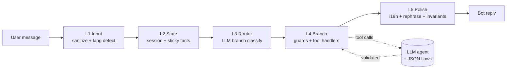

# Ecolaundry Chatbot

LLM-first chatbot per **Ecolaundry** (catena lavanderie self-service). Modulo isolato, caricato dinamicamente da `apps/backend` via `workspace.customChatbotId`. Multi-tenant ready, multilingua (es, ca, en, it, pt, fr).

## Architettura in un colpo d'occhio



- **Deterministic side** estrae fatti enumerabili (location, machineType, displayState, codici) e apre flussi multi-step.
- **LLM side** classifica l'intent in 6 lingue, gestisce le tangenti FAQ, mantiene il dialogo fluido.
- **State transitions atomiche** via [`utils/state-transitions.ts`](utils/state-transitions.ts) — niente mutazioni inline.
- **10 iron rules** documentate in [`CLAUDE.md`](CLAUDE.md), enforced da [`scripts/check-architecture.sh`](scripts/check-architecture.sh).

## Layout

```
custom-ecolaundry/
├── index.ts                 # entrypoint web (chatbotFn) — caricato da custom-client-chatbot.service
├── agent.ts                 # CLI demo (npm run demo)
├── prompts/agent.txt        # system prompt
├── models/                  # type definitions (no runtime)
├── docs/
│   ├── architecture.md      # design completo + 5 layers
│   ├── usecases.md          # 32 scenari customer (la spec)
│   ├── f-log.md             # regression catalogue (F1..F105)
│   ├── contracts.md         # tool validators
│   └── csv/                 # source-of-truth operativa (orari/prezzi/programmi)
├── json/
│   ├── settings.json        # tenant config (lingue, model, SMTP, ...)
│   ├── locations.json       # metadata per locale + faqOverrides
│   ├── i18n/{es,ca,en,it,pt,fr}.json   # catalogo testi (parità enforced)
│   ├── cases.json           # bridge "Caso N" doc ↔ semanticId codice
│   ├── display-flows.json   # flussi alarm/display
│   └── {washer,dryer}_*.json # flussi tecnici per modello macchina
├── utils/
│   ├── intent/              # detector per famiglia (display, payment, faq, ...)
│   ├── agent-extract/       # fact extraction (location, machine, topic-switch)
│   ├── guards/              # 28 guard ordinati (1 per Caso)
│   ├── branches/            # branch handler post-router (faq, loyalty, invoice, ...)
│   ├── tool-handlers/       # tool refuse-or-accept logic
│   ├── output-invariants/   # post-processor checks
│   └── state-transitions.ts # tutte le mutazioni atomiche
└── __tests__/unit/          # 78 file, ~1600 test, no LLM, <1s
```

## Lingue

Sei lingue supportate, parità di chiavi enforced (rule #12):

| Lang | enabledLanguages | Note |
|------|------------------|------|
| es | ✅ default tenant | base canonical |
| ca | ✅ | full |
| en | ✅ | full |
| it / pt / fr | ⏸ disponibili, non attive sul tenant Ecolaundry | full |

Per attivare una lingua: aggiungila a `settings.json:enabledLanguages` — i18n + welcome sono già pronti.

## Settings

`json/settings.json` è la fonte di verità. Campi essenziali:

| Campo | Valore tenant Ecolaundry | Significato |
|-------|--------------------------|-------------|
| `enabledLanguages` | `["es","ca","en"]` | lingue ammesse per le risposte |
| `defaultLanguage` | `"es"` | fallback quando lang detection è incerta |
| `model` | `"openai/gpt-4o-mini"` | OpenRouter model id |
| `agentTemperature` | `0.3` | tono LLM (basso = deterministico) |
| `agentMaxTokens` | `800` | cap risposta singola |
| `maxToolHops` | `6` | iterazioni tool per turn |
| `chatbotName` / `companyName` | `"Eco"` / `"Ecolaundry"` | branding nei prompt |
| `discountCodePrefix` | `"SAU"` | shape codice sconto (`SAU\d{6}\d+`) |
| `historyResetTtlMs` | `3600000` | history drop se gap > 1h |
| `smtp` | gmail + app password | credenziali per email escalation |
| `notificationEmails` | csv operatori | destinatari handoff humano |

Doc completa dei campi: [`docs/settings.md`](docs/settings.md).

## Comandi

```bash
npm run demo             # CLI REPL (richiede OPENROUTER_API_KEY in .env)
npm run demo -- --batch '[["ciao","tengo PUSH PROG"]]'   # scenari programmatici
npm run typecheck        # tsc --noEmit
npm run test:unit        # 78 file, ~1600 test (no LLM, <30s)
bash scripts/check-architecture.sh   # 8 check architetturali (rule 1/3/4/5/9/11/12 + C1)
```

## Integrazione con l'app

L'app principale risolve `workspace.customChatbotId === "ecolaundry"` → carica dinamicamente `custom-ecolaundry/index.ts` via `tsImport` ([custom-client-chatbot.service.ts:255](../src/application/services/custom-client-chatbot.service.ts#L255)). Il modulo espone `chatbotFn` (validato runtime). Nessuna dipendenza npm condivisa — modulo realmente isolato.

## Rules da non dimenticare

1. **No patches in `prompts/agent.txt`** — i bug si fixano in codice (guard, validator, post-processor).
2. **Tool refuses, LLM corrects** — i tool validano args + semantica.
3. **File ≤150 righe** (whitelist con motivazione in `scripts/check-architecture.sh`).
4. **State transitions atomiche** via `utils/state-transitions.ts`.
5. **Ogni detector ha sibling test** (`__tests__/unit/<detector>.test.ts`).
6. **No hardcoded phrase detection per INTENT** — l'LLM gestisce le frasi.
7. **Settings sono legge** — `runtime.ts:validateSettings` blocca fast on misconfig.
8. **Multi-language by design** — copertura es/it/en/ca/pt/fr.
9. **Naming semantico, mai ordinali** — niente `casoN` in codice, bridge via `cases.json`.
10. **Ogni gather ha catch-all + ladder 3-strikes** (`forceLocation` pattern).

Dettagli ed esempi: [`CLAUDE.md`](CLAUDE.md) + [`docs/architecture.md`](docs/architecture.md).
