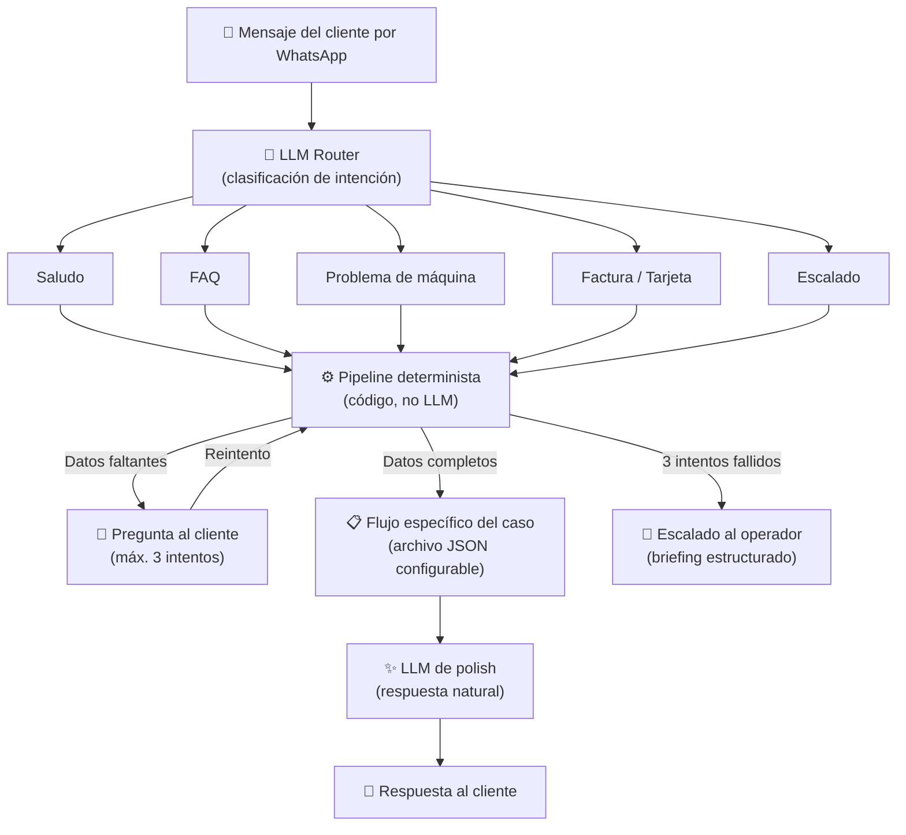

# Chatbot Ecolaundry — Propuesta técnica

## Propuesta

La propuesta consiste en el desarrollo de un asistente virtual conversacional multilingüe en WhatsApp, instalado en el servidor del cliente (on-premise), capaz de gestionar de forma autónoma los principales casos de uso de Ecolaundry:

- Incidencias técnicas (PUSH PROG, DOOR, SEL, AL001, ERR)
- Problemas de pago (doble cobro, cambio no devuelto, códigos de descuento)
- Información operativa (horarios, precios por sede, tarjeta de fidelización, facturas)
- Escalado estructurado al operador humano

---

## Tecnología

| Componente | Tecnología |
|---|---|
| Backend API | Node.js / Express + TypeScript |
| Base de datos | PostgreSQL + Prisma ORM |
| Frontend Back-office | React 18 + Vite |
| Autenticación | JWT + 2FA |
| Integración WhatsApp | Meta Business API |

---

## Arquitectura LLM

La solución utiliza una arquitectura híbrida basada en un **router LLM** que clasifica la intención del cliente y delega cada flujo a una pipeline determinista.

**Modelo AI**: `gpt-4o-mini`

---

## Seguridad

- Los datos de las conversaciones y los números de teléfono de los clientes se almacenan exclusivamente en el servidor del cliente (on-premise).
- La IA no recibe ni procesa datos personales sensibles (datos fiscales, datos de pago).
- Autenticación segura mediante JWT y 2FA TOTP.
- Comunicación cifrada mediante HTTPS/TLS.
- API Rate Limit para protección frente a abusos y ataques automatizados.

---

## Precios

### Costes de desarrollo e instalación

| Concepto | Importe |
|---|---|
| Desarrollo chatbot V1 | **2.500 €** |
| Setup on-premise | **1.000 €** |

### Costes mensuales

| Concepto | Importe |
|---|---|
| Asistencia mensual | **100 €** |
| Consumo de mensajes | **0,05 € / mensaje** |

### Funcionalidades opcionales

| Funcionalidad | Importe |
|---|---|
| Envío y recepción de imágenes / PDF | **1.000 €** |
| Recepción de mensajes de audio | **1.000 €** |
| Traducción automática de mensajes del operador | **1.000 €** |

---

## Roadmap

| Fecha | Hito |
|---|---|
| 07 Jun 2025 | Demo |
| 30 Jun 2025 | Mensajes al operador humano |
| 15 Jul 2025 | Multiidioma (IT, FR, ES, CA, EN) |
| 15 Sep 2025 | Panel de administración |
| 01 Oct 2025 | Integración WhatsApp |
| 15 Oct 2025 | Entrega del código del chatbot |
| 01 Nov 2025 | Setup on-premise |
| 15 Nov 2025 | Go Live |
