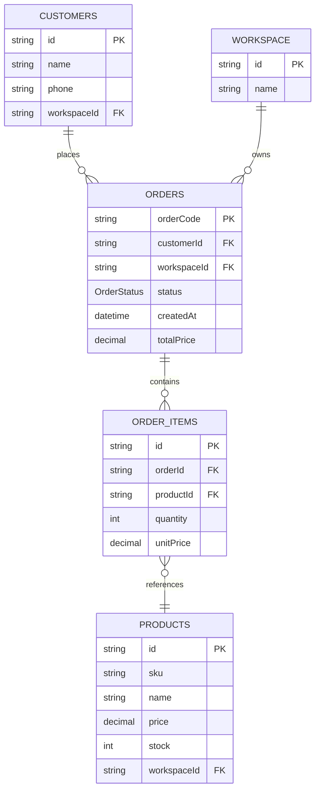

# Data Model: FR-13 Repeat Order with Confirmation Flow

**Feature**: Repeat Order with User Confirmation  
**Date**: 2025-11-12

---

## Entities

### No New Database Entities Required

This feature **REUSES** existing database schema:

- `orders` table (existing)
- `orderItems` table (existing)
- `products` table (existing)
- `agentConfig` table (existing - updated with {{LAST_ORDER}})

---

## Data Structures

### 1. LastOrderSummary (Runtime Variable)

**Purpose**: Formatted order summary for {{LAST_ORDER}} variable replacement

**Structure**:

```typescript
interface LastOrderSummary {
  orderCode: string // e.g., "ORD-2024-001"
  orderDate: string // ISO date: "2024-10-15"
  status: OrderStatus // "DELIVERED" (only completed orders)
  items: OrderItemSummary[]
  totalPrice: number // Calculated sum
  formattedText: string // Markdown for LLM prompt
}

interface OrderItemSummary {
  sku: string // e.g., "A001", "SALUMI-006"
  productName: string // Italian base language from DB
  quantity: number
  unitPrice: number
  lineTotal: number // quantity * unitPrice
}
```

**Example formattedText**:

```markdown
Ultimo ordine: ORD-2024-001 del 15/10/2024

Prodotti ordinati:

- A001 Tagliatelle fresche 500g x4 (3.50€ cad.) = 14.00€
- A002 Salame Toscano x12 (2.80€ cad.) = 33.60€
- A003 Parmigiano Reggiano 24 mesi x1 (12.00€ cad.) = 12.00€

Totale ordine: 59.60€
Stato: CONSEGNATO
```

**Validation Rules**:

- ✅ Only DELIVERED orders (status check)
- ✅ Only customer's own orders (customerId + workspaceId filter)
- ✅ Most recent order (ORDER BY createdAt DESC LIMIT 1)
- ✅ Product names in Italian (base language from products table)

**State Transitions**: N/A (read-only runtime variable)

---

### 2. AddProductsRequest (Calling Function Input)

**Purpose**: Array of products to add from confirmed repeat order

**Structure**:

```typescript
interface AddProductsRequest {
  customerId: string // From execution context
  workspaceId: string // From execution context
  products: ProductToAdd[] // Mapped from LastOrderSummary.items
}

interface ProductToAdd {
  sku: string // From OrderItemSummary.sku
  quantity: number // From OrderItemSummary.quantity
  notes?: string // Optional (e.g., "Da ordine ORD-2024-001")
}
```

**Example**:

```json
{
  "customerId": "cm9hjgq9v00014qk8fsdy4ujv",
  "workspaceId": "cm9hjgq9v00004qk8fsdy4ujv",
  "products": [
    {
      "sku": "A001",
      "quantity": 4,
      "notes": "Da ordine ORD-2024-001"
    },
    {
      "sku": "A002",
      "quantity": 12,
      "notes": "Da ordine ORD-2024-001"
    },
    {
      "sku": "A003",
      "quantity": 1,
      "notes": "Da ordine ORD-2024-001"
    }
  ]
}
```

**Validation Rules**:

- ✅ products array required (min 1 item)
- ✅ sku must exist in products table (workspace-filtered)
- ✅ quantity > 0 and integer
- ✅ Stock availability check (product.stock >= quantity)

---

### 3. CheckoutLinkParams (Link Generation)

**Purpose**: Parameters for generating checkout link with step navigation

**Structure**:

```typescript
interface CheckoutLinkParams {
  token: string // Secure token from SecureTokenService
  workspaceId: string // For URL construction
  step?: number // Optional: 1 (cart) or 2 (address)
}

interface CheckoutLink {
  url: string // Full URL with token + step
  expiresAt: string // ISO timestamp (15 minutes)
}
```

**Example**:

```json
{
  "url": "https://echatbot.example.com/checkout-public?token=eyJhbGc...&step=2",
  "expiresAt": "2024-11-12T15:30:00.000Z"
}
```

**Validation Rules**:

- ✅ token must be valid (not expired, correct HMAC signature)
- ✅ step must be 1 or 2 (default: 1 if omitted)
- ✅ workspaceId must match token payload

---

## Database Queries

### Query 1: Get Last Delivered Order

**Repository**: `OrderRepository.findLastDeliveredOrder()`

**SQL** (Prisma):

```typescript
const lastOrder = await prisma.orders.findFirst({
  where: {
    customerId: customerId,
    workspaceId: workspaceId,
    status: "DELIVERED",
  },
  orderBy: {
    createdAt: "desc",
  },
  include: {
    items: {
      include: {
        product: {
          select: {
            sku: true,
            name: true,
            price: true,
          },
        },
      },
    },
  },
  take: 1,
})
```

**Performance**:

- Index: `(customerId, workspaceId, status, createdAt DESC)`
- Estimated rows: 1 (LIMIT 1)
- Execution time: <50ms

---

### Query 2: Update Agent Config (One-time seed update)

**Purpose**: Add {{LAST_ORDER}} variable to Order Tracking Agent prompt

**SQL** (Prisma):

```typescript
await prisma.agentConfig.update({
  where: {
    agentType_workspaceId: {
      agentType: "ORDER_TRACKING",
      workspaceId: workspaceId,
    },
  },
  data: {
    systemPrompt: {
      // Append to existing prompt:
      // "\n\n## Ultimo Ordine Cliente\n\n{{LAST_ORDER}}"
    },
  },
})
```

**Execution**: Via `npm run seed` (one-time update)

---

## Variable Replacement Logic

### Implementation in PromptProcessorService

**Location**: `/backend/src/services/prompt-processor.service.ts`

**New Method**:

```typescript
async getLastOrderVariable(
  customerId: string,
  workspaceId: string
): Promise<string> {
  // 1. Query last delivered order
  const order = await this.orderRepo.findLastDeliveredOrder(customerId, workspaceId)

  // 2. If no orders, return empty state message
  if (!order) {
    return "Nessun ordine precedente disponibile."
  }

  // 3. Format order summary
  const items = order.items.map(item => {
    const lineTotal = item.quantity * item.unitPrice
    return `- ${item.product.sku} ${item.product.name} x${item.quantity} (${item.unitPrice.toFixed(2)}€ cad.) = ${lineTotal.toFixed(2)}€`
  }).join('\n')

  const totalPrice = order.items.reduce(
    (sum, item) => sum + (item.quantity * item.unitPrice),
    0
  )

  // 4. Return formatted text (Italian base language)
  return `Ultimo ordine: ${order.orderCode} del ${order.createdAt.toISOString().split('T')[0]}

Prodotti ordinati:
${items}

Totale ordine: ${totalPrice.toFixed(2)}€
Stato: ${order.status}`
}
```

**Update replaceAllVariables**:

```typescript
// Add to existing variable replacement logic
if (prompt.includes("{{LAST_ORDER}}")) {
  const lastOrder = await this.getLastOrderVariable(
    context.customerId,
    context.workspaceId
  )
  prompt = prompt.replace(/\{\{LAST_ORDER\}\}/g, lastOrder)
}
```

---

## Relationships



**Key Relationships**:

- One Customer → Many Orders (1:N)
- One Order → Many OrderItems (1:N)
- One Product → Many OrderItems (1:N)
- One Workspace → Many Orders/Products/Customers (1:N)

**Constraints**:

- Orders MUST have workspaceId (workspace isolation)
- OrderItems MUST reference existing productId
- Products MUST have unique sku within workspace

---

## Data Flow

### Repeat Order Confirmation Flow

```
┌─────────────────────────────────────────────────────────────────┐
│                     User Triggers Flow                          │
│          "Voglio ripetere l'ultimo ordine"                      │
└─────────────────────────────────────────────────────────────────┘
                              │
                              ▼
┌─────────────────────────────────────────────────────────────────┐
│              Router LLM → OrderTrackingAgent                    │
└─────────────────────────────────────────────────────────────────┘
                              │
                              ▼
┌─────────────────────────────────────────────────────────────────┐
│          PromptProcessorService.replaceAllVariables()           │
│                                                                 │
│  1. Detect {{LAST_ORDER}} in prompt                            │
│  2. Call getLastOrderVariable(customerId, workspaceId)         │
│  3. Query: orders.findFirst(DELIVERED, DESC createdAt)         │
│  4. Format: Markdown summary (Italian)                         │
│  5. Replace: prompt.replace('{{LAST_ORDER}}', summary)         │
└─────────────────────────────────────────────────────────────────┘
                              │
                              ▼
┌─────────────────────────────────────────────────────────────────┐
│                OrderTrackingAgent Execution                     │
│                                                                 │
│  Prompt now contains:                                          │
│  "Ultimo ordine: ORD-2024-001 del 15/10/2024                  │
│   - A001 Tagliatelle x4 = 14.00€                              │
│   - A002 Salame x12 = 33.60€                                  │
│   Totale: 47.60€"                                             │
└─────────────────────────────────────────────────────────────────┘
                              │
                              ▼
┌─────────────────────────────────────────────────────────────────┐
│             Agent Shows Order + Asks Confirmation               │
│                                                                 │
│  "Ciao Andrea! Il tuo ultimo ordine era ORD-2024-001:         │
│   - 4x Tagliatelle (14€)                                       │
│   - 12x Salame (33.60€)                                        │
│   Tot: 47.60€                                                  │
│                                                                 │
│   Vuoi ripetere l'operazione? 🛒"                             │
└─────────────────────────────────────────────────────────────────┘
                              │
                              ▼
┌─────────────────────────────────────────────────────────────────┐
│                    User Confirms: "SI"                          │
└─────────────────────────────────────────────────────────────────┘
                              │
                              ▼
┌─────────────────────────────────────────────────────────────────┐
│          Agent Recognizes Confirmation in History               │
│          Calls: addProducts([                                   │
│            {sku: "A001", quantity: 4},                  │
│            {sku: "A002", quantity: 12}                  │
│          ])                                                     │
└─────────────────────────────────────────────────────────────────┘
                              │
                              ▼
┌─────────────────────────────────────────────────────────────────┐
│                AddProduct CF Execution                          │
│                                                                 │
│  1. Iterate products array                                     │
│  2. For each: addProductToCart(sku, quantity)          │
│  3. Generate checkout token                                    │
│  4. Build link: linkGenerator.generateCheckoutLink(token, 2)   │
│  5. Return: {cartUrl: "...?token=xxx&step=2", totalAdded: 2}  │
└─────────────────────────────────────────────────────────────────┘
                              │
                              ▼
┌─────────────────────────────────────────────────────────────────┐
│              Agent Returns Checkout Link                        │
│                                                                 │
│  "✅ Ho aggiunto 2 prodotti al carrello!                       │
│   🛒 Procedi al checkout: [LINK]?step=2                       │
│   ⏰ Link valido per 15 minuti"                               │
└─────────────────────────────────────────────────────────────────┘
                              │
                              ▼
┌─────────────────────────────────────────────────────────────────┐
│           User Clicks Link → CheckoutPage (Step 2)             │
│                                                                 │
│  Frontend detects ?step=2 parameter                            │
│  Loads cart items from token                                   │
│  Shows Step 2 (Address) directly (skips Step 1 cart review)    │
└─────────────────────────────────────────────────────────────────┘
```

---

## Validation Rules Summary

| Field       | Required | Type    | Constraints                                       | Error Message                               |
| ----------- | -------- | ------- | ------------------------------------------------- | ------------------------------------------- |
| customerId  | ✅       | UUID    | Must exist in customers table                     | "Cliente non trovato"                       |
| workspaceId | ✅       | UUID    | Must match customer.workspaceId                   | "Workspace non valido"                      |
| orderCode   | ❌       | string  | If provided, must exist                           | "Ordine non trovato"                        |
| sku | ✅       | string  | Must exist in products table (workspace-filtered) | "Prodotto {code} non trovato"               |
| quantity    | ✅       | integer | > 0, <= product.stock                             | "Quantità non valida o stock insufficiente" |
| step        | ❌       | integer | 1 or 2                                            | "Step non valido (usa 1 o 2)"               |
| token       | ✅       | JWT     | Not expired, valid HMAC                           | "Token non valido o scaduto"                |

---

## Performance Considerations

### Database Indexes

**Required Indexes** (already exist):

```sql
-- orders table
CREATE INDEX idx_orders_customer_workspace_status ON orders(customerId, workspaceId, status, createdAt DESC);

-- products table
CREATE INDEX idx_products_code_workspace ON products(sku, workspaceId);

-- cartItems table
CREATE INDEX idx_cartitems_cart_product ON cartItems(cartId, productId);
```

### Query Optimization

- ✅ Use `findFirst()` with LIMIT 1 (not `findMany()` + slice)
- ✅ SELECT only needed fields in product join (not full product object)
- ✅ Cache formatted {{LAST_ORDER}} for 5 minutes (Redis optional)

### Expected Load

- **Variable replacement**: ~50ms (DB query + formatting)
- **AddProduct CF**: ~300ms (N products × 50ms each + link generation)
- **Total flow**: <1s (well under 3s LLM response target)

---

## Next Steps

✅ Data model complete  
⏳ Generate `contracts/` with OpenAPI specs  
⏳ Generate `quickstart.md` with implementation steps  
⏳ Update agent context (if new dependencies added)
