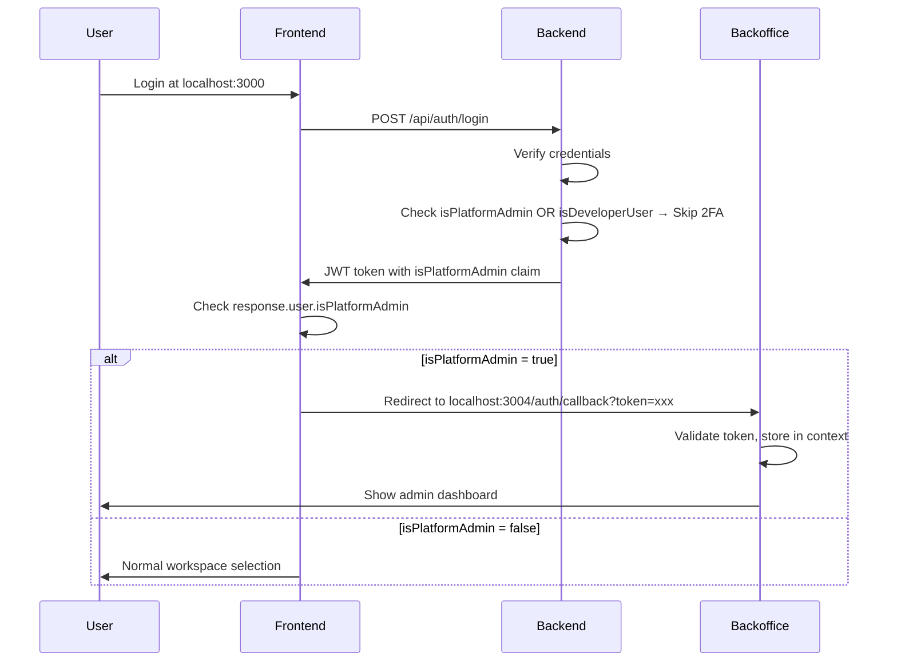

# Feature Specification: Platform Configuration Centralization

**Feature Branch**: `188-platform-config`  
**Created**: 2024-11-29  
**Status**: Draft  
**Input**: User description: "Dynamic platform configuration - centralized pricing, limits, and feature flags from database. All prices and features must be configurable from DB. New pricing: Basic €19 (was €29 - show strikethrough), Premium €39, Enterprise €129. Add canRegister and canLogin flags. When false, show WIP popup and disable chatbot."

## Executive Summary

Centralizzare TUTTA la configurazione della piattaforma in un'unica tabella database `PlatformConfig`. Eliminare l'enum `BillingPrices` e tutti i prezzi hardcoded. Ogni servizio (BE, FE, Scheduler) punta a un'API che restituisce la configurazione corrente.

### Impatto del Refactoring

| Componente | Stato Attuale | Nuovo Stato |
|------------|---------------|-------------|
| Prezzi | Enum `BillingPrices` hardcoded | Tabella `PlatformConfig` |
| Feature Flags | Non esistono | `canRegister`, `canLogin` in DB |
| Frontend | Prezzi duplicati in componenti | API `/api/platform-config` |
| Scheduler | Import diretto enum | Legge da DB via service |
| WhatsApp | No controllo WIP | Risponde con messaggio WIP se `canLogin=false` |

---

## User Scenarios & Testing _(mandatory)_

### User Story 1 - Admin Modifica Prezzi da Database (Priority: P1)

L'amministratore della piattaforma può modificare i prezzi dei piani direttamente dal database. Le modifiche si riflettono immediatamente su frontend senza deploy.

**Why this priority**: Core business - i prezzi sono fondamentali per il revenue

**Independent Test**: Cambiare il prezzo BASIC_MONTHLY da 19 a 25 nel DB, refreshare la pagina pricing del frontend, vedere il nuovo prezzo.

**Acceptance Scenarios**:

1. **Given** prezzo BASIC_MONTHLY = €19 in DB, **When** utente visita pagina pricing, **Then** vede "€19/mese"
2. **Given** prezzo BASIC_MONTHLY cambiato a €25 in DB, **When** utente refresha pagina, **Then** vede "€25/mese"
3. **Given** transazione creata con prezzo €19, **When** prezzo cambia a €25, **Then** transazione storica rimane €19

**360-Degree Validation**:

- [ ] Frontend: Fetch prezzi da API, no hardcoded values
- [ ] Backend API: `/api/platform-config` endpoint pubblico (no auth per pricing)
- [ ] Service Layer: `PlatformConfigService` con caching
- [ ] Repository: Query su `PlatformConfig` table
- [ ] Database: Nuova tabella `PlatformConfig` con chiave-valore
- [ ] Security: Endpoint pricing pubblico, endpoint admin protetto
- [ ] Testing: Unit test per service, integration per API
- [ ] Documentation: Swagger aggiornato

---

### User Story 2 - Visualizzazione Prezzo Scontato con Strikethrough (Priority: P1)

Il frontend mostra il prezzo originale barrato e il nuovo prezzo per evidenziare lo sconto.

**Why this priority**: Marketing - mostrare il risparmio aumenta conversioni

**Independent Test**: Configurare `BASIC_ORIGINAL_PRICE=29` e `BASIC_MONTHLY=19`, vedere "~~€29~~ €19/mese"

**Acceptance Scenarios**:

1. **Given** BASIC_MONTHLY=19 e BASIC_ORIGINAL_PRICE=29, **When** utente vede card pricing, **Then** mostra "~~€29~~ €19/mese"
2. **Given** BASIC_MONTHLY=19 e BASIC_ORIGINAL_PRICE=null, **When** utente vede card, **Then** mostra solo "€19/mese" senza strikethrough
3. **Given** FREE_CREDIT=19 in config, **When** utente vede trial banner, **Then** mostra "€19 di credito omaggio"

---

### User Story 3 - Flag canRegister per Disabilitare Registrazioni (Priority: P2)

L'admin può disabilitare le registrazioni impostando `canRegister=false`. Il bottone "Registrati" viene disabilitato e compare un popup "Lavori in corso".

**Why this priority**: Essenziale per manutenzione e go-live controllato

**Independent Test**: Settare `canRegister=false` nel DB, visitare homepage, vedere bottone disabilitato con popup

**Acceptance Scenarios**:

1. **Given** canRegister=true, **When** utente clicca "Registrati", **Then** procede normalmente
2. **Given** canRegister=false, **When** utente clicca "Registrati", **Then** popup multilingua "Lavori in corso 🚧" con immagine
3. **Given** canRegister=false, **When** utente tenta POST /api/auth/register, **Then** riceve 503 Service Unavailable

---

### User Story 4 - Flag canLogin per Disabilitare Login e Chatbot (Priority: P2)

L'admin può disabilitare login E chatbot WhatsApp impostando `canLogin=false`.

**Why this priority**: Manutenzione completa - blocca tutto durante deploy critici

**Independent Test**: Settare `canLogin=false`, vedere bottone login disabilitato e chatbot risponde con WIP

**Acceptance Scenarios**:

1. **Given** canLogin=true, **When** utente clicca "Login", **Then** procede normalmente
2. **Given** canLogin=false, **When** utente clicca "Login", **Then** popup multilingua "Lavori in corso 🚧"
3. **Given** canLogin=false, **When** cliente scrive su WhatsApp, **Then** chatbot risponde con messaggio WIP dal settings
4. **Given** canLogin=false, **When** utente tenta POST /api/auth/login, **Then** riceve 503 Service Unavailable

---

### User Story 5 - Scheduler Legge Prezzi da DB (Priority: P2)

I cronjob (monthly-billing, campaign-send) leggono i prezzi dalla tabella `PlatformConfig` invece che dall'enum.

**Why this priority**: Consistenza - tutti i servizi usano stessa fonte

**Independent Test**: Modificare PUSH_CAMPAIGN da 1.00 a 0.50, eseguire campaign-send, verificare che addebita €0.50

**Acceptance Scenarios**:

1. **Given** PUSH_CAMPAIGN=0.50 in DB, **When** scheduler invia campagna, **Then** addebita €0.50 per messaggio
2. **Given** BASIC_MONTHLY=19 in DB, **When** monthly-billing esegue, **Then** scala €19 dal credito workspace

---

### User Story 6 - Transazioni Storiche Preservano Prezzi Originali (Priority: P1)

Le transazioni già create mantengono il prezzo al momento della creazione, indipendentemente dai cambi futuri.

**Why this priority**: Integrità finanziaria - non si modifica lo storico

**Independent Test**: Creare transazione con BASIC=29, cambiare a 19, verificare che transazione storica rimane 29

**Acceptance Scenarios**:

1. **Given** transazione del 01/11 con amount=29, **When** prezzo cambia a 19 il 15/11, **Then** transazione mostra sempre €29
2. **Given** billingTransaction.priceAtTime=29, **When** query storico, **Then** priceAtTime non cambia mai

---

### Edge Cases

- **Config mancante**: Se una chiave non esiste in DB, usare default hardcoded e loggare warning
- **Cache stale**: Cache config per 5 minuti, invalidare su update admin
- **Migrazione dati**: Seed popola tabella con valori attuali dall'enum
- **Rollback**: Se canLogin passa da false a true, chatbot riprende normalmente
- **Concorrenza**: Due admin modificano contemporaneamente → last-write-wins con timestamp

---

## Requirements _(mandatory)_

### Functional Requirements

**Database & API**

- **FR-001**: Sistema DEVE avere tabella `PlatformConfig` con struttura chiave-valore tipizzata
- **FR-002**: Sistema DEVE esporre endpoint `GET /api/platform-config` pubblico per pricing
- **FR-003**: Sistema DEVE esporre endpoint `GET /api/admin/platform-config` protetto per admin
- **FR-004**: Sistema DEVE esporre endpoint `PUT /api/admin/platform-config/:key` per modifiche
- **FR-005**: Backend DEVE eliminare enum `BillingPrices` e usare solo DB

**Pricing**

- **FR-006**: Frontend DEVE mostrare prezzi con strikethrough se `originalPrice` è definito
- **FR-007**: FREE_CREDIT DEVE essere configurabile (default: €19, era €29)
- **FR-008**: Nuovi prezzi: BASIC=€19, PREMIUM=€39, ENTERPRISE=€129
- **FR-009**: Prezzi usage: MESSAGE=€0.10, PUSH_CAMPAIGN=€1.00 (invariati ma da DB)

**Feature Flags**

- **FR-010**: Flag `canRegister` DEVE controllare bottone registrazione e API
- **FR-011**: Flag `canLogin` DEVE controllare bottone login, API, E chatbot WhatsApp
- **FR-012**: Popup WIP DEVE essere multilingua (IT, EN, ES, PT) con immagine
- **FR-013**: Quando `canLogin=false`, chatbot DEVE rispondere con messaggio WIP da workspace settings

**Scheduler**

- **FR-014**: `monthly-billing.job` DEVE leggere prezzi piani da `PlatformConfig`
- **FR-015**: `campaign-send.job` DEVE leggere PUSH_CAMPAIGN da `PlatformConfig`
- **FR-016**: `whatsapp-challenge-queue.job` DEVE controllare `canLogin` prima di processare

**Storico**

- **FR-017**: `BillingTransaction.priceAtTime` DEVE essere immutabile dopo creazione
- **FR-018**: Ogni transazione DEVE salvare il prezzo al momento della creazione

### Key Entities

- **PlatformConfig**: Configurazione globale piattaforma
  - `key` (string, unique): Identificatore config (es. "BASIC_MONTHLY", "canLogin")
  - `value` (string): Valore (convertito a number/boolean in runtime)
  - `type` (enum): PRICE, FEATURE_FLAG, LIMIT
  - `description` (string): Descrizione per admin UI
  - `originalValue` (string, nullable): Valore originale per strikethrough
  - `updatedAt` (datetime): Ultimo aggiornamento
  - `updatedBy` (string, nullable): ID utente che ha modificato

- **BillingTransaction** (esistente, verificare):
  - Campo `amount` GIÀ salva il prezzo al momento della creazione ✅
  - Non serve modifica, già immutabile

---

## Success Criteria _(mandatory)_

### Measurable Outcomes

- **SC-001**: 100% dei prezzi mostrati provengono da API, zero hardcoded nel frontend
- **SC-002**: Cambio prezzo in DB si riflette nel frontend entro 5 minuti (cache TTL)
- **SC-003**: 100% delle transazioni storiche mantengono prezzo originale dopo cambio
- **SC-004**: Popup WIP compare in <200ms quando flag è false
- **SC-005**: Chatbot risponde con WIP in <2 secondi quando `canLogin=false`
- **SC-006**: Zero errori di tipo "price undefined" nei log dopo migrazione

---

## Assumptions

1. **Migrazione non-breaking**: I valori iniziali in `PlatformConfig` saranno identici all'enum attuale
2. **Single source**: Dopo migrazione, enum `BillingPrices` viene eliminato completamente
3. **Cache strategy**: 5 minuti TTL è accettabile per propagazione cambi prezzo
4. **Popup design**: Immagine WIP sarà un'icona/illustrazione generica (non custom design)
5. **Admin UI**: Per ora modifica via DB diretto o Prisma Studio, UI admin futura

---

## Technical Notes (for implementation)

### Nuova Struttura Prezzi

| Key | Type | Value | Original | Description |
|-----|------|-------|----------|-------------|
| BASIC_MONTHLY | PRICE | 19.00 | 29.00 | Piano Base mensile |
| PREMIUM_MONTHLY | PRICE | 39.00 | 49.00 | Piano Premium mensile |
| ENTERPRISE_MONTHLY | PRICE | 129.00 | 149.00 | Piano Enterprise mensile |
| FREE_CREDIT | PRICE | 19.00 | 29.00 | Credito omaggio trial |
| MESSAGE | PRICE | 0.10 | null | Costo messaggio AI |
| PUSH_CAMPAIGN | PRICE | 1.00 | null | Costo push campaign |
| WELCOME_MESSAGE | PRICE | 1.00 | null | Costo welcome message |
| canRegister | FLAG | true | null | Abilita registrazioni |
| canLogin | FLAG | true | null | Abilita login e chatbot |

### File da Modificare/Creare

**Backend** (`apps/backend/`):
- ❌ DELETE: `src/domain/enums/billing-prices.enum.ts`
- ✅ CREATE: `src/application/services/platform-config.service.ts`
- ✅ CREATE: `src/interfaces/http/controllers/platform-config.controller.ts`
- ✅ CREATE: `src/interfaces/http/routes/platform-config.routes.ts`
- ✅ UPDATE: `push-messaging.service.ts` → usa PlatformConfigService
- ✅ UPDATE: `whatsapp-webhook.controller.ts` → usa PlatformConfigService
- ✅ UPDATE: `auth.routes.ts` → check canLogin/canRegister

**Frontend** (`apps/frontend/`):
- ✅ UPDATE: Pagina pricing → fetch da API
- ✅ UPDATE: Login/Register buttons → check flags
- ✅ CREATE: `components/shared/WIPModal.tsx` multilingua
- ✅ CREATE: `services/platformConfigApi.ts`
- ✅ CREATE: `hooks/usePlatformConfig.ts`

**Database** (`packages/database/`):
- ✅ CREATE: Migration per tabella `PlatformConfig`
- ✅ UPDATE: Seed con valori iniziali

**Scheduler** (`apps/scheduler/`):
- ✅ CREATE: `services/platform-config.service.ts`
- ✅ UPDATE: `monthly-billing.job.ts` → usa service
- ✅ UPDATE: `campaign-send.job.ts` → usa service
- ✅ UPDATE: `whatsapp-challenge-queue.job.ts` → check canLogin

---

## Testing Requirements

### Backend Unit Tests (`apps/backend/__tests__/unit/`)

| Test File | Cosa Testa |
|-----------|------------|
| `platform-config.service.spec.ts` | Service caching, getPrice(), getFlag(), fallback defaults |
| `platform-config.controller.spec.ts` | API endpoints, auth, validation |
| `push-messaging-pricing.spec.ts` | Prezzi da DB invece che enum |
| `auth-feature-flags.spec.ts` | canLogin/canRegister blocking |

**Test Cases Essenziali**:
- ✅ `getPrice('BASIC_MONTHLY')` returns €19 from DB
- ✅ `getPrice('UNKNOWN_KEY')` returns default + logs warning
- ✅ `getFlag('canLogin')` returns boolean correctly
- ✅ Cache invalidation after 5 minutes
- ✅ `POST /auth/login` returns 503 when `canLogin=false`
- ✅ `POST /auth/register` returns 503 when `canRegister=false`
- ✅ Billing uses `priceAtTime` from DB, not enum

### Frontend Unit Tests (`apps/frontend/src/__tests__/`)

| Test File | Cosa Testa |
|-----------|------------|
| `usePlatformConfig.spec.ts` | Hook fetch, caching, error handling |
| `WIPModal.spec.tsx` | Render multilingua, immagine, chiusura |
| `PricingCard.spec.tsx` | Strikethrough quando originalPrice presente |
| `LoginButton.spec.tsx` | Disabled + modal quando canLogin=false |
| `RegisterButton.spec.tsx` | Disabled + modal quando canRegister=false |

**Test Cases Essenziali**:
- ✅ Pricing card shows "~~€29~~ €19" with strikethrough
- ✅ Pricing card shows "€19" without strikethrough when no originalPrice
- ✅ WIP modal renders in IT/EN/ES/PT based on user language
- ✅ Login button disabled when `canLogin=false`
- ✅ Register button disabled when `canRegister=false`
- ✅ Click on disabled button opens WIP modal
- ✅ Hook handles API error gracefully with fallback

### Scheduler Unit Tests (`apps/scheduler/__tests__/`)

| Test File | Cosa Testa |
|-----------|------------|
| `platform-config.service.spec.ts` | Service reads from DB correctly |
| `monthly-billing-pricing.spec.ts` | Uses DB prices for billing |
| `campaign-send-pricing.spec.ts` | Uses PUSH_CAMPAIGN from DB |
| `whatsapp-queue-canlogin.spec.ts` | Skips processing when canLogin=false |

**Test Cases Essenziali**:
- ✅ `monthly-billing` charges €19 for BASIC (not hardcoded €29)
- ✅ `campaign-send` charges €1.00 per push from DB
- ✅ `whatsapp-queue` sends WIP message when `canLogin=false`
- ✅ Service falls back to defaults when DB unavailable

### Integration Tests

| Test | Cosa Verifica |
|------|---------------|
| `GET /api/platform-config` | Returns all public pricing |
| `GET /api/admin/platform-config` | Requires auth, returns all config |
| `PUT /api/admin/platform-config/:key` | Updates value, invalidates cache |
| Price change flow | Change in DB → API returns new value → FE shows new price |

---

## Security: Backoffice Authentication (Added 2024-11-29)

### Overview

Il backoffice usa autenticazione JWT reale tramite redirect dal frontend, NON più autenticazione client-side fake.

### User Flags

| Flag | Tipo | Scopo |
|------|------|-------|
| `isPlatformAdmin` | Boolean | Accesso al backoffice admin |
| `isDeveloperUser` | Boolean | Skip 2FA per sviluppatori |

### Authentication Flow



### Security Requirements

- **SEC-001**: Backoffice NON ha login page - accesso solo tramite redirect FE
- **SEC-002**: JWT deve contenere claim `isPlatformAdmin: true` per accesso
- **SEC-003**: `platformAdminMiddleware` verifica il claim su tutte le route admin
- **SEC-004**: `isDeveloperUser` permette skip 2FA ma NON accesso backoffice
- **SEC-005**: Se token mancante/invalido → redirect a AccessDeniedPage

### Files Created/Modified

**Backend**:
- `src/interfaces/http/middlewares/platform-admin.middleware.ts` - Verifica isPlatformAdmin
- `src/interfaces/http/routes/user-admin.routes.ts` - API per gestione utenti
- `src/interfaces/http/controllers/auth.controller.ts` - Skip 2FA, include flags in JWT
- `src/application/services/auth.service.ts` - Include flags in generateToken()

**Frontend**:
- `src/pages/LoginPage.tsx` - Redirect isPlatformAdmin a backoffice

**Backoffice**:
- `src/pages/AuthCallbackPage.tsx` - Riceve token da redirect
- `src/pages/AccessDeniedPage.tsx` - Mostrata quando non autenticato
- `src/pages/ClientsPage.tsx` - UI per gestione permessi utenti
- Rimosso: `LoginPage.tsx`

**Database**:
- `User.isPlatformAdmin` - Boolean default false
- `User.isDeveloperUser` - Boolean default false
- Seed: `gelsogrove@gmail.com` con entrambi true

### Unit Tests

File: `__tests__/unit/platform-admin.spec.ts`

| Test Case | Descrizione |
|-----------|-------------|
| Deny access when not authenticated | 401 se user null |
| Deny access when not platform admin | 403 se isPlatformAdmin false |
| Allow access when platform admin | next() se isPlatformAdmin true |
| Skip 2FA for isPlatformAdmin | Login completo senza 2FA |
| Skip 2FA for isDeveloperUser | Login completo senza 2FA |
| Require 2FA for normal users | 2FA richiesto se enabled |
| JWT contains isPlatformAdmin | Token include il claim |
| JWT contains isDeveloperUser | Token include il claim |

```