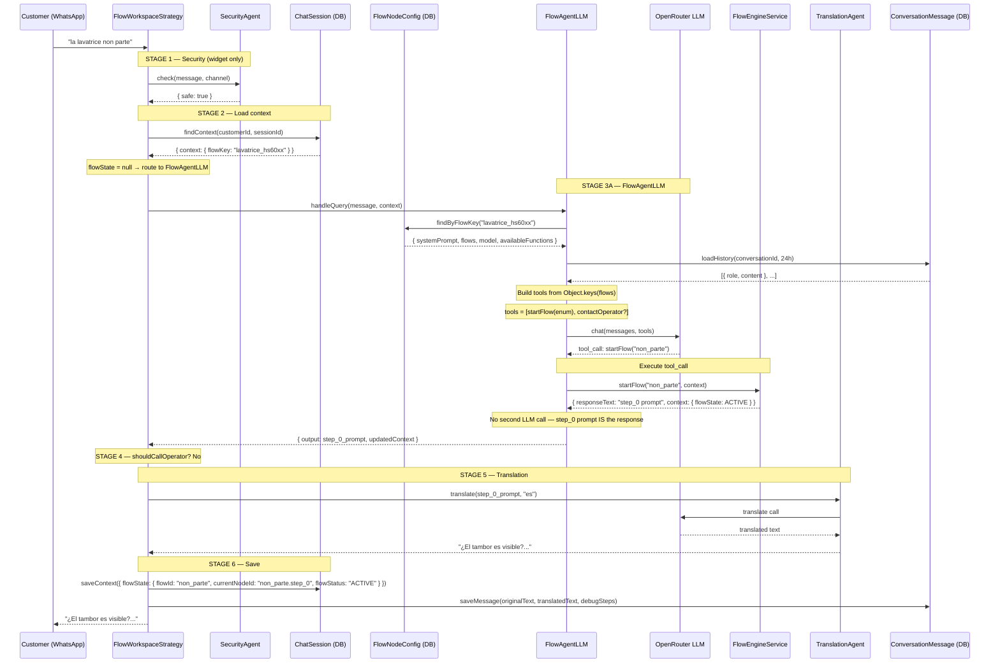

# Message Pipeline — ChannelMode.FLOW

## Overview

Every inbound message from a FLOW workspace goes through exactly **6 stages**.
The pipeline is implemented in `FlowWorkspaceStrategy.route()`.

```
Inbound message
       │
  ─────▼─────────────────────────────────────────────────────────
  STAGE 1  SecurityAgent         (widget channel ONLY)
  ─────────────────────────────────────────────────────────────────
       │
  ─────▼─────────────────────────────────────────────────────────
  STAGE 2  Context load          (ChatSession.context from DB)
  ─────────────────────────────────────────────────────────────────
       │
  ─────▼─────────────────────────────────────────────────────────
  STAGE 3  Route decide
           ┌─────────────────────────────────────────────────────┐
           │ QR trigger?   → load config, save flowKey, welcome  │
           │ flowActive?   → FlowEngineService.handleMessage()   │
           │ else          → FlowAgentLLM.handleQuery()          │
           └─────────────────────────────────────────────────────┘
  ─────────────────────────────────────────────────────────────────
       │
  ─────▼─────────────────────────────────────────────────────────
  STAGE 4  Post-processing
           shouldCallOperator? → contactOperator()
  ─────────────────────────────────────────────────────────────────
       │
  ─────▼─────────────────────────────────────────────────────────
  STAGE 5  TranslationAgent     (detects customerLanguage, translates)
  ─────────────────────────────────────────────────────────────────
       │
  ─────▼─────────────────────────────────────────────────────────
  STAGE 6  Save + Return        (ChatSession.context, ConversationMessage)
  ─────────────────────────────────────────────────────────────────
       │
  Outbound response
```

---

## Path A — FlowEngine (flow already active)

This is the **hot path** — runs deterministically without any LLM call.

```
Customer: "1"
    │
    ▼
FlowWorkspaceStrategy
    │ read ChatSession.context.flowState
    │ flowState.flowStatus === "ACTIVE"  ──YES──▶  FlowEngineService.handleMessage("1", context)
    │                                                       │
    │                                               classifyInput("1") → MATCH
    │                                                       │
    │                                               node = resolveNode(state.currentNodeId)
    │                                               // e.g. "non_parte.entry" → CHOICE node
    │                                                       │
    │                                               applyTransition("1", node, state)
    │                                               // transitions["1"] → "non_parte.caso_sel"
    │                                                       │
    │                                               nextNode = resolveNode("non_parte.caso_sel")
    │                                               state.currentNodeId = "non_parte.caso_sel"
    │                                                       │
    │                                               return FlowStepResult {
    │                                                 responseText: nextNode.prompt,
    │                                                 nextNodeId: "non_parte.caso_sel",
    │                                                 flowStatus: "ACTIVE",
    │                                                 shouldCallOperator: false
    │                                               }
    │
    ▼
TranslationAgent(responseText, customerLanguage)
    │  // if customer speaks Spanish → translate prompt
    ▼
Save ChatSession.context (updated flowState)
    ▼
Return translated response to customer
```

**Key point**: The `responseText` coming out of FlowEngineService is **already the full formatted message** — it is `node.prompt` which is pre-written by the admin in the FlowNodeConfig editor. **No extra LLM call is needed for formatting**.

---

## Path B — FlowAgentLLM → startFlow tool call

```
Customer: "the machine doesn't start"
    │
    ▼
FlowWorkspaceStrategy
    │ flowState is null or not ACTIVE
    │
    ▼
FlowAgentLLM.handleQuery(input, context)
    │
    │  1. Load FlowNodeConfig from DB by flowKey
    │     → { systemPrompt, model, temperature, flows, availableFunctions }
    │
    │  2. Build conversation history
    │     ConversationManager.loadHistory(conversationId, 24h)
    │     → [ {role:"user", content:"..."}, {role:"assistant", content:"..."}, ... ]
    │
    │  3. Build messages array for LLM:
    │     [
    │       { role: "system",    content: FlowNodeConfig.systemPrompt },
    │       { role: "user",      content: history[0] },
    │       { role: "assistant", content: history[1] },
    │       ...
    │       { role: "user",      content: currentMessage }  ← always last
    │     ]
    │
    │  4. Build tools (dynamic, from FlowNodeConfig):
    │     [
    │       {
    │         name: "startFlow",
    │         parameters: {
    │           flowId: { enum: ["non_parte", "errore_alm", "lavaggio_problema"] }
    │           // enum built from Object.keys(FlowNodeConfig.flows) — NEVER hardcoded
    │         }
    │       },
    │       {
    │         name: "contactOperator"             // ONLY if "contactOperator" in availableFunctions
    │       }
    │     ]
    │
    │  5. First LLM call → tool_call: { name: "startFlow", arguments: { flowId: "non_parte" } }
    │
    │  6. Execute tool call:
    │     FlowEngineService.startFlow("non_parte", context)
    │     → { responseText: step_0_prompt, context: updatedContext }
    │     //  responseText = "Is the drum visible? What do you see on the display?..."
    │
    │  7. ⚠️ NO SECOND LLM CALL NEEDED
    │     The step_0 prompt from FlowEngine IS the response.
    │     (It's a pre-written, admin-crafted message — not raw data)
    │
    │  return {
    │    output:            step_0_prompt,
    │    toolCallMade:      { name: "startFlow", flowId: "non_parte" },
    │    updatedContext:    context,  // flowState is now ACTIVE
    │    tokensUsed:        N,
    │    executionTimeMs:   N
    │  }
    │
    ▼
FlowWorkspaceStrategy receives result
    │  context.flowState = { flowId: "non_parte", currentNodeId: "non_parte.step_0", flowStatus: "ACTIVE", ... }
    ▼
TranslationAgent(step_0_prompt, customerLanguage)
    ▼
Save ChatSession.context
    ▼
Return translated step_0 to customer
```

---

## Path C — FlowAgentLLM → direct text (FAQ / general answer)

```
Customer: "what are your opening hours?"
    │
    ▼
FlowAgentLLM (same steps 1–5 as Path B)
    │
    │  5. First LLM call → text response: "Our support is available Mon–Fri 9am–6pm"
    │     (no tool call — LLM answered directly from systemPrompt knowledge)
    │
    │  return {
    │    output:          "Our support is available Mon–Fri 9am–6pm",
    │    toolCallMade:    null,
    │    updatedContext:  context unchanged,  // flowState stays null
    │    tokensUsed:      N
    │  }
    │
    ▼
TranslationAgent(output, customerLanguage)
    ▼
Return to customer (no flow started)
```

---

## Path D — QR Code trigger

```
Customer scans QR code on back of washing machine
QR sends: "START_FLOW_2_lavatrice_hs60xx"
    │
    ▼
FlowWorkspaceStrategy
    │  isQrTrigger("START_FLOW_2_lavatrice_hs60xx") → true
    │
    │  flowKey = extractFlowKey("START_FLOW_2_lavatrice_hs60xx")
    │  // regex: /^START_FLOW_\d+_(.+)$/ → "lavatrice_hs60xx"
    │
    │  config = await FlowNodeConfigRepository.findByFlowKey(workspaceId, "lavatrice_hs60xx")
    │  // throws if not found — no fallback
    │
    │  context = { flowKey: "lavatrice_hs60xx" }
    │  Save to ChatSession.context
    │
    │  welcomeText = `Hi! 👋 I'm the assistant for ${config.flowLabel}.
    │                 How can I help you today?`
    │
    ▼
TranslationAgent(welcomeText, customerLanguage)
    ▼
No flow started yet — waiting for customer to describe their problem
```

**Note**: The QR welcome response does NOT start a flow immediately. It just identifies the flow config. The customer's next message goes to FlowAgentLLM which then decides which flow to start.

---

## Path E — Escalation (shouldCallOperator)

```
FlowEngineService returns shouldCallOperator: true
    │  (happens when: HARD_BREAK input, or interruptCount >= INTERRUPT_HARD_LIMIT,
    │   or customer reaches a "handle_escalate" terminal node)
    │
    ▼
FlowWorkspaceStrategy
    │  if (result.shouldCallOperator) {
    │    await contactOperator(workspaceId, customerId, context, conversationHistory)
    │    // sends email to workspace.operatorEmail with AI-generated 1-sentence summary
    │  }
    │
    ▼
responseText already set by FlowEngine: "I'm connecting you with an operator 👍"
    ▼
TranslationAgent → translate
    ▼
Return to customer
```

---

## SecurityAgent integration (widget only)

```
Channel === "widget"?
    │ YES → SecurityAgent.check(message)
    │         {
    │           safe: true/false,
    │           blockedReason?: string
    │         }
    │         if !safe → return { blocked: true, response: "⚠️ I can't help with that." }
    │
    │ NO  → skip (WhatsApp messages skip security check)
    │
    ▼
Continue to Stage 2
```

SecurityAgent is at the **INPUT** — it checks what the customer sends, not what the bot responds. It runs before any routing decision.

---

## ConversationHistory integration

**Where history is used**: Only inside `FlowAgentLLM` (Path B and C). FlowEngineService does NOT use history — it is deterministic.

```
FlowAgentLLM.handleQuery()
    │
    │  ConversationManager.loadHistory(conversationId, windowHours=24)
    │  → last 24h of messages for this session from conversation_messages table
    │
    │  Injected as messages array into the SINGLE LLM call:
    │  [ system, user, assistant, user, assistant, ..., currentUser ]
    │
    │  ⚠️ This is NOT a separate "history LLM" — it's just the messages array
    │     that every LLM call receives. Same pattern as all other agents.
```

---

## TranslationAgent integration

**Called on output of BOTH paths** (FlowEngine output and FlowAgentLLM output).

```
FlowWorkspaceStrategy (after getting responseText from either path):
    │
    │  const translated = await TranslationAgent.translate({
    │    text:             responseText,
    │    targetLanguage:   customer.language,  // "es", "pt", "en", "it"
    │    sourceLanguage:   "en"                // all prompts authored in English
    │  })
    │
    │  return translated.text
```

TranslationAgent makes its **own separate LLM call** (small, fast — `gpt-4o-mini`).
It is NOT the same call as FlowAgentLLM.

---

## Sequence Diagram — Full Path B



---

## Data flowing through the pipeline

```
INPUT:  "la lavatrice non parte"
        workspaceId: "ws_abc"
        customerId:  "cust_123"
        channel:     "whatsapp"
        sessionId:   "sess_xyz"

STAGE 1: SecurityAgent skipped (not widget)

STAGE 2: ChatSession.context = {
           flowKey: "lavatrice_hs60xx"
           flowState: null
         }

STAGE 3 (FlowAgentLLM):
  FlowNodeConfig loaded: {
    flowKey:      "lavatrice_hs60xx",
    model:        "openai/gpt-4o-mini",
    temperature:  0.3,
    systemPrompt: "You are a troubleshooting assistant for the HS-60XX washer...",
    flows: {
      "non_parte":         { step_0: {...}, caso_sel: {...}, ... },
      "errore_alm":        { step_0: {...}, ... },
      "lavaggio_problema": { step_0: {...}, ... }
    },
    availableFunctions: ["contactOperator"]
  }

  LLM called with:
    model:        "openai/gpt-4o-mini"
    temperature:  0.3
    messages:     [system, ...history, userMessage]
    tools:        [startFlow(enum: ["non_parte","errore_alm","lavaggio_problema"]), contactOperator]

  LLM responds:  tool_call startFlow("non_parte")

  FlowEngine returns:
    responseText: "Is the door closed? Check that the door is properly..."
    context.flowState: {
      flowId:         "non_parte",
      currentNodeId:  "non_parte.step_0",
      flowStatus:     "ACTIVE",
      interruptCount: 0,
      lastValidStepAt: "2026-04-15T09:00:00.000Z"
    }

STAGE 5 (TranslationAgent):
  source language: en
  target language: it (customer.language)
  translated:      "Il cestello è visibile? Verifica che lo sportello sia..."

STAGE 6 (Save):
  ChatSession.context updated with flowState
  ConversationMessage saved with debugSteps array

OUTPUT: "Il cestello è visibile? Verifica che lo sportello sia..."
```
