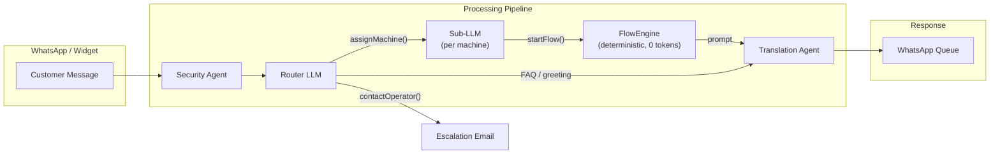

# Ecolaundry FLOW Chatbot — Documentation Index

> **Workspace**: Ecolaundry (FLOW type)
> **Pipeline**: Router LLM → Sub-LLM → FlowEngine (deterministic)
> **Source of truth**: [`achitecture.md`](achitecture.md)

---

## System Overview

## Three Paths

| Path | When | LLM tokens | Engine |
|------|------|------------|--------|
| **A** — Active Flow | `flowState = ACTIVE` | 0 | `FlowEngineService` (deterministic JSON) |
| **B** — Sub-LLM | `flowKey` set, no active flow | ~500 | `FlowAgentLLM` (classifies → startFlow) |
| **C** — Router | No `flowKey`, no active flow | ~2400 | Router LLM (collects locale/type/number) |

## Machines

| flowKey | Model | Programs | Flows |
|---------|-------|----------|-------|
| `lavatrice_hs60xx` | Washer HS-60XX (8 kg) | 60° Molt Calent, 40° Calent, 30° Temperat, Fred | `no_parte`, `post_ciclo`, `stop_error` |
| `asciugatrice_ed340` | Dryer ED-340 (15 kg) | 80° Tª Alta, 65° Tª Mitja, 50° Tª Baixa | `no_parte`, `post_ciclo` |

## Locations

| Locale | Hours | Loyalty Card | TPV | Notes |
|--------|-------|-------------|-----|-------|
| **Goya** | 8–22 | Yes (€7) | €7 | Button central; check dryer lint filter |
| **Pineda** | 8–22 | Yes (€8) | €8 | Button central; dryer credit anomaly → escalate |
| **L'Escala** | 7–23 | No | ? | Open location; may auto-activate |
| **Alemanya** | 8–22 | Yes | ? | Dryer credit → escalate; card issues |
| **Hortes** | 8–22 | Yes | ? | Card payment issues possible |

## Documentation Files

### Architecture & Design
| File | Description |
|------|-------------|
| [`achitecture.md`](achitecture.md) | **Source of truth** — Full pipeline, 3 paths, 22 scenarios, state management, DB config |
| [`flow1-router.md`](flow1-router.md) | Router decision matrix, FAQ intents, escalation rules |
| [`flow2-laundry.md`](flow2-laundry.md) | Washer deterministic flow (mermaid + rules) |
| [`flow3-asciugatrice.md`](flow3-asciugatrice.md) | Dryer deterministic flow (mermaid + rules) |
| [`variables.md`](variables.md) | Workspace settings & template variables reference |

### Flow JSON Configurations (loaded into FlowNodeConfig DB table)
| File | flowKey | Flows | Nodes |
|------|---------|-------|-------|
| [`01_secadora.json`](01_secadora.json) | `asciugatrice_ed340` | `no_parte`, `post_ciclo` | ~50 |
| [`02_lavatrice.json`](02_lavatrice.json) | `lavatrice_hs60xx` | `no_parte`, `post_ciclo`, `stop_error` | ~60 |

### Historical
| File | Description |
|------|-------------|
| [`demo.md`](demo.md) | Original demo email to Olga (project start narrative) |

## Prompts (in production DB, source in seed.ts)

| Component | Where | Description |
|-----------|-------|-------------|
| **Router** | `FlowNodeConfig` (flowKey=`router`) | Collects locale → type → number → `assignMachine()` |
| **Sub-LLM** | `FlowNodeConfig.systemPrompt` | Per-machine prompt with MACHINE SPECS + business rules + `startFlow()` |
| **Router Template** | `apps/backend/src/templates/flow/00-router.template.md` | Default template applied on "Reset default prompts" |

### Prompt Variables (Router template)

| Variable | Source |
|----------|--------|
| `{{chatbotName}}` | Workspace settings |
| `{{toneOfVoice}}` | Workspace settings |
| `{{companyName}}` | Workspace settings |
| `{{welcomeMessage}}` | Workspace settings |
| `{{faqs}}` | FAQ table (workspace-filtered) |

## Calling Functions

| Function | Type | Description |
|----------|------|-------------|
| `contactOperator` | CALLING_FUNCTION | Sends email to operator, sets ESCALATED state |
| `changeLanguage` | INTERNAL | Changes customer language preference |
| `assignMachine` | DELEGATE_TO_AGENT | Routes to Sub-LLM (flowKey + machineNumber) |
| `startFlow` | INTERNAL | Starts deterministic flow in FlowEngine |

## Key Principles

1. **One question per turn** — never ask multiple questions
2. **Payment check always first** — `step_0` of every `no_parte` flow
3. **No automatic compensation** — operator decides case by case
4. **No fraud accusations** — "we need to verify manually"
5. **Deterministic flows = 0 LLM tokens** — JSON transitions only
6. **Escalation = contactOperator()** — email + ESCALATED state
7. **All text in English** — TranslationAgent handles i18n output
