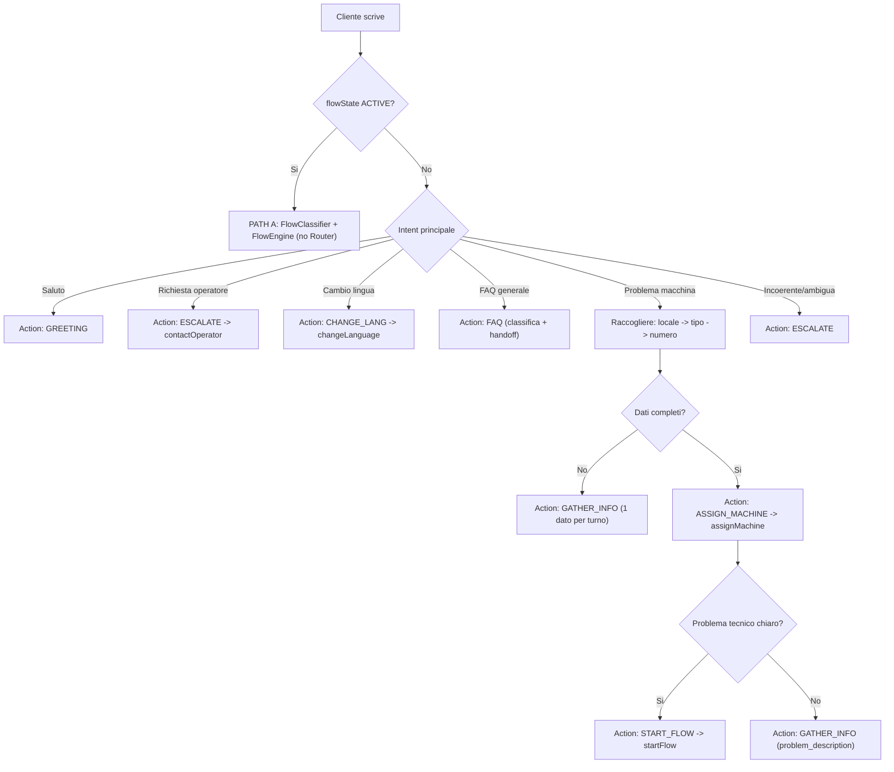

# Flow 1 — Router (Fonte di Verità: `achitecture.md`)

## Scopo

Questo documento definisce solo la logica di routing per i messaggi fuori dal flow deterministico.

- PATH A (flow attivo): NON usa Router LLM, usa `FlowClassifierService` + `FlowEngineService`.
- PATH B/C: usa `FlowAgentLLM` in modalita router/sub-router per decidere azioni.

## Regole hard

- Il Router decide, non improvvisa policy.
- Una domanda per volta.
- Niente accuse di frode.
- Nessuna compensazione promessa automaticamente.
- Se il caso e ambiguo o richiede validazione: `contactOperator`.
- Resume UX: quando un flow in PAUSA riprende, il sistema deve rimandare `currentNode.prompt` prima di chiedere nuovo input.

## Dati minimi da raccogliere

- `locale`
- `machine_type` (lavatrice o asciugatrice)
- `machine_number`
- `problem_description`

## Calling functions

- `assignMachine(flowKey, machineNumber)`
- `startFlow(flowId)`
- `contactOperator(reason)`
- `changeLanguage(lang)`

## Decision Matrix

| Action | Quando | Next step |
|---|---|---|
| `GREETING` | Primo messaggio/saluto | Risposta breve di apertura |
| `GATHER_INFO` | Mancano dati minimi macchina | Chiedere solo il dato mancante |
| `ASSIGN_MACHINE` | Tipo + numero disponibili | `assignMachine()` |
| `START_FLOW` | Problema macchina chiaro con flowKey assegnato | `startFlow()` |
| `FAQ` | Richiesta info generale (refund/fattura/carta/orari/prezzi) | Handoff alla risposta knowledge base |
| `ESCALATE` | Caso incoerente, cliente arrabbiato, caso non riconosciuto | `contactOperator()` |
| `CHANGE_LANG` | Richiesta cambio lingua | `changeLanguage()` |

## FAQ intents (classificazione, non risposta nel Router)

Allineati al Playbook:

- `DOUBLE_CHARGE` (5.3)
- `PAID_NOT_ACTIVATED` (5.4)
- `AL001` (5.5)
- `COMPENSATION_CODE` (5.6)
- `REFUND` (5.7)
- `INVOICE` (5.8)
- `LOYALTY_CARD` (5.9)
- `HOURS_PRICES_LOCAL_DIFFS` (5.10)

## Escalation immediata (Playbook §6 + §10)

- cliente molto arrabbiato
- contraddizioni in importo/racconto
- errore non mappato
- attivazione manuale necessaria
- decisione su compensazione
- sospetta incoerenza/frode
- codice errato/nuovo codice richiesto
- incidente con telecamere/AJAX
- caso sospetto Goya/Pineda: addebito dataphone 10 EUR

## Flowchart Router

## Note allineamento

- Le risposte FAQ complete sono gestite dalla voce conversazionale (`FlowAgentLLM` con knowledge), non dalla parte decisionale del Router.
- Durante flow attivo, il routing semantico non deve interferire con il deterministico.
