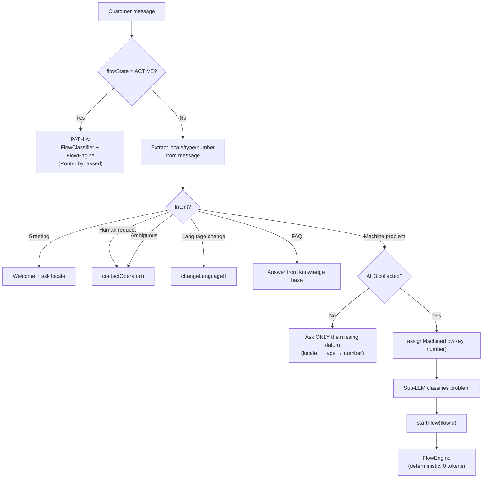

# Flow 1 — Router LLM

> **Source of truth**: [`achitecture.md`](achitecture.md)
> **Template**: `apps/backend/src/templates/flow/00-router.template.md`
> **DB config**: `FlowNodeConfig` where `flowKey = 'router'`

## Purpose

The Router is the entry point for all FLOW workspace messages when no flow is active.
It collects **locale**, **machine type**, and **machine number**, then calls `assignMachine()`.

- **PATH A** (flow active): Router is BYPASSED → `FlowClassifierService` + `FlowEngineService` handle it
- **PATH B/C**: Router LLM decides next action

## Router Prompt (production template)

```
You are {{chatbotName}}, the virtual assistant of {{companyName}}.
Tone: {{toneOfVoice}}.

WELCOME → {{welcomeMessage}} + address customer request
MISSION → Collect locale → type → number → call tool
EXTRACTION → Parse location/type/number from message BEFORE asking
FLOW → Ask ONLY what's missing, ONE question per turn
ESCALATION → contactOperator() if customer asks for human
FAQ → {{faqs}} for general questions
```

### Template Variables

| Variable | Source | Example |
|----------|--------|---------|
| `{{chatbotName}}` | Workspace settings | "Sofia" |
| `{{toneOfVoice}}` | Workspace settings | "Friendly, professional" |
| `{{companyName}}` | Workspace settings | "Ecolaundry" |
| `{{welcomeMessage}}` | Workspace settings | "Hi! I'm Sofia..." |
| `{{faqs}}` | FAQ table (workspace-filtered) | Q&A pairs |

## Hard Rules

- ONE question per turn — NEVER ask multiple questions
- No fraud accusations — "we need to verify manually"
- No automatic compensation promises
- If ambiguous or requires validation → `contactOperator`
- Resume UX: when PAUSED flow resumes, re-send `currentNode.prompt`

## Data Collection Order

```
1. locale        → "Which location?" (Goya, Pineda, L'Escala, Alemanya, Hortes)
2. machine_type  → "Washer or dryer?"
3. machine_number → "What's the machine number?"
4. → assignMachine(flowKey, machineNumber)
```

## Calling Functions

| Function | Type | When |
|----------|------|------|
| `assignMachine(flowKey, machineNumber)` | DELEGATE_TO_AGENT | locale + type + number collected |
| `contactOperator(reason)` | CALLING_FUNCTION | Customer asks for human, ambiguous case |
| `changeLanguage(lang)` | INTERNAL | Language change request |
| `startFlow(flowId)` | INTERNAL | Sub-LLM identifies problem → starts deterministic flow |

## Decision Matrix

| Action | When | Next step |
|--------|------|-----------|
| `GREETING` | First message / greeting only | Welcome + ask locale |
| `GATHER_INFO` | Missing locale, type, or number | Ask ONLY the missing datum |
| `ASSIGN_MACHINE` | All 3 data points collected | `assignMachine()` → Sub-LLM |
| `FAQ` | General question (hours, price, refund, invoice...) | Answer from knowledge base |
| `ESCALATE` | Angry, contradictions, unknown error | `contactOperator()` |
| `CHANGE_LANG` | Language change request | `changeLanguage()` |

## FAQ Intents (from Playbook)

| Intent | Playbook Section |
|--------|-----------------|
| `DOUBLE_CHARGE` | 5.3 |
| `PAID_NOT_ACTIVATED` | 5.4 |
| `AL001` | 5.5 |
| `COMPENSATION_CODE` | 5.6 |
| `REFUND` | 5.7 |
| `INVOICE` | 5.8 |
| `LOYALTY_CARD` | 5.9 |
| `HOURS_PRICES_LOCAL_DIFFS` | 5.10 |

## Immediate Escalation Triggers (Playbook §6 + §10)

- Customer very angry
- Contradictions in amount or story
- Error not mapped in known cases
- Manual machine activation needed
- Compensation decision required
- Suspected fraud/inconsistency
- Incorrect code / new code needed
- Camera/AJAX system incidents
- Goya/Pineda: dataphone charge of €10 (should be €7/€8)

## Flowchart


