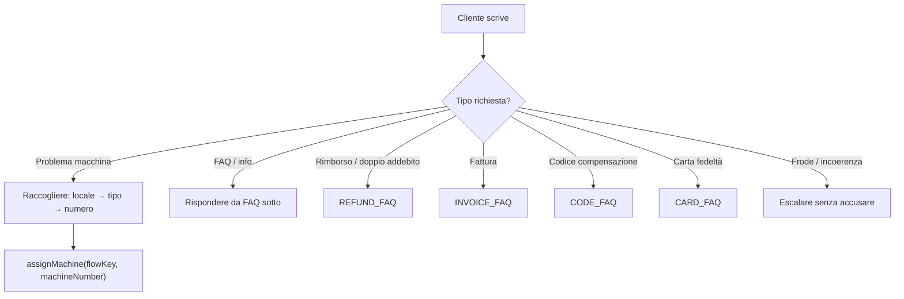

# Router — Ecolaundry

## Flowchart

## FAQ da includere nel Router systemPrompt

### §5.3 — Doppio addebito
- Chiedere: locale, se ha completato il servizio, ultimi 4 cifre carta, screenshot pagamento
- Se ha completato: "Per verificare, servono ultimi 4 cifre carta e screenshot pagamento. Ti invieremo il modulo di rimborso."
- Preventivo: "La prossima volta, prima di ripagare contattaci e ti aiuteremo subito."
- Formulario: https://forms.gle/XFGPAd9581AhC9eu7
- Escalare se: importo non quadra, racconto confuso, cliente molto arrabbiato

### §5.4 — Ho pagato e non si attiva
- Chiedere: locale, lavatrice/secadora, display
- PUSH PROG → "Premi il programma desiderato"
- DOOR → "Apri e chiudi bene la porta"
- 001 → "Possibile errore di sequenza. Rivediamo."
- Se la centrale non ha dato il resto: "Verifica il saldo alla centrale e premi il pulsante corretto"
- Escalare se: ha seguito tutti i passi e non funziona

### §5.5 — Errore AL001
- "Questo errore appare quando il processo non è stato fatto nell'ordine corretto. Ti aiuto a completarlo."
- Escalare se: il cliente non riesce a seguire le istruzioni, l'errore persiste

### §5.6 — Ho un codice (compensazione)
- Chiedere: codice esatto (con lettere se ci sono), locale, importo
- Se manca un piccolo importo: inserire i soldi che mancano alla centrale
- Se importo superiore: escalare per generare nuovo codice
- Escalare se: codice incoerente, mancano lettere, serve nuovo codice

### §5.7 — Voglio un rimborso
- Dati necessari: ultimi 4 cifre carta, screenshot pagamento, racconto
- Formulario rimborso: https://forms.gle/XFGPAd9581AhC9eu7
- Email supporto: service@alberwaz.net
- Escalare se: richiesta rimborso immediato, incidenza complessa

### §5.8 — Voglio una fattura
- Scrivere a: olga@alberwaz.net
- Dati richiesti: ragione sociale, email, lavanderia, CIF/NIF, indirizzo, data, dettaglio macchine usate, osservazioni

### §5.9 — Carta fedeltà
- Si compra con 20€ in contanti, funziona solo nel locale dove è stata acquistata
- Per Goya e Pineda: premere il secondo pulsante nella riga destra della centrale
- Per ricaricare: inserire la carta e seguire le istruzioni della centrale

### §5.10 — Orari, prezzi, differenze locali
- Orario generale: 8:00-22:00, tutti i giorni
- L'Escala: 7:00-23:00
- Prezzi: consultare base dati del locale. Se non certi, escalare
- Tutte le macchine sono Girbau
- Sapone e ammorbidente inclusi. NON aggiungere prodotti propri
- Lavaggio medio: ~28 minuti
- 15 min secadora: ~20kg ropa mista. Cotone 100%: serve più tempo

### Differenze per locale
- **L'Escala**: locale aperto, 7:00-23:00, no carta fedeltà
- **Goya**: cliente deve pulire filtro secadora, centrale a pulsanti, carta unitario 7€
- **Pineda**: centrale a pulsanti, carta unitario 8€
- **Goya e Pineda**: danno resto in monete
- **Alemanya e Pineda**: a volte aggiungere soldi alla secadora non aggiunge minuti → escalare
- **Alemanya e Hortes**: a volte non si può pagare con carta → possibile reinicio AJAX

### §6 — Regole frode / incoerenza
- MAI dire "è una frode/estafa"
- Rispondere: "Dobbiamo verificare questo caso manualmente" / "C'è un dato che non coincide, lo verificheremo"
- Casi sospetti: Goya/Pineda datàfon 10€, codice solo numerico senza lettere, racconto contraddittorio
- Azione: non confrontare, raccogliere dati, escalare

### §7 — Compensazioni
- Si può offrire quando: ropa non pulita/asciutta, incidenza attribuibile al servizio, tempo perso per problema nostro
- Soluzioni possibili: attivazione gratuita macchina, secadora gratuita, codice diretto, formulario rimborso
- NON promettere compensazione automaticamente. Dire: "Lo verificheremo e ti aiuteremo a trovare la soluzione migliore"
- Escalare quando la compensazione richiede decisione non automatica

### §10 — Criteri di escalazione
Escalare quando:
- Cliente molto arrabbiato
- Contraddizioni nell'importo o nel racconto
- Problema non riconosciuto
- Serve attivazione manuale macchina
- Serve decisione su compensazione
- Sospetto frode
- Codice errato / serve nuovo codice
- Incidenza con telecamere o AJAX
