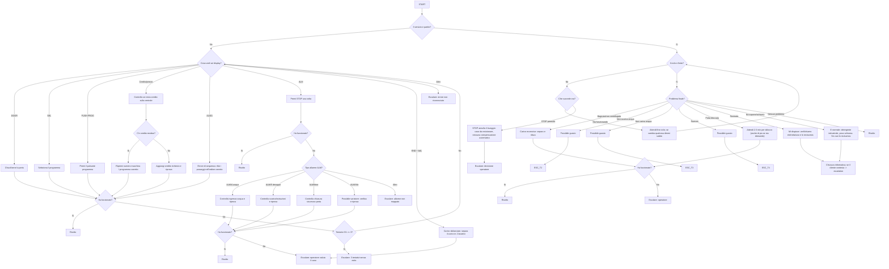

# Flow 2 — Lavatrice (Deterministico)

Fonte di verita: `achitecture.md`.

## Regole operative

- Questo flow e eseguito dal `FlowEngineService` (0 token LLM).
- Una sola istruzione/domanda per step.
- D1 ha retry limit: massimo 3 tentativi, poi escalation.
- Nodo `CREDIT` diviso in step concreti (credito residuo, pressione tasto, nuovo credito).
- Se flow riprende da PAUSA, rimandare sempre `currentNode.prompt` prima del nuovo input.
- Nessuna compensazione automatica promessa dal bot.

## Copertura Playbook

- 5.1 No funciona la rentadora
- 5.4 He pagat i no s'ha activat
- 5.5 Error AL001
- Regole compensazione §7
- Escalation §10
