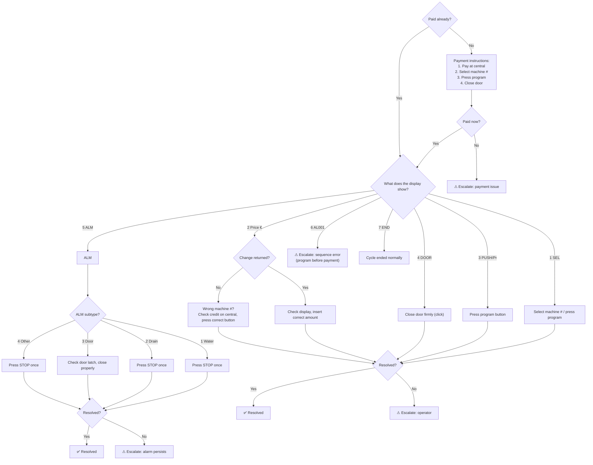
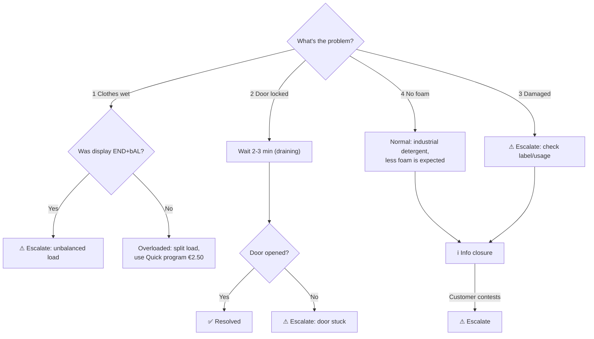
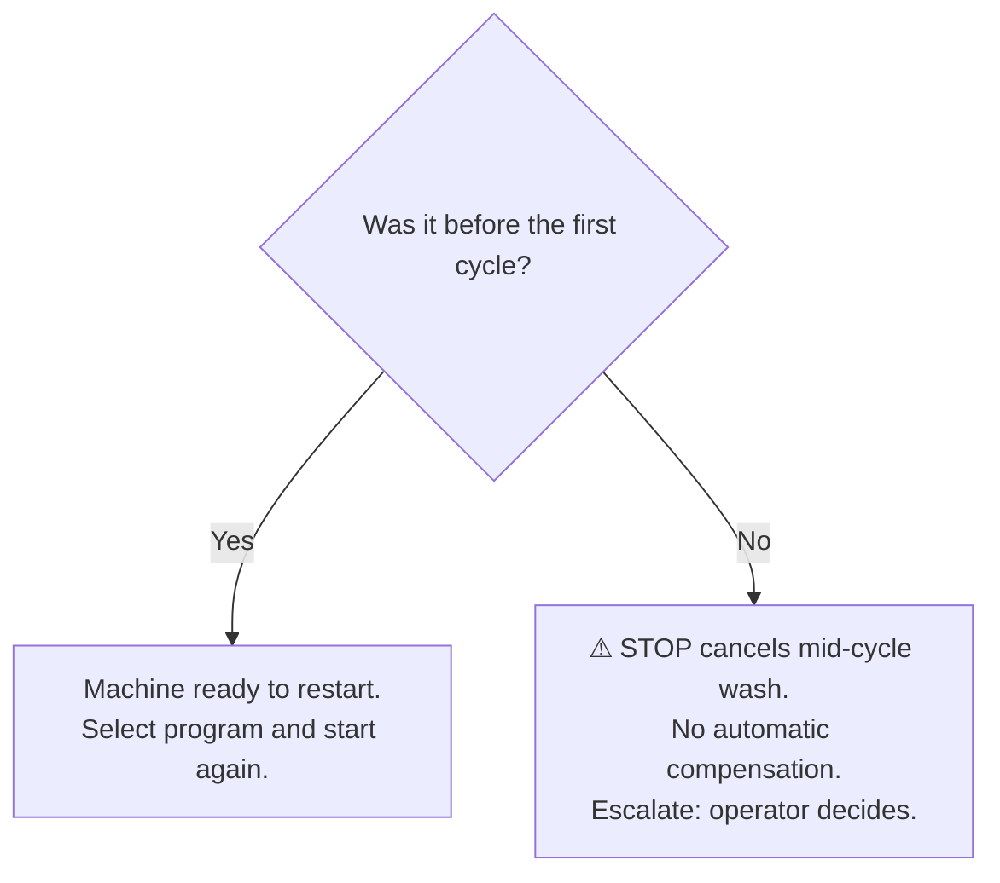

# Flow 2 — Lavatrice HS-60XX (Deterministico)

> **Source of truth**: [`achitecture.md`](achitecture.md)
> **flowKey**: `lavatrice_hs60xx`
> **JSON config**: [`02_lavatrice.json`](02_lavatrice.json)
> **Engine**: `FlowEngineService` (0 LLM tokens)

## Machine Specs

| Program | Temp | Fabrics | Price |
|---------|------|---------|-------|
| Molt Calent | 60° | White, work clothes, very dirty (resistant) | €4.00 |
| Calent | 40° | Cotton, coloured, nylon, other fibres | €3.50 |
| Temperat | 30° | Cotton blends, coloured, synthetics | €3.00 |
| Fred (*) | Cold | Delicates, wool, silk, curtains, down | €3.00 |

- **Capacity**: 8 kg
- **Spin**: 800 / 1000 / 1200 RPM (selectable)
- **Extras**: Extra rinse (+€0.50), Pre-wash (+€1.00)
- **Payment**: Coins, card, or loyalty card at central panel
- **Soap**: Automatic dosing (detergent + softener + active oxygen) — industrial, less foam is NORMAL
- **Duration**: ~28 min (normal cycle)

## Operating Rules

- One instruction/question per step
- Payment check is ALWAYS `step_0` (first step)
- Retry limit: loop back max before escalation
- If flow resumes from PAUSED: re-send `currentNode.prompt` before new input
- No automatic compensation promised by bot
- STOP = cancels wash → operator decides compensation

## Flows

### Flow: `no_parte` (machine won't start)

### Flow: `post_ciclo` (after wash finished)

### Flow: `stop_error` (STOP button pressed)

## Playbook Coverage

| Section | Topic | Covered |
|---------|-------|---------|
| 5.1 | Washer not working | ✅ `no_parte` flow |
| 5.4 | Paid but won't start | ✅ `no_parte.display_check` |
| 5.5 | Error AL001 | ✅ `no_parte.case_al001` |
| §7 | Compensation rules | ✅ No auto-promise, escalate |
| §10 | Escalation protocol | ✅ All terminal `escalate` nodes |

## Node Map (02_lavatrice.json)

| Flow | Nodes | Types |
|------|-------|-------|
| `no_parte` | `step_0` → `pay_help` → `pay_retry` → `display_check` → 7 branches → `ask_resolved` | CONFIRMATION, ACTION, CHOICE, INFO |
| `post_ciclo` | `step_0` → 5 branches (`wet_clothes`, `door_locked`, `damaged`, `foam_info`, `escalate`) | CHOICE, CONFIRMATION, INFO |
| `stop_error` | `step_0` → `stop_first_time` / `stop_mid_cycle` | CONFIRMATION, INFO |
