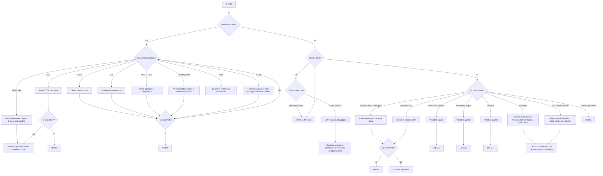

# Flow 2 — Lavatrice (Deterministico)

Fonte di verita: `achitecture.md`.

## Regole operative

- Questo flow e eseguito dal `FlowEngineService` (0 token LLM).
- Una sola istruzione/domanda per step.
- Se non risolto o caso ambiguo: escalation umana.
- Nessuna compensazione automatica promessa dal bot.

## Copertura Playbook

- 5.1 No funciona la rentadora
- 5.4 He pagat i no s'ha activat
- 5.5 Error AL001
- Regole compensazione §7
- Escalation §10
