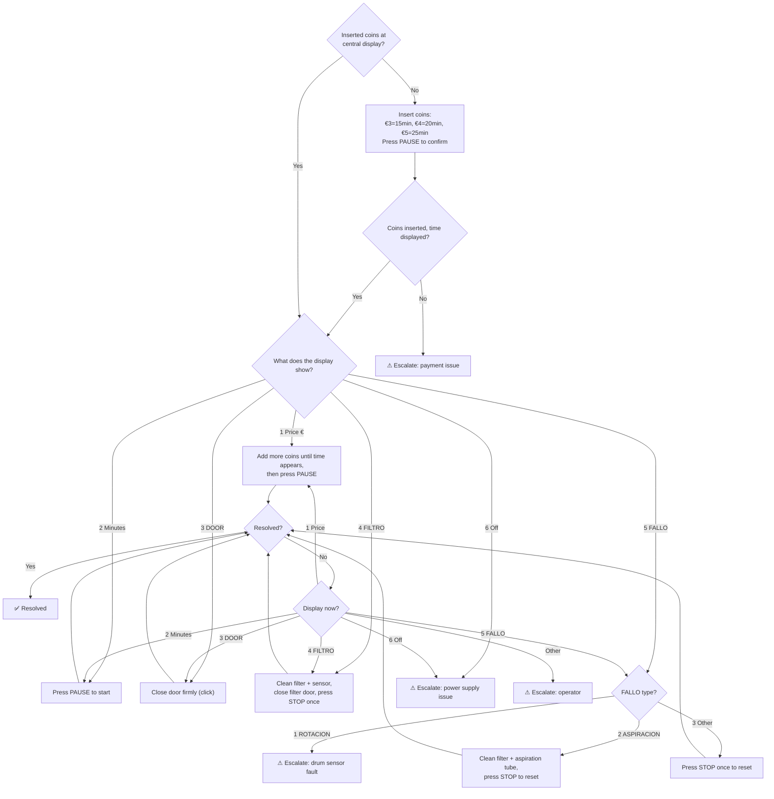
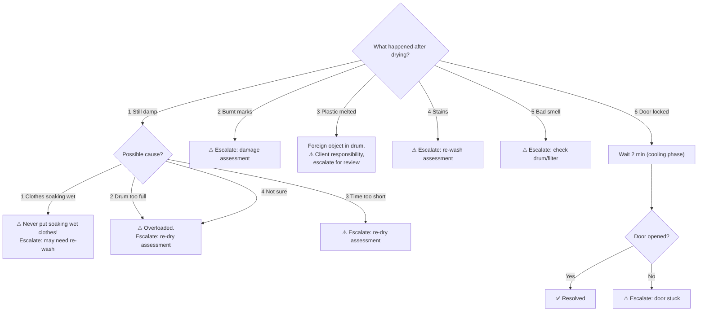

# Flow 3 — Asciugatrice ED-340 (Deterministico)

> **Source of truth**: [`achitecture.md`](achitecture.md)
> **flowKey**: `asciugatrice_ed340`
> **JSON config**: [`01_secadora.json`](01_secadora.json)
> **Engine**: `FlowEngineService` (0 LLM tokens)

## Machine Specs

| Program | Temp | Fabrics |
|---------|------|---------|
| Tª Alta | 80° | Towels, weekly laundry, 100% cotton |
| Tª Mitja | 65° | Duvets, blankets, mixed fabrics (50% cotton) |
| Tª Baixa | 50° | Sofa covers, work clothes, polyester/cotton blends |

- **Capacity**: 15 kg
- **Payment**: Coins at central display (€3 = 15 min, €4 = 20 min, €5 = 25 min)
- **Start**: Press PAUSE to confirm time and start
- **Cooling phase**: Last 2 min — door may stay locked briefly after cycle ends
- **STOP**: Stops cycle completely — operator evaluates compensation
- **Alarm types**: PUERTA DEL FILTRO, FALLO DE ROTACION, FALLO DE ASPIRACION

> ⚠️ NEVER put soaking wet clothes in dryer — damages filter and clothes won't dry

## Operating Rules

- One instruction/question per step
- Payment check is ALWAYS `step_0` (first step)
- If flow resumes from PAUSED: re-send `currentNode.prompt` before new input
- No automatic compensation promised by bot
- Local anomalies (Alemanya/Pineda credit issues) → always escalate

## Flows

### Flow: `no_parte` (dryer won't start)

### Flow: `post_ciclo` (after drying finished)

## Playbook Coverage

| Section | Topic | Covered |
|---------|-------|---------|
| 5.2 | Dryer not working | ✅ `no_parte` flow |
| 5.4 | Paid but won't start (dryer) | ✅ `no_parte.display_check` |
| §7 | Compensation rules | ✅ No auto-promise, escalate |
| §8 | Location-specific (Alemanya/Pineda) | ✅ Credit anomaly → escalate |
| §10 | Escalation protocol | ✅ All terminal `escalate` nodes |

## Node Map (01_secadora.json)

| Flow | Nodes | Types |
|------|-------|-------|
| `no_parte` | `step_0` → `pay_help` → `pay_retry` → `display_check` → 6 branches → `check_result` → `check_retry` | CONFIRMATION, ACTION, CHOICE, INFO |
| `post_ciclo` | `step_0` → 6 branches (`damp`, `burnt`, `plastic`, `stain`, `smell`, `door_locked`) | CHOICE, CONFIRMATION, ACTION, INFO |
