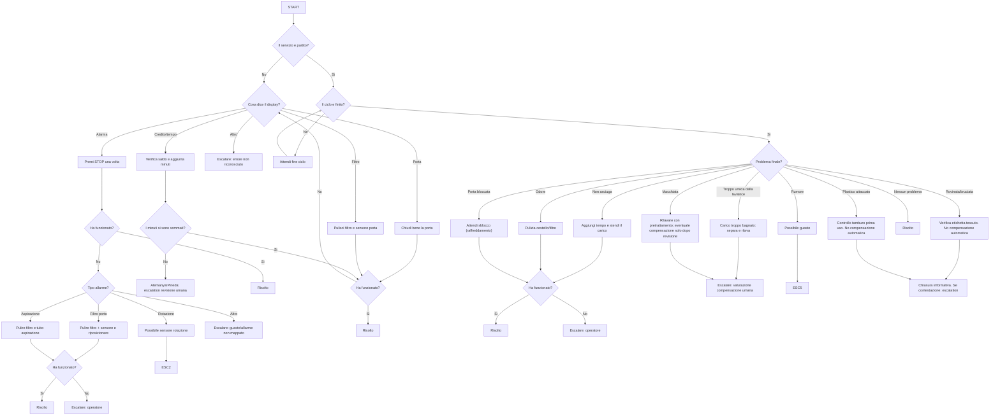

# Flow 3 — Asciugatrice/Secadora (Deterministico)

Fonte di verita: `achitecture.md`.

## Regole operative

- Flow deterministico (`FlowEngineService`), no LLM per la transizione nodi.
- Una domanda/azione per step.
- Nessuna compensazione promessa automaticamente.
- Casi locali critici (Alemanya/Pineda) sempre con escalation umana.

## Copertura Playbook

- 5.2 No funciona la secadora
- 5.4 He pagat i no s'ha activat (parte secadora)
- 8. Differenze per locale (Alemanya/Pineda, Goya)
- Regole compensazione §7
- Escalation §10
