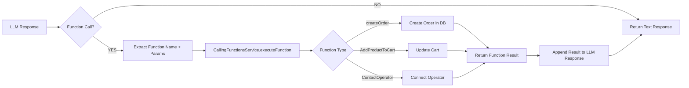

# 🤖 LLMService - Flusso Completo e Architettura

**File Sorgente**: `backend/src/services/llm.service.ts`  
**Responsabilità**: Core engine per elaborazione messaggi WhatsApp con AI  
**Data Documentazione**: 11 Ottobre 2025  
**Versione**: 2.0 (con WIP Message + Security checks)

---

## 📋 **INDICE**

1. [Overview](#overview)
2. [Diagramma di Flusso Mermaid](#diagramma-di-flusso)
3. [Flusso Dettagliato Step-by-Step](#flusso-dettagliato)
4. [Check di Sicurezza (Priorità)](#check-di-sicurezza)
5. [Pre-Processing](#pre-processing)
6. [LLM Response Generation](#llm-response-generation)
7. [Post-Processing](#post-processing)
8. [Function Calling](#function-calling)
9. [Error Handling](#error-handling)
10. [Logging e Debug](#logging-e-debug)

---

## 🎯 **OVERVIEW**

**LLMService** è il **cuore del sistema ShopME**. Gestisce TUTTI i messaggi WhatsApp in arrivo e coordina:

- ✅ Verifica sicurezza workspace e customer
- ✅ Recupero dati dinamici (prodotti, ordini, FAQ, ecc.)
- ✅ Elaborazione prompt con variabili personalizzate
- ✅ Chiamata OpenRouter (GPT-4-mini) per risposta AI
- ✅ Function calling per azioni (crea ordine, contatta operatore, ecc.)
- ✅ Post-processing con link sicuri (token-based)

**Endpoint Entry Point**: `POST /api/whatsapp/webhook` → `llm.service.handleMessage()`

---

## 📊 **DIAGRAMMA DI FLUSSO MERMAID**

```mermaid
flowchart TD
    Start([📱 Messaggio WhatsApp Arriva]) --> HandleMessage[🚀 LLMService.handleMessage]

    HandleMessage --> FindCustomer{🔍 findCustomerByPhone}
    FindCustomer --> GetWorkspace[🏢 getById workspace]

    GetWorkspace --> CheckWorkspaceActive{🔴 1. workspace.isActive?}

    CheckWorkspaceActive -->|❌ NO - DISABLED| GetCustomerLang[🌍 customer.language || 'es']
    GetCustomerLang --> GetWipMessage[📝 workspace.wipMessages[lang]]
    GetWipMessage --> SendWipWhatsApp[📤 WhatsApp: Invia WIP message]
    SendWipWhatsApp --> ReturnIgnore1[🛑 return 'IGNORE']
    ReturnIgnore1 --> End1([❌ STOP - No LLM])

    CheckWorkspaceActive -->|✅ YES - ACTIVE| CheckNewCustomer{🟡 2. customer === null?}

    CheckNewCustomer -->|✅ YES - NEW USER| NewUserFlow[🆕 NewUser flow]
    NewUserFlow --> SendWelcome[📤 Invia Welcome message]
    SendWelcome --> ReturnSuccess1[✅ return success]
    ReturnSuccess1 --> End2([✅ Fine])

    CheckNewCustomer -->|❌ NO - EXISTS| CheckBlacklist{🟠 3. isBlacklisted?}

    CheckBlacklist -->|✅ YES - BLOCKED| ReturnIgnore2[🛑 return 'IGNORE']
    ReturnIgnore2 --> End3([❌ STOP - Customer blocked])

    CheckBlacklist -->|❌ NO - OK| CheckChatbotActive{🟢 4. activeChatbot?}

    CheckChatbotActive -->|❌ NO - DISABLED| ReturnIgnore3[🛑 return 'IGNORE']
    ReturnIgnore3 --> End4([❌ STOP - Chatbot disabled])

    CheckChatbotActive -->|✅ YES - ACTIVE| GetPrompt[📄 getActivePromptByWorkspaceId]

    GetPrompt --> CheckPromptExists{Prompt exists?}
    CheckPromptExists -->|❌ NO| ReturnError[❌ return error 'Servizio non disponibile']
    ReturnError --> End5([❌ Fine con errore])

    CheckPromptExists -->|✅ YES| PreProcessing[⚙️ PRE-PROCESSING]

    PreProcessing --> GetFaqs[📚 getActiveFaqs]
    GetFaqs --> GetServices[🛠️ getActiveServices]
    GetServices --> GetCategories[📂 getActiveCategories]
    GetCategories --> GetOffers[🎁 getActiveOffers]
    GetOffers --> GetProducts[🛍️ getActiveProducts]
    GetProducts --> BuildUserInfo[👤 Build userInfo object]

    BuildUserInfo --> PreProcessPrompt[🔧 preProcessPrompt]
    PreProcessPrompt --> SavePromptFile[💾 Save prompt.txt debug]

    SavePromptFile --> GenerateLLM[🤖 generateLLMResponse]

    GenerateLLM --> CallOpenRouter[🌐 OpenRouter API]
    CallOpenRouter --> CheckFunctionCall{Function call?}

    CheckFunctionCall -->|✅ YES| ExecuteFunction[⚡ CallingFunctionsService]
    ExecuteFunction --> GetFunctionResult[📦 Function result]
    GetFunctionResult --> PostProcessing[🔄 POST-PROCESSING]

    CheckFunctionCall -->|❌ NO| PostProcessing

    PostProcessing --> ReplaceLinkTokens[🔗 replaceLinkTokens]
    ReplaceLinkTokens --> CheckCheckoutToken{[LINK_CHECKOUT_WITH_TOKEN]?}

    CheckCheckoutToken -->|✅ YES| GetCartLink[🛒 getCartLink]
    GetCartLink --> ReplaceCheckoutToken[🔀 Replace token con URL]
    ReplaceCheckoutToken --> CheckProfileToken{[LINK_PROFILE_WITH_TOKEN]?}

    CheckCheckoutToken -->|❌ NO| CheckProfileToken

    CheckProfileToken -->|✅ YES| GetProfileLink[👤 getProfileLink]
    GetProfileLink --> ReplaceProfileToken[🔀 Replace token con URL]
    ReplaceProfileToken --> CheckOrdersToken{[LINK_ORDERS_WITH_TOKEN]?}

    CheckProfileToken -->|❌ NO| CheckOrdersToken

    CheckOrdersToken -->|✅ YES| GetOrdersLink[📋 getOrdersListLink]
    GetOrdersLink --> ReplaceOrdersToken[🔀 Replace token con URL]
    ReplaceOrdersToken --> FinalResponse[✅ Final response ready]

    CheckOrdersToken -->|❌ NO| FinalResponse

    FinalResponse --> ReturnSuccess2[✅ return { success, output, debugInfo }]
    ReturnSuccess2 --> SendWhatsApp[📤 WhatsApp: Invia risposta finale]
    SendWhatsApp --> End6([✅ Fine successo])

    style CheckWorkspaceActive fill:#ff6b6b,stroke:#c92a2a,color:#fff
    style CheckNewCustomer fill:#ffd93d,stroke:#f59f00,color:#000
    style CheckBlacklist fill:#ff922b,stroke:#e8590c,color:#fff
    style CheckChatbotActive fill:#51cf66,stroke:#2f9e44,color:#fff
    style GenerateLLM fill:#339af0,stroke:#1864ab,color:#fff
    style PostProcessing fill:#b197fc,stroke:#7950f2,color:#fff
    style End1 fill:#ff6b6b,stroke:#c92a2a,color:#fff
    style End3 fill:#ff6b6b,stroke:#c92a2a,color:#fff
    style End4 fill:#ff6b6b,stroke:#c92a2a,color:#fff
    style End6 fill:#51cf66,stroke:#2f9e44,color:#fff
```

---

## 🔄 **FLUSSO DETTAGLIATO STEP-BY-STEP**

### **FASE 1: INIZIALIZZAZIONE** 🚀

```typescript
async handleMessage(llmRequest: LLMRequest, customerData?: any): Promise<any>
```

**Input**:

- `llmRequest.phone`: Numero WhatsApp cliente (es. "+393331234567")
- `llmRequest.chatInput`: Messaggio testo del cliente (es. "Voglio ordinare pizza")
- `llmRequest.workspaceId`: ID workspace (fallback se customer non trovato)
- `customerData` (opzionale): Dati aggiuntivi (lastordercode, ecc.)

**Actions**:

1. Log: `"🚀 LLM: handleMessage chiamato per telefono: +39..."`
2. Inizializza repositories: `MessageRepository`
3. Carica utility: `replaceAllVariables`, `workspaceService`

---

### **FASE 2: CARICAMENTO DATI** 🔍

```typescript
// 1. Find Customer
let customer = await messageRepo.findCustomerByPhone(llmRequest.phone)

// 2. Get Workspace ID
const workspaceId = customer ? customer.workspaceId : llmRequest.workspaceId

// 3. Load Workspace
const workspace = await workspaceService.getById(workspaceId)

// 4. Get Agent Config (LLM settings)
const agentConfig = workspace.agentConfigs?.[0]
```

**Log Output**:

```
🔍 CUSTOMER TROVATO: { id: 'xxx', workspaceId: 'yyy', phone: '+39...' }
🏢 WORKSPACE ID SCELTO: yyy - Source: customer.workspaceId
🏢 WORKSPACE TROVATO: { id: 'yyy', name: 'MyShop', agentConfigsCount: 1 }
🤖 AGENTCONFIGS COUNT per workspace yyy: 1
🎯 SCELTO AGENTCONFIG[0]: gpt-4o-mini temp:0.3
```

**Dati Caricati**:

- `customer`: Oggetto Customer completo (id, name, email, phone, language, discount, ...)
- `workspace`: Oggetto Workspace completo (id, name, isActive, wipMessages, ...)
- `agentConfig`: Configurazione LLM (model, temperature, maxTokens, ...)

---

### **FASE 3: SECURITY CHECKS (PRIORITÀ)** 🔒

#### **🔴 CHECK 1: Workspace Disabled?**

```typescript
if (!workspace.isActive) {
  // Get customer language or default to Spanish
  const customerLanguage = customer?.language || "es"

  // Get WIP message in customer's language
  const wipMessages = (workspace.wipMessages as Record<string, string>) || {}
  const wipMessage =
    wipMessages[customerLanguage.toLowerCase()] ||
    wipMessages["es"] ||
    "Estamos en mantenimiento. Por favor, contacte más tarde."

  // Send WIP message via WhatsApp
  const whatsappService = new WhatsAppService()
  await whatsappService.sendMessage(llmRequest.phone, wipMessage, workspace.id)

  // STOP processing
  return "IGNORE"
}
```

**Trigger**: `workspace.isActive === false`  
**Action**: Invia messaggio WIP in lingua cliente + **STOP**  
**Log**: `"🚫 LLM: Workspace is DISABLED - Sending WIP message"`  
**Result**: `return "IGNORE"` → **NO LLM, NO ORDINI, NO AZIONI**

---

#### **🟡 CHECK 2: New Customer?**

```typescript
if (!customer) {
  console.log("🆕 LLM: New user detected, calling NewUser method")
  return await this.NewUser(llmRequest, workspace, messageRepo)
}
```

**Trigger**: `customer === null` (customer non esiste nel DB)  
**Action**: Chiama `NewUser()` flow  
**NewUser Flow**:

1. Crea nuovo customer nel DB
2. Invia welcome message da `workspace.welcomeMessages[lingua]`
3. Return success

**Log**: `"🆕 LLM: New user detected, calling NewUser method"`

---

#### **🟠 CHECK 3: Customer Blacklisted?**

```typescript
const isBlocked = await messageRepo.isCustomerBlacklisted(
  customer.phone,
  workspace.id
)

if (isBlocked || customer.isBlacklisted || isChatbotInactive) {
  console.log(`🚫 LLM: Customer blocked - isBlocked: ${isBlocked}, ...`)
  return "IGNORE"
}
```

**Trigger**:

- `customer.isBlacklisted === true`
- OR `messageRepo.isCustomerBlacklisted()` returns true
- OR `customer.activeChatbot === false`

**Action**: **STOP** processing  
**Result**: `return "IGNORE"` → **NO risposta WhatsApp**

**Log**: `"🚫 LLM: Customer blocked - isBlocked: true, ..."`

---

#### **🟢 CHECK 4: Chatbot Active?**

```typescript
const isChatbotInactive = customer.activeChatbot === false

if (isChatbotInactive) {
  console.log(`🚫 LLM: Chatbot inactive for customer`)
  return "IGNORE"
}
```

**Trigger**: `customer.activeChatbot === false`  
**Action**: **STOP** processing  
**Result**: `return "IGNORE"`

---

### **FASE 4: PRE-PROCESSING** ⚙️

#### **4.1 Get Active Prompt**

```typescript
const prompt = await workspaceService.getActivePromptByWorkspaceId(workspace.id)

if (!prompt) {
  return {
    success: false,
    output: "❌ Servizio temporaneamente non disponibile.",
    debugInfo: { stage: "no_prompt" },
  }
}
```

**Fonte**: Tabella `Prompts` → `WHERE workspaceId = xxx AND isActive = true`  
**Contenuto**: Prompt template con variabili (es. `{{prodotti}}`, `{{nome}}`, ...)

---

#### **4.2 Carica Dati Dinamici**

```typescript
const userLanguage = customer.language || workspace.language || "it"

const faqs = await messageRepo.getActiveFaqs(workspace.id)
const services = await messageRepo.getActiveServices(workspace.id)
const categories = await messageRepo.getActiveCategories(
  workspace.id,
  userLanguage
)
const offers = await messageRepo.getActiveOffers(workspace.id, userLanguage)
const products = await messageRepo.getActiveProducts(
  workspace.id,
  customerDiscount
)
```

**Dati Recuperati**:

- `faqs`: Lista FAQ attive (domande frequenti)
- `services`: Lista servizi offerti
- `categories`: Categorie prodotti (tradotte in lingua utente)
- `offers`: Offerte attive (tradotte in lingua utente)
- `products`: Prodotti attivi (con prezzo scontato se customer ha discount)

**Formato Products** (esempio):

```
[ID: 123] Pizza Margherita - €8.00 (sconto 10% applicato: €7.20)
[ID: 456] Pizza Diavola - €9.00 (sconto 10% applicato: €8.10)
```

---

#### **4.3 Build User Info**

```typescript
const userInfo = {
  nameUser: customer.name || "",
  discountUser: customer.discount || 0,
  companyName: customer.company || "",
  lastordercode: customerData?.lastordercode || customer.lastOrderCode || "",
  languageUser: this.getLanguageDisplayName(userLanguage),
}
```

**User Info Object**:

- `nameUser`: "Mario Rossi"
- `discountUser`: 10 (percentuale sconto)
- `companyName`: "Acme Corp"
- `lastordercode`: "ORD-2025-001"
- `languageUser`: "ITALIANO" (display name, non codice)

---

#### **4.4 Pre-Process Prompt**

```typescript
const promptWithVars = await this.promptProcessorService.preProcessPrompt(
  prompt,
  workspace.id,
  userInfo,
  { faqs, products, categories, services, offers }
)
```

**Process**:

1. Sostituisce variabili utente: `{{nome}}` → "Mario Rossi"
2. Sostituisce variabili workspace: `{{prodotti}}` → lista completa prodotti
3. Sostituisce variabili dinamiche: `{{faqs}}` → lista FAQ
4. Genera prompt finale completo pronto per LLM

**Prompt Finale** (esempio):

```
Sei un assistente virtuale per la pizzeria "Da Mario".

Utente: Mario Rossi (sconto 10%)
Lingua: ITALIANO
Ultimo ordine: ORD-2025-001

Prodotti disponibili:
[ID: 123] Pizza Margherita - €7.20
[ID: 456] Pizza Diavola - €8.10

FAQ:
1. Orari: Aperti 12:00-23:00
2. Consegna: Consegna gratuita sopra €20

Rispondi in modo professionale e aiuta l'utente.
```

---

#### **4.5 Save Prompt Debug**

```typescript
try {
  const promptPath = path.join(process.cwd(), "prompt.txt")
  fs.writeFileSync(
    promptPath,
    `=== PROMPT GENERATO ${new Date().toISOString()} ===\n\n${promptWithVars}\n\n=== FINE PROMPT ===\n`
  )
} catch (error) {
  console.log("❌ Errore salvando prompt:", error.message)
}
```

**File Output**: `backend/prompt.txt`  
**Scopo**: Debug - vedere prompt esatto inviato a LLM

---

### **FASE 5: LLM RESPONSE GENERATION** 🤖

```typescript
const rawLLMResult = await this.generateLLMResponse(
  promptWithVars,
  llmRequest.chatInput,
  workspace,
  customer,
  customerData,
  userLanguage,
  llmRequest
)
```

**Process**:

1. Chiama OpenRouter API con:

   - `model`: `agentConfig.model` (es. "openai/gpt-4o-mini")
   - `temperature`: `agentConfig.temperature` (es. 0.3)
   - `messages`: [system prompt, user message, chat history]
   - `tools`: Function definitions disponibili

2. OpenRouter può rispondere in 2 modi:
   - **Text Response**: Risposta diretta (es. "Certo! Ecco i nostri prodotti...")
   - **Function Call**: Richiesta esecuzione funzione (es. `createOrder`)

**Function Call Example**:

```json
{
  "function_call": {
    "name": "createOrder",
    "arguments": {
      "productIds": ["123", "456"],
      "quantities": [2, 1],
      "paymentMethod": "CASH"
    }
  }
}
```

---

#### **5.1 Function Execution (se chiamata)**

```typescript
if (rawLLMResult.debugInfo.functionCall) {
  const functionResult = await this.callingFunctionsService.executeFunction(
    rawLLMResult.debugInfo.functionCall,
    rawLLMResult.debugInfo.functionParams,
    customer,
    workspace
  )
}
```

**Funzioni Disponibili**:

- `createOrder`: Crea ordine nel DB
- `ContactOperator`: Connette con operatore umano
- `GetShipmentTrackingLink`: Link tracking spedizione
- `GetLinkOrderByCode`: Link dettagli ordine
- `AddProductToCart`: Aggiunge prodotto al carrello
- `RemoveProductFromCart`: Rimuove prodotto dal carrello
- `ViewCart`: Mostra contenuto carrello
- `EmptyCart`: Svuota carrello
- `SearchProducts`: Cerca prodotti per categoria/nome
- `GetOrdersList`: Lista ordini cliente
- `GetProfileInfo`: Informazioni profilo cliente

**Result**: Funzione eseguita + risposta aggiunta al messaggio LLM

---

### **FASE 6: POST-PROCESSING** 🔄

```typescript
const linkResult = await this.replaceLinkTokens(
  rawLLMResult.response,
  customer,
  workspace
)
```

**Process**: Sostituisce token speciali con link sicuri generati dinamicamente

---

#### **6.1 Replace Checkout Link**

```typescript
if (finalResponse.includes("[LINK_CHECKOUT_WITH_TOKEN]")) {
  const checkoutLink = await this.callingFunctionsService.getCartLink({
    customerId: customer.id,
    workspaceId: workspace.id,
  })
  const linkUrl = checkoutLink?.linkUrl || ""

  finalResponse = finalResponse.replace("[LINK_CHECKOUT_WITH_TOKEN]", linkUrl)
}
```

**Genera**: `https://shopme.app/cart-public?token=xxx`  
**Token**: Valido 7 giorni, contiene `customerId` + `workspaceId`  
**Scopo**: Cliente può vedere carrello e completare ordine senza login

---

#### **6.2 Replace Profile Link**

```typescript
if (finalResponse.includes("[LINK_PROFILE_WITH_TOKEN]")) {
  const profileLink = await this.callingFunctionsService.getProfileLink({
    customerId: customer.id,
    workspaceId: workspace.id,
  })
  let linkUrl = profileLink?.linkUrl || ""

  finalResponse = finalResponse.replace("[LINK_PROFILE_WITH_TOKEN]", linkUrl)
}
```

**Genera**: `https://shopme.app/profile-public?token=xxx`  
**Scopo**: Cliente può vedere e modificare dati profilo

---

#### **6.3 Replace Orders List Link**

```typescript
if (finalResponse.includes("[LINK_ORDERS_WITH_TOKEN]")) {
  const ordersLink = await this.callingFunctionsService.getOrdersListLink({
    customerId: customer.id,
    workspaceId: workspace.id,
  })
  const linkUrl = ordersLink?.linkUrl || ""

  finalResponse = finalResponse.replace("[LINK_ORDERS_WITH_TOKEN]", linkUrl)
}
```

**Genera**: `https://shopme.app/orders-public?token=xxx`  
**Scopo**: Cliente può vedere lista completa dei suoi ordini

---

### **FASE 7: FINAL RESPONSE** ✅

```typescript
return {
  success: true,
  output: linkResult.finalResponse,
  debugInfo: {
    stage: "completed",
    model: rawLLMResult.debugInfo.model,
    temperature: rawLLMResult.debugInfo.temperature,
    functionCall: rawLLMResult.debugInfo.functionCall,
    functionParams: rawLLMResult.debugInfo.functionParams,
    effectiveParams: rawLLMResult.debugInfo.effectiveParams,
    tokenReplacements: linkResult.tokenReplacements,
    error: rawLLMResult.debugInfo.error || false
  },
  functionCalls: [...] // Se presenti
}
```

**Response Object**:

- `success`: `true` se tutto ok
- `output`: Risposta finale pronta per WhatsApp (con link sostituiti)
- `debugInfo`: Informazioni debug complete
- `functionCalls`: Array chiamate funzioni eseguite

**Output Example**:

```
"Certo Mario! Ho aggiunto al carrello:
- 2x Pizza Margherita (€7.20 cad)
- 1x Pizza Diavola (€8.10)

Totale: €22.50 (sconto 10% già applicato!)

Ecco il link per completare l'ordine: https://shopme.app/cart-public?token=abc123xyz"
```

---

## 🔒 **CHECK DI SICUREZZA (PRIORITÀ)**

### **Ordine di Esecuzione** (CRITICO):

```
1. 🔴 workspace.isActive?        → MASSIMA PRIORITÀ
2. 🟡 customer === null?          → SECONDO
3. 🟠 customer.isBlacklisted?     → TERZO
4. 🟢 customer.activeChatbot?     → QUARTO
5. ✅ Procedi con LLM normale      → ULTIMO
```

### **Tabella Decisionale**:

| workspace.isActive | customer | isBlacklisted | activeChatbot | Action                |
| ------------------ | -------- | ------------- | ------------- | --------------------- |
| ❌ false           | \*       | \*            | \*            | 🚫 WIP message + STOP |
| ✅ true            | null     | -             | -             | 🆕 NewUser flow       |
| ✅ true            | exists   | ✅ true       | \*            | 🚫 IGNORE + STOP      |
| ✅ true            | exists   | ❌ false      | ❌ false      | 🚫 IGNORE + STOP      |
| ✅ true            | exists   | ❌ false      | ✅ true       | ✅ Procedi LLM        |

**Legenda**:

- `*` = Qualsiasi valore
- `-` = Non applicabile (customer non esiste)

---

## 🛠️ **FUNCTION CALLING**

### **Available Functions** (20 totali):

1. **ContactOperator** - Connette con operatore umano
2. **GetShipmentTrackingLink** - Link tracking spedizione
3. **GetLinkOrderByCode** - Link dettagli ordine specifico
4. **AddProductToCart** - Aggiunge prodotto al carrello
5. **RemoveProductFromCart** - Rimuove prodotto dal carrello
6. **ViewCart** - Mostra contenuto carrello
7. **EmptyCart** - Svuota carrello completamente
8. **SearchProducts** - Cerca prodotti per nome/categoria
9. **createOrder** - Crea ordine completo nel DB
10. **GetOrdersList** - Lista ordini cliente
11. **GetProfileInfo** - Info profilo cliente
12. **UpdateProfileInfo** - Aggiorna dati profilo
13. **CancelOrder** - Cancella ordine (se PENDING)
14. **GetProductDetails** - Dettagli prodotto singolo
15. **GetCategories** - Lista categorie disponibili
16. **GetOffers** - Lista offerte attive
17. **GetFAQ** - Lista FAQ
18. **GetServices** - Lista servizi offerti
19. **ChangeLanguage** - Cambia lingua conversazione
20. **GetBusinessHours** - Orari apertura

### **Function Call Flow**:



### **Function Call Example**:

**User Message**: "Voglio 2 margherita e 1 diavola, pagamento in contanti"

**LLM Function Call**:

```json
{
  "function": "createOrder",
  "arguments": {
    "productIds": ["123", "456"],
    "quantities": [2, 1],
    "paymentMethod": "CASH",
    "notes": ""
  }
}
```

**Function Execution**:

```typescript
const orderResult = await createOrder({
  customerId: customer.id,
  workspaceId: workspace.id,
  productIds: ["123", "456"],
  quantities: [2, 1],
  paymentMethod: "CASH"
})

// Result:
{
  success: true,
  orderCode: "ORD-2025-042",
  total: 22.50,
  message: "Ordine creato con successo"
}
```

**Final LLM Response**:

```
"Perfetto Mario! Ho creato il tuo ordine ORD-2025-042:

- 2x Pizza Margherita (€7.20 cad)
- 1x Pizza Diavola (€8.10)

Totale: €22.50
Pagamento: Contanti alla consegna

Ti arriverà tra 30-40 minuti. Grazie!"
```

---

## ⚠️ **ERROR HANDLING**

### **Error Types**:

1. **No Customer Found** (new user):

   - Action: Call `NewUser()` flow
   - Response: Welcome message

2. **No Workspace Found**:

   - Action: Log error + return error response
   - Response: "Servizio temporaneamente non disponibile"

3. **No Active Prompt**:

   - Action: Return error
   - Response: "❌ Servizio temporaneamente non disponibile"

4. **LLM API Error** (OpenRouter timeout/error):

   - Action: Catch error + log + return fallback
   - Response: "Mi dispiace, ho avuto un problema. Riprova tra poco."

5. **Function Execution Error**:

   - Action: Catch error + log + return error to LLM
   - LLM: Handles error gracefully in response

6. **Database Error**:
   - Action: Catch error + log + return error response
   - Response: "Errore durante l'elaborazione. Contatta assistenza."

### **Error Logging**:

```typescript
try {
  // ... operation
} catch (error) {
  console.log("❌ Errore durante operazione:", error)
  logger.error("LLMService error:", {
    stage: "generate_llm_response",
    error: error.message,
    stack: error.stack,
    customer: customer.id,
    workspace: workspace.id,
  })

  return {
    success: false,
    output: "Mi dispiace, ho avuto un problema...",
    debugInfo: { stage: "error", error: error.message },
  }
}
```

---

## 📝 **LOGGING E DEBUG**

### **Console Logs** (tutti i punti critici):

```typescript
🚀 LLM: handleMessage chiamato per telefono: +39...
🔍 CUSTOMER TROVATO: { id, workspaceId, phone }
🏢 WORKSPACE ID SCELTO: xxx - Source: customer.workspaceId
🏢 WORKSPACE TROVATO: { id, name, agentConfigsCount }
🤖 AGENTCONFIGS COUNT per workspace xxx: 1
🎯 SCELTO AGENTCONFIG[0]: gpt-4o-mini temp:0.3

🚫 LLM: Workspace is DISABLED - Sending WIP message
🌍 Customer language: es (default: es if NULL)
📤 Sending WIP message in es: "Trabajos en curso..."

🆕 LLM: New user detected, calling NewUser method
🔍 LLM: Existing customer found - id: xxx, phone: +39...
🚫 LLM: Customer blocked - isBlocked: true, ...

🔧 LLM: Workspace config - llmModel: gpt-4o-mini, temperature: 0.3
📎 LLMService: Using checkout link: https://shopme.app/cart-public?token=xxx
📎 LLMService: Created short profile link: https://shopme.app/profile-public?token=xxx
```

### **Debug Files**:

1. **prompt.txt** - Ultimo prompt generato (overwrite ad ogni messaggio)
2. **logs/prompt-debug-{workspaceId}-{timestamp}.txt** - Storico prompt (se DEBUG_MODE=true)

### **Debug Info Response**:

```typescript
{
  debugInfo: {
    stage: "completed",
    model: "openai/gpt-4o-mini",
    temperature: 0.3,
    functionCall: "createOrder",
    functionParams: { productIds: [...], ... },
    effectiveParams: { ... },
    tokenReplacements: [
      "REPLACE LINK_CHECKOUT_WITH_TOKEN with getCartLink"
    ],
    error: false
  }
}
```

---

## 📚 **FILES E DIPENDENZE**

### **File Principale**:

- `backend/src/services/llm.service.ts` (853 righe)

### **Dipendenze Chiave**:

- `CallingFunctionsService` - Esecuzione function calls
- `PromptProcessorService` - Pre-processing prompt con variabili
- `MessageRepository` - Accesso dati DB (customer, products, orders, ...)
- `WorkspaceService` - Gestione workspace e prompt
- `WhatsAppService` - Invio messaggi WhatsApp
- `SecureTokenService` - Generazione token sicuri per link pubblici
- `TokenService` - Gestione token JWT
- `OpenRouter API` - Chiamata LLM (GPT-4-mini)

### **Database Tables Accessed**:

- `Customers` - Dati clienti
- `Workspace` - Configurazione workspace
- `Prompts` - Template prompt attivi
- `Products` - Catalogo prodotti
- `Categories` - Categorie prodotti
- `Offers` - Offerte attive
- `Services` - Servizi offerti
- `FAQ` - Domande frequenti
- `Orders` - Ordini creati
- `Carts` - Carrelli attivi
- `AgentConfig` - Configurazione LLM (model, temperature, ...)
- `ChatSession` - Sessioni chat (storico conversazioni)
- `Message` - Messaggi scambiati

---

## 🎯 **BEST PRACTICES**

### **Performance**:

1. ✅ Carica dati in parallelo quando possibile
2. ✅ Cache agentConfig per non ricaricarlo ad ogni messaggio
3. ✅ Limita numero prodotti nel prompt (max 100)
4. ✅ Use database indexes su campi frequenti (phone, workspaceId, ...)

### **Security**:

1. ✅ Sempre controllare `workspace.isActive` PRIMA di tutto
2. ✅ Verificare customer blacklist prima di LLM
3. ✅ Usare token sicuri time-limited per link pubblici
4. ✅ Non esporre dati sensibili nei log (no email complete, no password)
5. ✅ Validare TUTTI i parametri function call prima di esecuzione

### **Error Handling**:

1. ✅ Catch TUTTI gli errori e logga stack trace completo
2. ✅ Return sempre messaggio user-friendly (no errori tecnici)
3. ✅ Fallback gracefully se LLM non risponde
4. ✅ Notify admin se errori critici (es. workspace non trovato)

### **Debugging**:

1. ✅ Salva prompt.txt ad ogni chiamata LLM
2. ✅ Log TUTTI i check di sicurezza (workspace, blacklist, ...)
3. ✅ Log function calls con parametri completi
4. ✅ Use structured logging (JSON) per facilità parsing

---

## 📊 **METRICHE MONITORATE**

### **Performance**:

- ⏱️ Tempo totale elaborazione messaggio (target: <3s)
- ⏱️ Tempo chiamata OpenRouter (target: <2s)
- ⏱️ Tempo caricamento dati DB (target: <500ms)

### **Business**:

- 📊 Numero messaggi elaborati/ora
- 📊 Numero ordini creati via LLM
- 📊 Tasso conversione (messaggi → ordini)
- 📊 Function calls più usate
- 📊 Lingue più usate dai clienti

### **Errori**:

- ❌ Numero errori LLM API (timeout, rate limit)
- ❌ Numero workspace disabled hit
- ❌ Numero customer blacklisted hit
- ❌ Numero function call falliti

---

## ✅ **CHECKLIST MANUTENZIONE**

Quando modifichi LLMService, verifica:

- [ ] Hai aggiunto logging per nuove operazioni?
- [ ] Hai gestito TUTTI i casi di errore possibili?
- [ ] Hai aggiornato questa documentazione?
- [ ] Hai testato con workspace disabled?
- [ ] Hai testato con customer blacklisted?
- [ ] Hai testato con new customer?
- [ ] Function calls hanno validazione parametri?
- [ ] Token link sono time-limited e sicuri?
- [ ] Prompt finale non supera max tokens OpenRouter?
- [ ] Performance accettabile (<3s totali)?

---

## 🔗 **LINKS UTILI**

- [OpenRouter API Docs](https://openrouter.ai/docs)
- [GPT-4-mini Model Card](https://platform.openai.com/docs/models/gpt-4o-mini)
- [Function Calling Guide](https://platform.openai.com/docs/guides/function-calling)
- [WhatsApp Business API](https://developers.facebook.com/docs/whatsapp)
- [PRD Completo](../PRD.md) - Product Requirements Document (9933 righe)

---

**✅ DOCUMENTAZIONE COMPLETA E AGGIORNATA**

**Ultima Modifica**: 11 Ottobre 2025  
**Versione**: 2.0 (con WIP Message + Security checks)  
**Autore**: Andrea (con supporto GitHub Copilot Agent)  
**File Sorgente**: `backend/src/services/llm.service.ts`

**Status**: ✅ PRODUCTION READY

---
