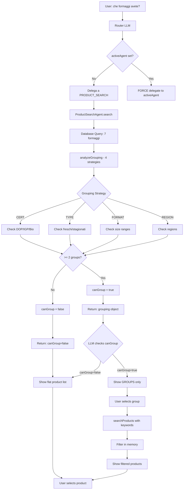
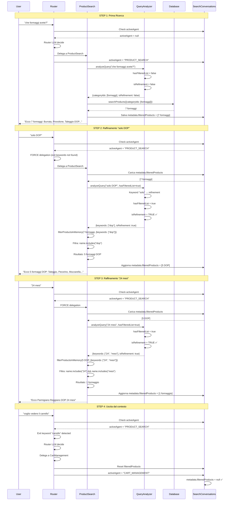

# Sistema di Filtri Progressivi - Documentazione Tecnica

**Last Updated**: 2025-11-10 (QueryAnalyzer removed - using direct RAG integration)

> **⚠️ NOTE**: QueryAnalyzer Agent removed on November 10, 2025.  
> Product search now uses direct RAG integration with vector embeddings.  
> Progressive filtering logic remains unchanged.

## 📋 Indice

1. [Overview](#overview)
2. [Hierarchical Filtering (NEW)](#hierarchical-filtering)
3. [Architettura](#architettura)
4. [State Management](#state-management)
5. [Flow Completo](#flow-completo)
6. [Componenti Chiave](#componenti-chiave)
7. [Reset Logic](#reset-logic)
8. [Esempi Pratici](#esempi-pratici)

---

## 🎯 Overview

Il **Sistema di Filtri Progressivi** permette all'utente di raffinare la ricerca prodotti in modo iterativo, mantenendo in memoria i risultati precedenti per filtrarli senza ri-interrogare il database.

### Problema Risolto

**PRIMA** (senza filtri progressivi):

```
User: "che formaggi avete?"
Bot: → Database query → 7 formaggi

User: "solo DOP"
Bot: → Database query → 7 formaggi DOP (SBAGLIATO! Include anche salumi DOP)
```

**DOPO** (con filtri progressivi):

```
User: "che formaggi avete?"
Bot: → Database query → 7 formaggi
     → Salva in metadata.filteredProducts

User: "solo DOP"
Bot: → Filtra metadata.filteredProducts in memoria → 5 formaggi DOP ✅
     → Aggiorna metadata.filteredProducts

User: "24 mesi"
Bot: → Filtra metadata.filteredProducts in memoria → 1 formaggio ✅
```

---

## 🆕 Hierarchical Filtering

**Added**: 2025-11-10  
**Feature**: Smart product grouping instead of flat product lists

### Problema Risolto

**PRIMA** (senza grouping - LISTA PIATTA):

```
User: "che formaggi avete?"
Bot: 1. Gorgonzola Dolce DOP - €6.50
     2. Parmigiano Reggiano DOP 24 mesi - €8.90
     3. Mozzarella di Bufala Campana DOP - €7.80
     4. Pecorino Romano DOP - €6.20
     5. Taleggio DOP - €7.50
     6. Provolone Piccante - €6.80
     7. Burrata Pugliese - €8.20

User: 🤯 Too many choices! I'm confused...
```

**DOPO** (con grouping - GERARCHICO):

```
User: "che formaggi avete?"
Bot: Abbiamo formaggi in queste categorie:
     1. 🏆 DOP (5 prodotti)
     2. 📦 Senza certificazione (2 prodotti)

     Quale categoria ti interessa?

User: "1" or "DOP"
Bot: → Filtra in memoria i 5 DOP
     Ecco i formaggi DOP:
     1. Gorgonzola Dolce DOP - €6.50
     2. Parmigiano Reggiano DOP 24 mesi - €8.90
     ...

User: "24 mesi"
Bot: → Filtra in memoria
     Ecco Parmigiano Reggiano DOP 24 mesi - €8.90 ✅
```

### Fix 2025-11-10: LLM Function Schema

**Root Cause**: LLM ignorava `grouping` perché non documentato nel function schema

**File**: `backend/src/application/agents/ProductSearchAgentLLM.ts`

**BEFORE** (bug):

```typescript
{
  name: "searchProducts",
  parameters: { ... },
  // ❌ NO 'returns' schema - LLM doesn't know about grouping!
}
```

**AFTER** (fix):

```typescript
{
  name: "searchProducts",
  parameters: { ... },
  returns: {  // ✅ ADDED
    type: "object",
    properties: {
      products: { type: "array", ... },
      totalCount: { type: "number" },
      grouping: {  // ✅ NOW LLM KNOWS ABOUT GROUPING
        type: "object",
        properties: {
          canGroup: {
            type: "boolean",
            description: "If true, show ONLY groups (NOT products)"
          },
          groupBy: {
            type: "string",
            enum: ["certification", "type", "format", "region"]
          },
          groups: {
            type: "array",
            items: {
              properties: {
                name: { type: "string" },
                count: { type: "number" },
                keywords: { type: "array", items: { type: "string" } }
              }
            }
          }
        }
      }
    }
  }
}
```

### Flow con Smart Grouping



### Grouping Priority

**Principle V (Constitution)**: CERTIFICATION > TYPE > FORMAT > REGION

**Implementation**: `ProductSearchAgent.analyzeGrouping()` (lines 234-290)

1. **CERTIFICATION** (priority 1):

   - Groups: DOP, IGP, Bio, **Senza certificazione**
   - Detection: Regex on name + description
   - Example: "Parmigiano Reggiano DOP" → DOP group

2. **TYPE** (priority 2):

   - Groups: freschi, stagionati, pasta molle, pasta dura
   - Keywords: "fresco", "stagionato", "molle", "dura"
   - Fallback: If no certification groups

3. **FORMAT** (priority 3):

   - Groups: <200g, 200-500g, 500g-1kg, >1kg
   - Based on: Product weight/size
   - Fallback: If no cert/type groups

4. **REGION** (priority 4):
   - Groups: Emilia-Romagna, Lombardia, Toscana, etc.
   - Detection: Italian regions in name/description
   - Last resort fallback

### Metadata Updated

```typescript
interface SearchConversationMetadata {
  filteredProducts?: Array<{ ... }>
  selectedProductCode?: string
  lastQuery?: string
  lastResponse?: string

  // 🆕 ADDED for smart grouping
  grouping?: {
    canGroup: boolean
    groupBy: "certification" | "type" | "format" | "region"
    groups: Array<{
      name: string
      count: number
      keywords: string[]
    }>
  }
}
```

---

## 🏗️ Architettura

### Tabelle Database

#### `SearchConversations`

```prisma
model SearchConversations {
  id           String   @id @default(cuid())
  sessionId    String   @unique
  workspaceId  String
  customerId   String
  activeAgent  String?  // "PRODUCT_SEARCH" | "CART_MANAGEMENT" | null
  metadata     Json?    // { filteredProducts: [...], selectedProductCode: "..." }
  expiresAt    DateTime
  createdAt    DateTime @default(now())
  updatedAt    DateTime @updatedAt
}
```

### Metadati Salvati

```typescript
interface SearchConversationMetadata {
  // Lista prodotti filtrati - USATA per filtri progressivi
  filteredProducts?: Array<{
    id: string
    productCode: string
    name: string
    description: string
    price: number
    stock: number
    categoryId: string
    categoryName: string
    supplierName: string
    region?: string
    certifications?: string[]
    isOrganic: boolean
    isHalal: boolean
    isVegan: boolean
    isGlutenFree: boolean
  }>

  // Prodotto selezionato dall'utente (per delegation a Cart)
  selectedProductCode?: string

  // Query precedente (per context)
  lastQuery?: string

  // Risposta precedente (per context)
  lastResponse?: string
}
```

---

## 🔄 State Management

### activeAgent State

L'`activeAgent` controlla quale Specialist Agent ha il controllo della conversazione.

#### Stati Possibili

```typescript
type ActiveAgent =
  | "PRODUCT_SEARCH" // Ricerca/filtro prodotti attivo
  | "CART_MANAGEMENT" // Gestione carrello attiva
  | "ORDER_TRACKING" // Tracking ordini attivo
  | "CUSTOMER_SUPPORT" // Supporto clienti attivo
  | null // Router decide
```

#### Lifecycle activeAgent

```
1. CREAZIONE:
   Router delega specialist → activeAgent = "PRODUCT_SEARCH"

2. MANTENIMENTO:
   Finché user continua ricerca → activeAgent rimane "PRODUCT_SEARCH"

3. CAMBIO CONTESTO:
   User chiede "carrello" → Router delega Cart → activeAgent = "CART_MANAGEMENT"

4. RESET:
   Mission complete o timeout → activeAgent = null
```

### metadata.filteredProducts State

La lista `filteredProducts` contiene i prodotti correnti in memoria.

#### Lifecycle filteredProducts

```
1. CREAZIONE:
   Prima searchProducts() → salva risultati in metadata.filteredProducts

2. RAFFINAMENTO:
   Query successiva → filtra metadata.filteredProducts → aggiorna con nuovi risultati

3. RESET:
   - activeAgent cambia da PRODUCT_SEARCH → filteredProducts = null
   - Nuova ricerca (isRefinement=false) → filteredProducts sovrascritto

4. PERSISTENZA:
   - Salvata in DB ad ogni upsert di SearchConversations
   - TTL: 10 minuti (expiresAt)
```

---

## 📊 Flow Completo

### Scenario: Ricerca Progressiva "Formaggi → DOP → 24 mesi"



---

## 🔧 Componenti Chiave

### 1. Router Service - State Check & Force Delegation

**File**: `backend/src/services/llm-router.service.ts`

```typescript
// STEP 2.5: STATE-BASED PRE-ROUTING CHECK
const searchConversation = await this.prisma.searchConversations.findUnique({
  where: { sessionId: params.conversationId },
})

if (searchConversation?.activeAgent) {
  const query = params.message.trim()

  // Check if user wants to exit product search context
  const exitKeywords = [
    "carrello",
    "cart",
    "ordini",
    "orders",
    "aiuto",
    "help",
    "operatore",
    "operator",
  ]
  const isExitQuery = exitKeywords.some((kw) =>
    query.toLowerCase().includes(kw)
  )

  if (isExitQuery) {
    logger.info(
      `🚪 Exit keywords detected - letting Router LLM decide new context`
    )
    // Continue to Router LLM below
  } else {
    // FORCE delegation to activeAgent for ALL queries (simple OR complex)
    logger.info(`🎯 FORCE delegating to ${searchConversation.activeAgent}`)

    return await this.delegateToActiveAgent({
      activeAgent: searchConversation.activeAgent,
      query,
      params,
      conversationHistory,
    })
  }
}
```

**Logica**:

- ✅ Se `activeAgent` è impostato E query NON contiene exit keywords → **FORCE delegation**
- ✅ Se exit keywords → Router LLM decide nuovo contesto
- ✅ Questo bypassa Router LLM per velocità e garantisce continuità

### 2. Product Search - Refinement Detection

**File**: `backend/src/application/agents/ProductSearchAgentLLM.ts`

> **Note**: QueryAnalyzer removed. Product search now uses direct RAG integration with embeddings.

```typescript
interface SearchContext {
  workspaceId: string
  query: string
  hasFilteredList?: boolean // ✅ Indica se esiste lista in memoria
  conversationContext?: {
    lastQuery?: string
    lastResponse?: string
  }
}

interface SearchResult {
  filters: {
    categoryIds?: string[]
    supplierIds?: string[]
    certifications?: string[]
    regions?: string[]
    priceRange?: { min?: number; max?: number }
    keywords?: string[]
    reasoning: string
  }
  isRefinement: boolean // ✅ TRUE se raffinamento, FALSE se nuova ricerca
  reasoning: string
  tokensUsed: number
}
```

**Metodo**: `determineIfRefinement()`

```typescript
private determineIfRefinement(
  query: string,
  hasFilteredList: boolean,
  filters: any,
  conversationContext?: { lastQuery?: string; lastResponse?: string }
): boolean {
  // No filtered list → always new search
  if (!hasFilteredList) {
    return false
  }

  const queryLower = query.toLowerCase().trim()

  // Refinement keywords
  const refinementKeywords = [
    "solo", "only", "voglio", "want",
    "più", "meno", "less", "more",
    "economico", "cheap", "costoso", "expensive",
    "migliore", "best",
    "dop", "igp", "bio", "organic",
    "24 mesi", "stagionato",
  ]

  // New search keywords
  const newSearchKeywords = [
    "avete", "have you", "cerca", "search",
    "mostra", "show", "vorrei", "i would like",
    "quale", "which",
  ]

  const hasRefinementKeywords = refinementKeywords.some((kw) =>
    queryLower.includes(kw)
  )
  const hasNewSearchKeywords = newSearchKeywords.some((kw) =>
    queryLower.includes(kw)
  )

  // Decision logic
  if (hasRefinementKeywords && !hasNewSearchKeywords) {
    return true  // REFINEMENT
  }

  if (hasNewSearchKeywords) {
    return false  // NEW SEARCH
  }

  // Default: assume refinement if unclear
  return true
}
```

### 3. ProductSearchAgent - Progressive Filtering

**File**: `backend/src/application/agents/ProductSearchAgentLLM.ts`

```typescript
case "searchProducts":
  // 1. Check if filtered list exists
  const filteredProducts = existingConversation?.metadata?.filteredProducts
  const hasFilteredList = filteredProducts && filteredProducts.length > 0

  // 2. Analyze query to determine if refinement
  const analysisResult = await this.queryAnalyzerAgent.analyzeQuery({
    workspaceId,
    query,
    hasFilteredList,  // ✅ Pass flag to QueryAnalyzer
    conversationContext: {
      lastQuery: (existingConversation as any)?.lastQuery,
      lastResponse: (existingConversation as any)?.lastResponse,
    },
  })

  let searchResult: any

  // 3. BRANCH: Refinement vs New Search
  if (analysisResult.isRefinement && hasFilteredList) {
    // ✅ REFINEMENT: Filter in memory
    logger.info(`🎯 REFINEMENT MODE: Filtering ${filteredProducts.length} products in memory`)

    searchResult = this.filterProductsInMemory(
      filteredProducts,
      analysisResult.filters,
      language
    )
  } else {
    // ✅ NEW SEARCH: Query database
    logger.info(`🆕 NEW SEARCH: Querying database`)

    searchResult = await this.productSearchAgent.search(
      workspaceId,
      analysisResult.filters,
      language
    )
  }

  // 4. Save results including filteredProducts
  await this.searchConversationRepo.upsert({
    sessionId,
    workspaceId,
    customerId,
    metadata: {
      products: metadataProducts,
      filteredProducts: metadataProducts,  // ✅ Save for next refinement
      lastQuery: query,
      lastResponse: response,
    },
    expiresAt: new Date(Date.now() + 10 * 60 * 1000),
  })
```

**Metodo**: `filterProductsInMemory()`

```typescript
private filterProductsInMemory(
  products: any[],
  filters: any,
  language: string
): any {
  let filtered = [...products]

  logger.info(`🔍 Filtering ${filtered.length} products in memory`, { filters })

  // Filter by keywords (name/description contains)
  if (filters.keywords && filters.keywords.length > 0) {
    const keywordsLower = filters.keywords.map((k: string) => k.toLowerCase())
    filtered = filtered.filter((p) => {
      const searchText = `${p.name} ${p.description || ""}`.toLowerCase()
      return keywordsLower.some((keyword: string) =>
        searchText.includes(keyword)
      )
    })
    logger.info(`   Keywords filter: ${filtered.length} products remain`)
  }

  // Filter by price range
  if (filters.priceRange) {
    if (filters.priceRange.min !== undefined) {
      filtered = filtered.filter((p) => p.price >= filters.priceRange.min)
    }
    if (filters.priceRange.max !== undefined) {
      filtered = filtered.filter((p) => p.price <= filters.priceRange.max)
    }
  }

  // Filter by certifications (check boolean fields + array + name)
  if (filters.certifications && filters.certifications.length > 0) {
    filtered = filtered.filter((p) => {
      return filters.certifications.some((cert: string) => {
        const certLower = cert.toLowerCase()
        // Check boolean fields
        if (certLower === "bio" || certLower === "organic") return p.isOrganic
        if (certLower === "halal") return p.isHalal
        if (certLower === "vegan") return p.isVegan
        if (certLower === "gluten-free") return p.isGlutenFree
        // Check certifications array
        if (p.certifications) {
          return p.certifications.some((c: string) =>
            c.toLowerCase().includes(certLower)
          )
        }
        // Check name (for DOP, IGP in product name)
        return p.name.toLowerCase().includes(certLower)
      })
    })
  }

  // Filter by regions
  if (filters.regions && filters.regions.length > 0) {
    filtered = filtered.filter((p) => {
      return filters.regions.some(
        (region: string) =>
          p.region && p.region.toLowerCase().includes(region.toLowerCase())
      )
    })
  }

  logger.info(`✅ In-memory filtering complete: ${filtered.length} products`)

  // Return in same format as ProductSearchAgent.search()
  return {
    products: filtered,
    totalCount: filtered.length,
    filters: filters,
  }
}
```

---

## 🔄 Reset Logic

### Quando viene RESETTATO filteredProducts

#### 1. Cambio activeAgent da PRODUCT_SEARCH

**File**: `backend/src/services/llm-router.service.ts`

```typescript
// Check previous activeAgent to detect context switch
const currentConversation = await prisma.searchConversations.findUnique({
  where: { sessionId: params.conversationId },
})

const previousAgent = (currentConversation as any)?.activeAgent
const isLeavingProductSearch =
  previousAgent === "PRODUCT_SEARCH" && delegationTarget !== "PRODUCT_SEARCH"

// RESET filteredProducts when leaving PRODUCT_SEARCH
let updatedMetadata: any = currentConversation?.metadata || {}
if (isLeavingProductSearch) {
  logger.info(`🧹 Leaving PRODUCT_SEARCH context → Resetting filteredProducts`)
  updatedMetadata = {
    ...(updatedMetadata as any),
    filteredProducts: null, // ✅ Clear list
    // Keep selectedProductCode if user confirmed a product
  }
}

await this.prisma.searchConversations.upsert({
  where: { sessionId },
  update: {
    activeAgent: delegationTarget,
    metadata: updatedMetadata,
  },
})
```

**Trigger**:

- User chiede "carrello" → activeAgent cambia a CART_MANAGEMENT
- User chiede "ordini" → activeAgent cambia a ORDER_TRACKING
- User chiede "aiuto" → activeAgent cambia a CUSTOMER_SUPPORT

#### 2. Nuova Ricerca (isRefinement=false)

Quando QueryAnalyzer determina che è una **nuova ricerca** (non raffinamento), i risultati del database SOVRASCRIVONO `filteredProducts`:

```typescript
// NEW SEARCH detected
const searchResult = await this.productSearchAgent.search(...)

// Overwrite filteredProducts with new results
await this.searchConversationRepo.upsert({
  metadata: {
    filteredProducts: metadataProducts,  // ✅ Overwrite
  },
})
```

**Trigger**:

- User chiede "avete pasta?" dopo aver cercato formaggi
- User usa keyword "cerca", "mostra", "avete"

#### 3. Timeout (TTL)

SearchConversations ha un TTL di 10 minuti:

```typescript
expiresAt: new Date(Date.now() + 10 * 60 * 1000)
```

Un cronjob rimuove record scaduti:

```typescript
// backend/src/jobs/cleanup-search-conversations.ts
await prisma.searchConversations.deleteMany({
  where: {
    expiresAt: { lt: new Date() },
  },
})
```

---

## 💡 Esempi Pratici

### Esempio 1: Ricerca Progressiva Completa

```
🔹 STEP 1: Prima ricerca
User: "che formaggi avete?"
System:
  - activeAgent: null → PRODUCT_SEARCH
  - hasFilteredList: false
  - isRefinement: false
  - Action: Database query (categoryIds=[formaggi])
  - Result: 7 formaggi
  - Save: filteredProducts = [7 formaggi]
Bot: "Ecco 7 formaggi: 1. Burrata, 2. Provolone, 3. Taleggio DOP..."

🔹 STEP 2: Raffinamento DOP
User: "solo DOP"
System:
  - activeAgent: PRODUCT_SEARCH → FORCE delegation
  - hasFilteredList: true (7 formaggi)
  - isRefinement: true (keyword "solo")
  - Action: filterProductsInMemory(7 formaggi, {keywords: ["dop"]})
  - Result: 5 formaggi DOP
  - Save: filteredProducts = [5 DOP]
Bot: "Ecco 5 formaggi DOP: 1. Taleggio, 2. Pecorino, 3. Mozzarella..."

🔹 STEP 3: Raffinamento 24 mesi
User: "24 mesi"
System:
  - activeAgent: PRODUCT_SEARCH → FORCE delegation
  - hasFilteredList: true (5 DOP)
  - isRefinement: true (keyword "24 mesi")
  - Action: filterProductsInMemory(5 DOP, {keywords: ["24", "mesi"]})
  - Result: 1 formaggio
  - Save: filteredProducts = [1 formaggio]
Bot: "Ecco Parmigiano Reggiano DOP 24 mesi - €12.50"

🔹 STEP 4: Selezione prodotto
User: "1"
System:
  - activeAgent: PRODUCT_SEARCH → FORCE delegation
  - Action: Show product details
  - Save: selectedProductCode = "FORMAG-006"
Bot: "Parmigiano Reggiano DOP 24 mesi - Dettagli... Vuoi aggiungerlo?"

🔹 STEP 5: Conferma aggiunta
User: "sì"
System:
  - activeAgent: PRODUCT_SEARCH → FORCE delegation
  - ProductSearch: Delegation handoff "🛒 DELEGATE_TO_CART: add FORMAG-006"
  - Router: Intercept pattern → Delega a CartManagement
  - activeAgent: PRODUCT_SEARCH → CART_MANAGEMENT
  - Reset: filteredProducts = null ✅
Bot: "✅ Parmigiano aggiunto al carrello! Vuoi altro?"
```

### Esempio 2: Uscita Anticipata dal Contesto

```
🔹 STEP 1-2: (come sopra - 7 formaggi → 5 DOP)

🔹 STEP 3: User esce dal contesto
User: "voglio vedere il carrello"
System:
  - activeAgent: PRODUCT_SEARCH
  - Exit keyword "carrello" detected → Router LLM decide
  - Router: Delega a CartManagement
  - activeAgent: PRODUCT_SEARCH → CART_MANAGEMENT
  - Reset: filteredProducts = null ✅
Bot: "Ecco il tuo carrello: ..."

🔹 STEP 4: Nuova ricerca dopo reset
User: "avete pasta?"
System:
  - activeAgent: CART_MANAGEMENT
  - Router: Delega a ProductSearch
  - activeAgent: CART_MANAGEMENT → PRODUCT_SEARCH
  - hasFilteredList: false (reset precedente)
  - isRefinement: false
  - Action: Database query (categoryIds=[pasta])
Bot: "Ecco 5 prodotti di pasta: ..."
```

### Esempio 3: Categoria Changed Detection (DISABLED)

**NOTA**: Category change detection è DISABILITATA perché confrontava UUIDs con testo query (sempre falliva).

```typescript
// ❌ DISABLED CODE (commented out)
/*
if (filters.categoryIds && filters.categoryIds.length > 0) {
  const lastQueryLower = conversationContext.lastQuery.toLowerCase()
  const categoriesChanged = !filters.categoryIds.every((catId: string) =>
    lastQueryLower.includes(catId)  // ❌ UUID never in query!
  )
  
  if (categoriesChanged) {
    return false  // NEW SEARCH
  }
}
*/
```

**Problema**: Cercava UUID `"a006a579-5b13-447c-99c2-8fb4013ce3d7"` nella query `"che formaggi avete?"` → sempre falliva.

**Soluzione**: Commentato - usiamo solo keyword detection.

---

## 🐛 Known Issues & Fixes

### Issue 1: Router LLM Non Delega con activeAgent Attivo

**Problema**: Router LLM rispondeva direttamente invece di delegare a ProductSearch anche con `activeAgent=PRODUCT_SEARCH`.

**Fix**: FORCE delegation per TUTTE le query (non solo semplici) tranne exit keywords.

```typescript
// BEFORE (only simple queries)
if (isSimpleQuery) {
  return await this.delegateToActiveAgent(...)
}

// AFTER (all queries except exit keywords)
if (!isExitQuery) {
  return await this.delegateToActiveAgent(...)
}
```

### Issue 2: Category Change Detection Sempre Falliva

**Problema**: Confrontava UUIDs con testo query.

**Fix**: Commentato completamente - usiamo keyword detection.

### Issue 3: QueryAnalyzer Non Riceveva hasFilteredList

**Problema**: ProductSearch non passava `hasFilteredList` a QueryAnalyzer.

**Fix**: Aggiunto parametro `hasFilteredList` nel context.

---

## 🎯 Best Practices

### 1. Sempre Passare hasFilteredList

```typescript
// ✅ CORRECT
const analysisResult = await this.queryAnalyzerAgent.analyzeQuery({
  workspaceId,
  query,
  hasFilteredList: !!(filteredProducts && filteredProducts.length > 0),
  conversationContext,
})

// ❌ WRONG
const analysisResult = await this.queryAnalyzerAgent.analyzeQuery({
  workspaceId,
  query,
  // Missing hasFilteredList!
})
```

### 2. Salvare SEMPRE filteredProducts Dopo Search

```typescript
// ✅ CORRECT
await this.searchConversationRepo.upsert({
  metadata: {
    products: metadataProducts,
    filteredProducts: metadataProducts, // ✅ Save for next refinement
  },
})

// ❌ WRONG
await this.searchConversationRepo.upsert({
  metadata: {
    products: metadataProducts,
    // Missing filteredProducts!
  },
})
```

### 3. Reset filteredProducts Quando Cambia Contesto

```typescript
// ✅ CORRECT
if (isLeavingProductSearch) {
  updatedMetadata.filteredProducts = null
}

// ❌ WRONG
// Never reset - memory leak + wrong filters!
```

### 4. Log Tutti i Branch del Flow

```typescript
if (analysisResult.isRefinement && hasFilteredList) {
  logger.info(
    `🎯 REFINEMENT MODE: Filtering ${filteredProducts.length} products`
  )
} else {
  logger.info(`🆕 NEW SEARCH: Querying database`)
}
```

---

## 📚 Riferimenti

- **State-Based Routing**: `docs/memory-bank/03-architecture/state-based-routing.md`
- **Database Schema**: `backend/prisma/schema.prisma`
- **Router Service**: `backend/src/services/llm-router.service.ts`
- **QueryAnalyzer**: `backend/src/application/agents/QueryAnalyzerAgentLLM.ts`
- **ProductSearch**: `backend/src/application/agents/ProductSearchAgentLLM.ts`

---

## ✅ Checklist Implementazione

- [x] Database: Campo `activeAgent` in SearchConversations
- [x] Database: Campo `metadata.filteredProducts` in SearchConversations
- [x] Router: FORCE delegation con activeAgent attivo
- [x] Router: Exit keywords detection
- [x] Router: Reset filteredProducts on context switch
- [x] QueryAnalyzer: `hasFilteredList` parameter
- [x] QueryAnalyzer: `isRefinement` flag
- [x] QueryAnalyzer: `determineIfRefinement()` method
- [x] QueryAnalyzer: Refinement keywords detection
- [x] ProductSearch: Check `metadata.filteredProducts`
- [x] ProductSearch: Branch `isRefinement` vs new search
- [x] ProductSearch: `filterProductsInMemory()` method
- [x] ProductSearch: Save `filteredProducts` in metadata
- [ ] Test: E2E progressive filtering flow
- [ ] Test: Reset on context switch
- [ ] Test: Multiple refinements chain

---

**Ultima Modifica**: 10 Novembre 2025  
**Autore**: GitHub Copilot + Andrea  
**Versione**: 1.0
