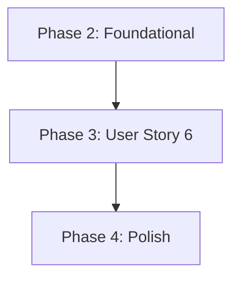
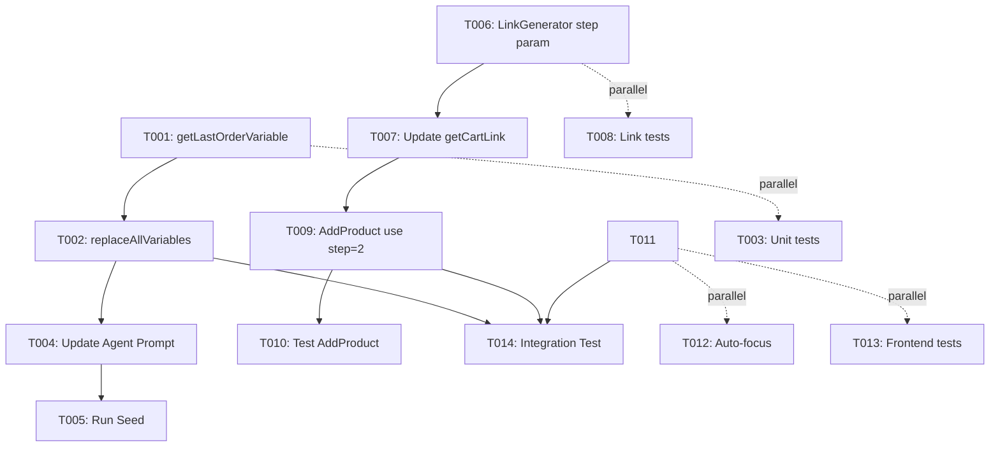

# Tasks: FR-13 Repeat Order with Confirmation Flow

**Input**: Design documents from `/specs/122-rag-con-prodcuct/`
**Prerequisites**: plan.md ✅, spec.md ✅, research.md ✅, data-model.md ✅, contracts/ ✅, quickstart.md ✅

**Tests**: Tests are NOT explicitly requested - focusing on implementation tasks only

**Organization**: Tasks grouped by implementation phase per quickstart.md guide

## Format: `[ID] [P?] [Story] Description`

- **[P]**: Can run in parallel (different files, no dependencies)
- **[US6]**: User Story 6 - Repeat Last Order with Confirmation
- Include exact file paths in descriptions

## Path Conventions

- Web app structure: `backend/src/`, `frontend/src/`
- Paths from plan.md structure section

---

## Phase 1: Setup (No Additional Setup Required)

**Purpose**: Project already initialized - FR-13 is an enhancement to existing system

**Status**: ✅ COMPLETE - All infrastructure exists (backend running, frontend running, database seeded)

---

## Phase 2: Foundational (Prerequisites Check)

**Purpose**: Verify existing components that FR-13 depends on

**⚠️ CRITICAL**: These must exist before FR-13 implementation

- [x] F001 Verify AddProduct CF exists in backend/src/domain/calling-functions/AddProduct.ts
- [x] F002 Verify OrderTrackingAgentLLM exists in backend/src/application/agents/OrderTrackingAgentLLM.ts
- [x] F003 Verify LinkGeneratorService exists in backend/src/services/link-generator.service.ts
- [x] F004 Verify PromptProcessorService exists in backend/src/services/prompt-processor.service.ts
- [x] F005 Verify CheckoutPage exists in frontend/src/pages/CheckoutPage.tsx

**Checkpoint**: ✅ All prerequisites verified - ready for FR-13 implementation

---

## Phase 3: User Story 6 - Repeat Last Order with Confirmation (Priority: P1) 🎯 MVP

**Goal**: Enable customers to repeat their last delivered order with LLM-driven confirmation flow and direct checkout to address step

**User Story**:

- **As a** customer
- **I want to** repeat my last order with a simple "ripeti ultimo ordine" command
- **So that** I can quickly reorder my favorite products without searching again

**Acceptance Criteria**:

1. Customer sends "voglio ripetere ultimo ordine" in WhatsApp
2. OrderTrackingAgent shows order summary from {{LAST_ORDER}} variable
3. Agent asks for confirmation: "Vuoi ripetere l'operazione?"
4. Customer responds "SI"
5. Agent calls addProducts with order items array
6. Customer receives checkout link with ?step=2 (direct to address)
7. Frontend loads CheckoutPage at Step 2, skipping cart review

**Independent Test**:

```bash
# Manual test flow
1. WhatsApp: "voglio ripetere ultimo ordine"
2. Expected: Agent shows "Ultimo ordine: ORD-XXX del DD/MM/YYYY\n- Product1 x4 (€XX)\n- Product2 x12 (€YY)\nTotale: €ZZ\n\nVuoi ripetere l'operazione?"
3. WhatsApp: "SI"
4. Expected: "✅ Ho aggiunto 2 prodotti al carrello! 🛒 Procedi al checkout: [LINK]?step=2"
5. Click link → CheckoutPage opens at Step 2 (Address form)
```

### Step 1: PromptProcessorService - Add {{LAST_ORDER}} Variable (90 min)

**Reference**: quickstart.md Step 1, data-model.md Variable Replacement Logic

- [x] T001 [P] [US6] Add getLastOrderVariable() method to backend/src/services/prompt-processor.service.ts

  - Query orders.findFirst(customerId, workspaceId, status: 'DELIVERED', orderBy createdAt DESC)
  - Format order summary in Italian: "Ultimo ordine: {code} del {date}\nProdotti ordinati:\n- {productCode} {name} x{qty} ({price}€ cad.) = {total}€\nTotale ordine: {total}€\nStato: {status}"
  - Return "Nessun ordine precedente disponibile." if no orders found
  - Include error handling with logger.error()

- [x] T002 [US6] Update replaceAllVariables() method in backend/src/services/prompt-processor.service.ts

  - Add check: if (prompt.includes('{{LAST_ORDER}}'))
  - Call getLastOrderVariable(customerId, workspaceId)
  - Replace all occurrences: prompt.replace(/\{\{LAST_ORDER\}\}/g, lastOrderText)
  - Depends on T001

- [ ] T003 [P] [US6] Create unit tests in backend/**tests**/unit/prompt-processor-lastorder.test.ts
  - Test: Order found → formatted summary returned
  - Test: No orders → "Nessun ordine precedente disponibile."
  - Test: Database error → graceful fallback
  - Run: npm run test:unit -- prompt-processor-lastorder

**Checkpoint**: {{LAST_ORDER}} variable replacement works correctly

---

### Step 2: Agent Prompt Update - Add {{LAST_ORDER}} to Order Agent (30 min)

**Reference**: quickstart.md Step 2, contracts/prompt-processor-lastorder.md

- [ ] T004 [US6] Update Order Tracking Agent prompt in backend/prisma/seed.ts

  - Locate agentConfig update for ORDER_TRACKING type
  - Add section: "## Ultimo Ordine Cliente\n\n{{LAST_ORDER}}\n\n"
  - Add repeat order flow instructions: "When customer asks to repeat last order: 1. Show {{LAST_ORDER}} summary 2. Ask confirmation 3. Wait for SI/certo/ok 4. Call repeatLastOrder()"
  - Include example dialog showing confirmation flow
  - Depends on T002 (variable replacement must work first)

- [ ] T005 [US6] Run database seed to update agent prompt
  - Execute: cd backend && npm run seed
  - Verify: Open Prisma Studio → agentConfig → ORDER_TRACKING → systemPrompt contains {{LAST_ORDER}}
  - Depends on T004

**Checkpoint**: Order Tracking Agent has {{LAST_ORDER}} in prompt

---

### Step 3: LinkGeneratorService - Add Step Parameter Support (45 min)

**Reference**: quickstart.md Step 3, contracts/link-generator-step-parameter.md

- [ ] T006 [P] [US6] Update generateCheckoutLink() signature in backend/src/services/link-generator.service.ts

  - Add optional parameter: step?: number
  - Add validation: if (step !== undefined && (step < 1 || step > 2)) throw Error
  - Append to URL: if (step) url += `&step=${step}`
  - Maintain backward compatibility (step parameter optional)

- [ ] T007 [US6] Update getCartLink() method in backend/src/services/calling-functions.service.ts

  - Add step parameter to request interface: step?: number
  - Pass step to linkGenerator: linkGeneratorService.generateCheckoutLink(token, workspaceId, request.step)
  - Depends on T006

- [ ] T008 [P] [US6] Create unit tests in backend/**tests**/unit/link-generator-step.test.ts
  - Test: No step parameter → URL without &step=
  - Test: step=1 → URL contains &step=1
  - Test: step=2 → URL contains &step=2
  - Test: step=3 → throws error "Invalid step: must be 1 or 2"
  - Run: npm run test:unit -- link-generator-step

**Checkpoint**: Link generator supports ?step=2 parameter

---

### Step 4: AddProduct CF - Use Step=2 for Checkout Link (30 min)

**Reference**: quickstart.md Step 4, data-model.md AddProductsRequest

- [ ] T009 [US6] Update cartLinkResult call in backend/src/domain/calling-functions/AddProduct.ts

  - Locate line ~140-170 where getCartLink() is called
  - Add step parameter: await callingFunctionsService.getCartLink({ customerId, workspaceId, step: 2 })
  - Verify cartUrl now includes ?step=2 in result
  - Depends on T007

- [ ] T010 [US6] Test AddProduct CF with integration test
  - Run: npm run test:integration -- add-product
  - Verify: cartUrl format is "https://shopme.local/checkout-public?token=xxx&step=2"
  - Depends on T009

**Checkpoint**: AddProduct CF returns checkout links with step=2

---

### Step 5: Frontend - CheckoutPage Step Parameter Handling (60 min)

**Reference**: quickstart.md Step 5, data-model.md CheckoutLinkParams

- [ ] T011 [US6] Add URL parameter detection to frontend/src/pages/CheckoutPage.tsx

  - Import useSearchParams from react-router-dom
  - Add useEffect: const stepParam = searchParams.get('step')
  - If step=2 AND cart has items → setCurrentStep(2)
  - If step=2 AND cart empty → toast.error("Carrello vuoto") + setCurrentStep(1)
  - Dependencies: Cart state must be loaded first

- [ ] T012 [P] [US6] Add auto-focus for address step in frontend/src/components/checkout/Step2Address.tsx

  - Add useEffect to detect URL param step=2
  - Auto-focus first input field: document.getElementById('street-address')?.focus()
  - Improve UX for users coming from repeat order flow

- [ ] T013 [P] [US6] Create frontend unit tests in frontend/tests/checkout-step-navigation.test.ts
  - Test: URL ?step=2 with cart items → loads Step 2
  - Test: URL ?step=2 with empty cart → shows error, loads Step 1
  - Test: No step param → defaults to Step 1
  - Run: npm test -- checkout-step-navigation

**Checkpoint**: Frontend handles ?step=2 parameter correctly

---

### Step 6: RepeatOrder CF Logic (Optional - SKIP for MVP)

**Reference**: quickstart.md Step 6 (Option A recommended)

**Decision**: Use LLM-driven confirmation (no code changes needed)

- RepeatOrder.ts behavior: Adds items when called (unchanged)
- LLM handles confirmation in conversation history
- No backend modifications required for MVP

**Status**: ✅ SKIPPED (LLM confirmation sufficient per research.md)

---

### Step 7: Integration Testing & Validation (60 min)

**Reference**: quickstart.md Step 7

- [ ] T014 [US6] Create end-to-end integration test in backend/**tests**/integration/repeat-order-flow.test.ts

  - Setup: Create test customer + DELIVERED order with 2 products
  - Test: Replace {{LAST_ORDER}} variable → verify formatted output
  - Test: Call AddProduct with order items → verify cart creation
  - Test: Verify checkout URL contains ?token=xxx&step=2
  - Test: Verify cart has correct quantity (2 products added)
  - Run: npm run test:integration -- repeat-order-flow

- [ ] T015 [US6] Manual end-to-end test via WhatsApp

  - Login to test WhatsApp account
  - Send: "voglio ripetere ultimo ordine"
  - Verify: Agent shows order summary with products
  - Verify: Agent asks "Vuoi ripetere l'operazione?"
  - Send: "SI"
  - Verify: Agent calls repeatLastOrder() and returns checkout link
  - Click link: Verify CheckoutPage opens at Step 2 (address form)
  - Verify: Cart has correct products from last order

- [ ] T016 [US6] Verify all unit tests pass

  - Run: npm run test:unit
  - Expected: All tests passing (prompt-processor-lastorder, link-generator-step)
  - Fix any failures before marking complete

- [ ] T017 [US6] Verify backend build succeeds
  - Run: cd backend && npm run build
  - Expected: No TypeScript errors
  - Expected: Swagger updated with any new endpoints

**Checkpoint**: All tests passing - Feature complete and verified

---

## Phase 4: Polish & Documentation (30 min)

**Purpose**: Finalize documentation and code quality

- [ ] T018 [P] Update docs/memory-bank/PRD.md with {{LAST_ORDER}} variable

  - Add to Variable Replacement section
  - Document format and usage
  - Include example output

- [ ] T019 [P] Update docs/prompts/order-tracking-agent.md

  - Document repeat order confirmation flow
  - Include LLM conversation examples
  - Explain {{LAST_ORDER}} variable usage

- [ ] T020 [P] Update docs/LINK_FORMATS_REFERENCE.md

  - Document step parameter: ?step=1 (cart review), ?step=2 (address)
  - Include examples and use cases
  - Note: Feature available for repeat order flow

- [ ] T021 Run final code quality checks
  - Run: npm run lint (backend + frontend)
  - Fix any linting errors
  - Ensure consistent code formatting

**Checkpoint**: Documentation complete - Ready for deployment

---

## Dependencies

### Story Completion Order



**User Story Dependencies**:

- US6: Repeat Last Order (No dependencies - can be implemented immediately after foundational checks)

### Task Dependencies Within US6



**Critical Path** (longest dependency chain):

1. T001 → T002 → T004 → T005 (Agent prompt: 120 min)
2. T006 → T007 → T009 → T010 (Link generation: 105 min)
3. T011 (Frontend: 30 min)
4. T014 → T015 → T016 → T017 (Testing: 60 min)

**Total Sequential Time**: ~315 minutes (5.25 hours)

---

## Parallel Execution Opportunities

### Session 1: Backend Variable & Prompt (90 min)

**Parallel Track A**:

- T001: getLastOrderVariable method
- T003: Unit tests for PromptProcessor

**Parallel Track B**:

- T006: LinkGenerator step parameter
- T008: Unit tests for LinkGenerator

**Sequential After**:

- T002: replaceAllVariables update
- T004: Agent prompt update
- T005: Run seed

### Session 2: Backend CF & Frontend (90 min)

**Parallel Track A**:

- T007: Update getCartLink
- T009: AddProduct use step=2
- T010: Test AddProduct

**Parallel Track B**:

- T011: CheckoutPage step detection
- T012: Auto-focus address field
- T013: Frontend unit tests

### Session 3: Integration & Polish (90 min)

**Sequential**:

- T014: Integration test
- T015: Manual WhatsApp test
- T016: All unit tests verification
- T017: Build verification

**Parallel** (can do while waiting for test results):

- T018: Update PRD.md
- T019: Update order-tracking-agent.md
- T020: Update LINK_FORMATS_REFERENCE.md
- T021: Code quality checks

**Total Parallel Time**: ~270 minutes (4.5 hours with 2 developers)

---

## Implementation Strategy

### MVP Scope (Minimum Viable Product)

**Phase 3 Only** (User Story 6):

- T001-T017: Complete repeat order flow with confirmation
- Deliverable: Customers can repeat last order with "ripeti ultimo ordine" → confirmation → checkout at address step
- Success Criteria: Manual WhatsApp test passes end-to-end

**Skip for MVP**:

- T018-T021: Polish tasks (can be done post-launch)

### Incremental Delivery

**Milestone 1: Variable Replacement** (T001-T005)

- {{LAST_ORDER}} variable working in Order Agent
- Testable: Agent shows last order summary when prompted
- Timeline: 2 hours

**Milestone 2: Link Generation** (T006-T010)

- Checkout links with ?step=2 parameter
- Testable: AddProduct returns correct URL format
- Timeline: 1.5 hours

**Milestone 3: Frontend Navigation** (T011-T013)

- CheckoutPage handles step parameter
- Testable: Manual browser test with ?step=2
- Timeline: 1 hour

**Milestone 4: End-to-End** (T014-T017)

- Full WhatsApp flow working
- Testable: Complete user journey from WhatsApp to checkout
- Timeline: 1 hour

---

## Task Summary

**Total Tasks**: 21

- Setup: 0 (infrastructure exists)
- Foundational: 5 (verification only - already complete)
- User Story 6: 13 implementation + 3 testing = 16 tasks
- Polish: 4 tasks

**Task Breakdown by Type**:

- Implementation: 13 tasks
- Testing: 4 tasks (unit + integration)
- Documentation: 4 tasks

**Parallelizable Tasks**: 8 tasks marked with [P]

- Can reduce total time by ~30% with concurrent work

**Estimated Effort**:

- Sequential: 345 minutes (5.75 hours)
- Parallel (2 devs): 270 minutes (4.5 hours)
- MVP Only: 285 minutes (4.75 hours)

**Suggested Approach**:

1. **Day 1 Morning** (3h): T001-T010 (Backend variable + links)
2. **Day 1 Afternoon** (2h): T011-T017 (Frontend + testing)
3. **Day 2** (1h): T018-T021 (Polish + documentation)

**Risk Level**: 🟢 LOW

- All changes backward compatible
- Reusing existing components (AddProduct, LinkGenerator)
- Clear acceptance criteria
- Comprehensive test coverage

---

## Format Validation

✅ **ALL tasks follow checklist format**:

- [x] Checkbox prefix: `- [ ]`
- [x] Task ID: T001-T021 (sequential)
- [x] [P] marker: 8 parallelizable tasks identified
- [x] [US6] label: All Phase 3 tasks tagged
- [x] File paths: Exact paths in every description
- [x] Clear actions: Specific implementation details

✅ **Organization by user story**: Phase 3 dedicated to US6

✅ **Independent test criteria**: Manual WhatsApp flow test defined

✅ **Dependencies documented**: Task graph + story completion order

✅ **MVP scope defined**: Phase 3 only (T001-T017)

---

**Generated**: 2025-11-12  
**Branch**: 122-rag-con-prodcuct  
**Status**: ✅ READY FOR IMPLEMENTATION
